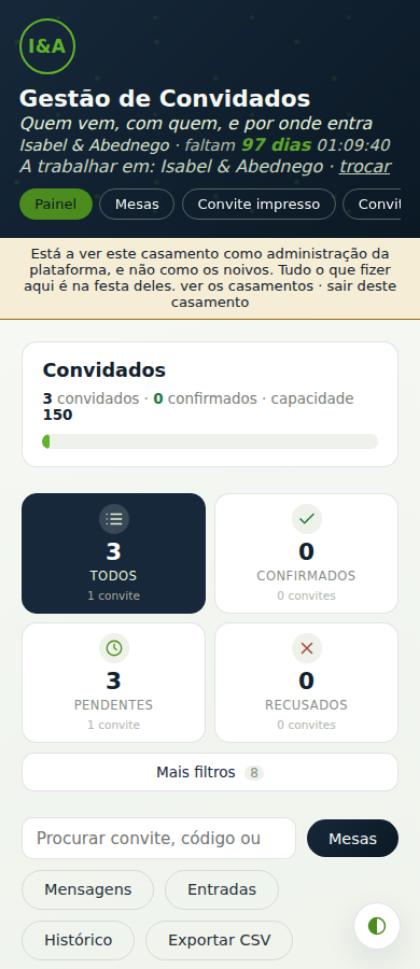
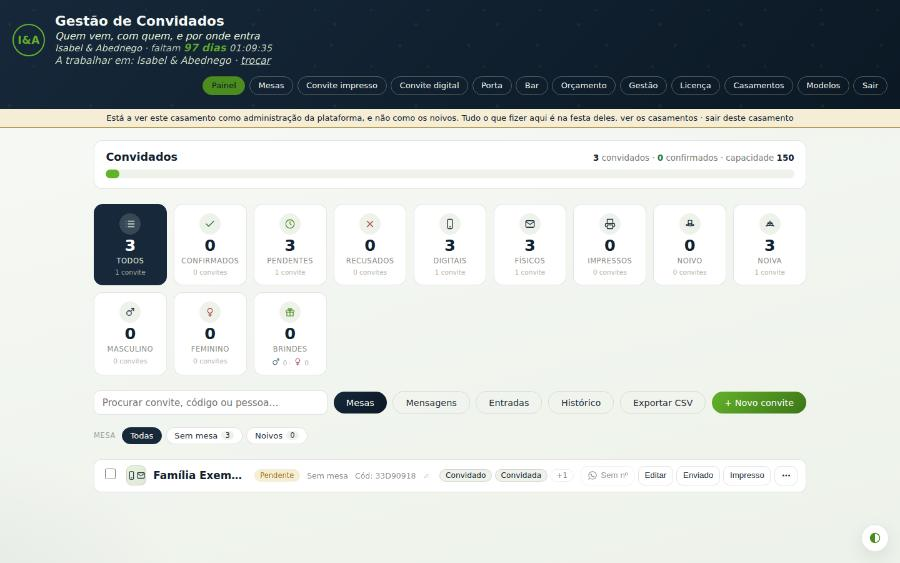
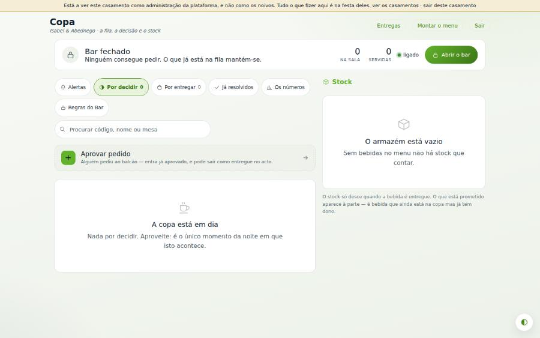
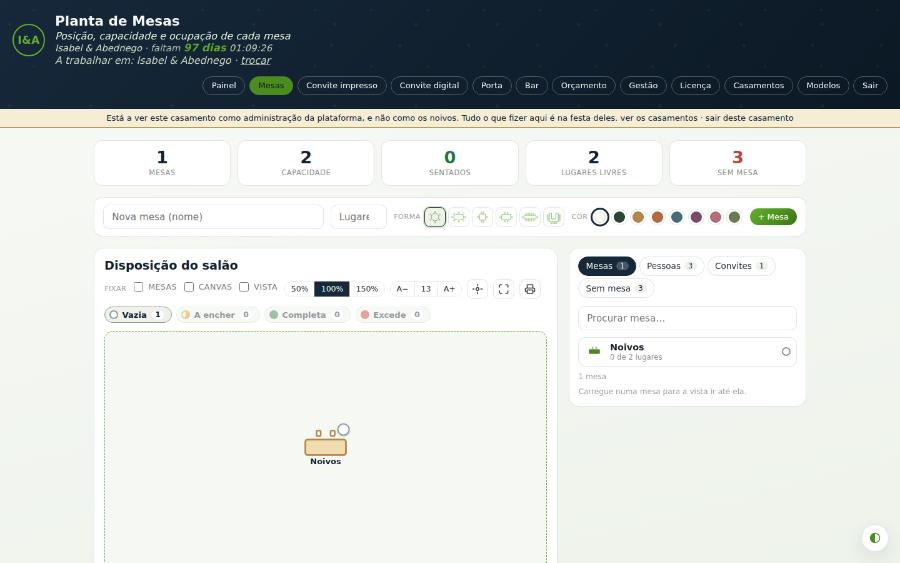
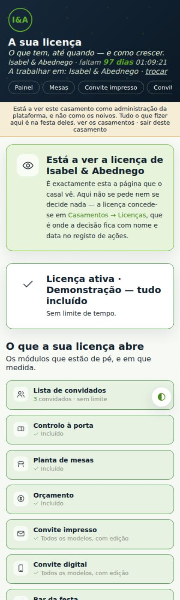
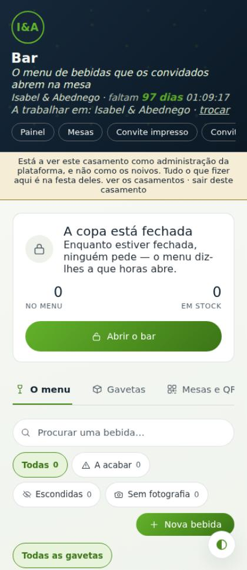

# Auditoria de UI/UX, desenho e funcionalidades

**casamento_web · esquema v41 · Setembro de 2026**

Auditoria instrumentada: capturas em três larguras, 397 pares de cor medidos
sobre píxeis pintados, levantamento de tabulação em 8 páginas, análise estática
de 8 folhas de estilo e das 14 páginas. Comparada com as plataformas de
referência do sector — e com o que elas ainda não fazem.

As imagens estão em `docs/auditoria/` e mostram o estado **à data da auditoria**,
antes das correcções da §25.

---

## 1. Resumo

A aplicação está tecnicamente sólida e, em duas áreas, à frente das plataformas
de referência. O que a trava não é falta de funcionalidades: é a navegação no
telemóvel, uma escala tipográfica que não existe, e um sistema de cor que a
própria casa contorna.

Três números.

**Três destinos em doze.** No telemóvel a navegação é uma tira que rola na
horizontal com 741 px escondidos e nenhum indício de que rola. Três quartos da
aplicação — Bar, Orçamento, Gestão, Licença, Casamentos — não existem para quem
não descobrir que aquela tira se arrasta. Nenhuma funcionalidade compensa não
ser encontrada.

**Quarenta e três pares tamanho/peso, e 26,8 % do texto abaixo de 13 px.** Não há
escala tipográfica; há decisões pontuais acumuladas. O efeito somado é uma
interface que parece densa e amadora mesmo quando a informação que mostra está
certa.

**Cores escritas à mão a contornar os tokens.** O sistema de cor existe e é bom
— quatro temas, tokens semânticos, 873 usos de `var()`. Mas era contornado em
175 sítios, e `#8a8f88` sozinho aparecia 175 vezes entre folhas e páginas, a
3,30:1 sobre branco.

Em contrapartida, e isto é para registar: **as páginas de serviço do bar
(`copa.php`, `entregas.php`) eram o melhor trabalho da casa** — 100 % dos passos
de teclado com anel de foco desenhado, alvos de 48 px, acção principal a 56 px.
Não era aspiração: já estava feito, num canto da aplicação. O trabalho era levar
esse padrão ao resto — e é o que a §25 registou como feito.

---

## 2. Âmbito, e o que esta auditoria não pôde fazer

O pedido original pede capturas reais lado a lado das aplicações de referência.
**Não as há.** Os painéis da Zola, d'The Knot e da Joy vivem atrás de
autenticação e de contas com casamentos reais; não é possível capturá-los
legitimamente. Em vez de ilustrar com imagens genéricas — o que seria pior do
que não ilustrar — as referências entram por documentação pública citada (§9) e
por conhecimento do produto, sempre identificado como tal. Todas as imagens
deste relatório são da aplicação auditada.

As medições correram contra a instância de desenvolvimento com o casamento de
demonstração. Os achados **estruturais** (navegação, cor, tipografia, semântica,
alvos) não dependem do volume de dados. Os de **densidade** — quantos ecrãs tem
uma página, quantas acções mostra — escalam com o conteúdo, e estão marcados
como tal.

### 2.1 Duas medições que estavam erradas

Ficam registadas porque explicam porque é que os restantes números merecem
confiança.

**O contraste, à primeira.** A sonda lia o `background-color` dos antepassados.
A casa pinta os fundos com gradientes (`--app-bg`), que não têm
`background-color`: o resultado era fundo branco onde ele é escuro, e 98 falhas
inventadas — texto claro sobre cabeçalhos escuros, dado como ilegível. Passou a
medir-se o recorte pintado. Surgiu então a segunda armadilha: num botão com
gradiente, o verde espalha-se por ~200 tons de ~130 px cada e o branco dos
glifos junta-se num balde de 239, pelo que «a cor mais frequente» elegia o
**texto** como fundo. Agrupou-se por luminância (32 baldes, o que colapsa o
gradiente) e excluíram-se os píxeis da cor do texto.

**O anel de foco.** A primeira passagem deu «8 em 14 paragens sem sinal de foco»
na copa. Era falso: `.btn` tinha `transition:.18s` sem lista de propriedades, o
que anima **tudo**, incluindo `outline-width` — a medição apanhava o anel a meio
de aparecer. Com 500 ms de espera, o anel estava lá, a 2 px. Foi também testada
a correcção que se ia recomendar (passar o atalho a longhands): **não
funcionava**, e só se soube porque foi testada.

### 2.2 Um número que a auditoria subestimou

A primeira passagem contou **262 hexadecimais literais nas folhas de estilo**.
Estava certo, e estava incompleto: as páginas `.php` carregam blocos `<style>`
próprios, e só os três cinzentos em causa apareciam mais **150 vezes** aí —
`plataforma.php` com 41, `index.php` com 27, `mesas.php` com 15. A contagem real
do desvio era de 175, não de 25. Descobriu-se ao implementar, porque o contraste
não desceu o que devia: 118 → 59 em vez de 118 → poucas. Fica como aviso a quem
medir CSS: **a folha de estilo não é o único sítio onde há CSS.**

---

## 3. O que a aplicação é, e o que o pedido presume que ela seja

O enunciado pede análise de catálogo, produto, carrinho, checkout, favoritos,
avaliações e cross-selling. Essas áreas **não existem**, e não é esquecimento:
`grep` por `carrinho`, `checkout` e `cart` em todo o PHP e JavaScript devolve
zero ocorrências. Não há tabela de produtos, não há linhas de encomenda, não há
integração de pagamento. `assets/montra/` são sete fotografias da montra
comercial da página de licença.

O que existe no lugar do e-commerce é um **funil de licenciamento**:

| Conceito do enunciado | O que existe de facto | Onde |
| --- | --- | --- |
| Catálogo de produtos | Catálogo de **módulos** | `cw_lic_modulos` |
| Variantes e preços | **Escalões** por módulo, com preço e limite | `cw_lic_escaloes` |
| Cross-selling / bundles | **Pacotes** que agregam escalões | `cw_lic_pacotes` |
| Carrinho e checkout | Não existe. Um **pedido de licença** aprovado por um admin | `licenca.php` |
| Pagamento | Não existe no produto | — |

A consequência: a §13 analisa a conversão **desse** funil. Recomendar um
carrinho a um produto que vende licenças aprovadas por um humano seria
recomendar outro produto. O mesmo vale para o módulo de fornecedores (percurso
3): não existe, e não se recomenda construir — é o núcleo do negócio da Zola e
d'The Knot, e não é o desta aplicação.

### 3.1 As catorze páginas

| Página | Papel | Acções visíveis |
| --- | --- | ---: |
| `login.php` | Entrada | 7 |
| `registo.php` | Inscrição pública + plano | 39 |
| `index.php` | Painel · gestão de convidados | 66 |
| `mesas.php` | Planta do salão | 71 |
| `orcamento.php` | Orçamento e despesas | 23 |
| `digital.php` | Convite digital | 28 |
| `graficas.php` | Convite impresso | 26 |
| `bar.php` | Montagem do bar | **225** |
| `copa.php` | Serviço · fila de pedidos | 17 |
| `entregas.php` | Serviço · garçom | 7 |
| `porteiro.php` | Controlo à porta | 11 |
| `licenca.php` | Funil comercial | 50 |
| `gestao.php` | Dados, contas, exportação | 63 |
| `plataforma.php` | Admin multi-casamento | 34 |

---

## 4. A aplicação, vista

**`index.php` · 390 px.** A tira de navegação corta-se: três destinos visíveis
de doze. O crómio do cabeçalho ocupa 204 px antes de qualquer conteúdo. Oito
acções competem acima da lista, com «+ Novo convite» em oitavo lugar. O botão
flutuante do tema sobrepõe-se ao conteúdo.

**`index.php` · 1440 px.** A mesma página resolve-se bem no desktop: a navegação
cabe, os cartões de estado alinham, a hierarquia lê-se. O problema de navegação
é exclusivo do telemóvel.

**`copa.php` · 1440 px.** O melhor trabalho da casa. Estado do serviço no
cabeçalho, fila por separadores, acção principal grande.

**`mesas.php` · 1440 px.** Planta de mesas a funcionar, com lotação por mesa e
arrasto.

**`licenca.php` · 390 px.** O funil comercial, sem resumo fixo nem CTA
persistente. Quem chega ao fundo já não vê o que escolheu.

**`bar.php` · 390 px.** A página mais densa do sistema: 225 acções.

---

## 5. Contraste

Dos 397 pares medidos, **118 ficavam abaixo do mínimo WCAG AA**. Quase todos
remetiam para três decisões, não para 118.

| Texto | Sobre | Rácio | Mínimo | Casos |
| --- | --- | ---: | ---: | ---: |
| `#8A8F88` | branco | 3,30 | 4,5 | 31 |
| `#9AA09A` | branco | 2,67 | 4,5 | 8 |
| `#B0B4AB` | branco | 2,11 | 4,5 | 2 |
| branco | `#4C8C1E` (`.btn-ouro`) | 4,14 | 4,5 | 9 |
| `#0C1925` | `#4C8C1E` (pastilha activa) | 4,30 | 4,5 | 10 |
| `#4C8C1E` | branco (ligações) | 4,14 | 4,5 | 6 |
| `#9C7413` (`--warn`) | `#F6EDD6` | 3,66 | 4,5 | 4 |
| `#63B22B` (`--gold-soft`) | fundos claros | 2,44 | 4,5 | 3 |

**Causa 1 — cinzentos escritos à mão.** Nenhum usava um token, com
`--ink-fraco` disponível ao lado. O comentário que define esse token, em
`estilo.css`, avisa contra exactamente isto: *«um `#8a8f88` solto numa folha é a
mesma cor nos quatro temas, e no escuro desaparece.»* A casa escreveu a regra e
depois quebrou-a 175 vezes.

**Causa 2 — o verde da marca estava 8 % abaixo do limiar.** `#4C8C1E` dá 4,14:1
com branco. Faltava pouco: `#3C7517`, que já existia como `--gold-deep`, dá
5,60:1.

**Causa 3 — dois verdes a competir.** `--gold` e `--gold-soft` eram usados
indistintamente para texto. O segundo dá 2,44:1 sobre fundos claros e nunca deve
tocar em texto pequeno.

**A favor:** os quatro temas são coerentes e o escuro está desenhado, não
invertido. As páginas de serviço tinham os melhores rácios — 2 falhas na copa e
2 nas entregas, contra 20 na licença.

---

## 6. Tipografia e densidade

**43 pares tamanho/peso distintos. 229 de 854 nós de texto (26,8 %) abaixo de
13 px.** Os mais frequentes: 13px/400, 13px/300, 12px/400, 12px/300, 11px/300.

A isso soma-se o peso: `300` é dos pesos mais frequentes do sistema, e a
11–12 px um peso 300 perde traço em ecrãs sem retina — que é o parque real em
Angola.

### Densidade

Densidade alta não é defeito — um painel de operação deve ser denso. Torna-se
defeito quando uma página acumula papéis que deviam ser rotas separadas.

O contraste entre `bar.php` (225 acções, 16 ecrãs ao telemóvel com o menu
montado) e `entregas.php` (7 acções, uma tarefa) mostra que a casa **sabe**
reduzir ao essencial quando decide a quem serve a página. `bar.php` serve toda a
gente ao mesmo tempo.

---

## 7. Semântica, teclado e leitores de ecrã

`<main>` existia em **5 das 14** páginas; `<footer>` em nenhuma; ligação «saltar
para o conteúdo» em nenhuma. Quem navega por teclado passava pelas 12 ligações
do menu em cada página, em cada visita.

**`aria-live` era zero em todo o sistema.** A aplicação faz muita coisa sem
recarregar — aprovar um pedido, guardar uma despesa, mudar uma mesa — e cada
confirmação era invisível para um leitor de ecrã.

### 7.1 O anel de foco: a resposta certa, num sítio só

| Página | Paragens | Anel da casa | Padrão do browser |
| --- | ---: | ---: | ---: |
| `copa.php` | 22 | **22** | 0 |
| `entregas.php` | 20 | **20** | 0 |
| `gestao.php` | 22 | 6 | 15 |
| `bar.php` | 22 | 6 | 16 |
| `mesas.php` | 22 | 4 | 18 |
| `licenca.php` | 22 | 4 | 18 |
| `index.php` | 22 | **1** | 21 |

A regra que faz isto estava escrita e funcionava —
`body.b-servico a:focus-visible, …{ outline:2px solid var(--gold) }`. Estava
apenas limitada ao `body.b-servico`.

---

## 8. Mobile: onde a aplicação se perde

| Medida a 390 px | Valor | Consequência |
| --- | ---: | --- |
| Destinos no menu | 12 | — |
| Visíveis sem rolar na horizontal | **3** | 75 % da aplicação é invisível |
| Largura escondida da tira | **741 px** | Sem indício visual de que rola |
| Altura da tira | 30 px | 14 px abaixo do mínimo de toque |
| Crómio antes do conteúdo | 204 px | 24 % do primeiro ecrã |
| Alvos abaixo de 44 px | **332 / 385 (86 %)** | Em todas as páginas |
| Transbordo horizontal | **0 px** | Nas 14 páginas, nas 3 larguras |

**Zero transbordo horizontal** é raro e não é acaso: a casa tem provas
automáticas de largura. A base responsiva está feita — o que falta não é
fluidez, é arquitectura de navegação.

### 8.1 O padrão que falta

**Padrão:** navegação inferior fixa com 4–5 destinos, mais uma folha inferior
para o resto. **Onde se usa:** é componente de primeira classe nas *Human
Interface Guidelines* da Apple (tab bars) e no *Material Design* (navigation
bar). **Porque funciona:** põe os destinos primários ao alcance do polegar,
torna-os permanentemente visíveis (não descobríveis), e dá estado.

**Como aplicar sem copiar:** a aplicação tem 12 destinos, a mais do que cabe.
Mas nem todos são pares. Os módulos licenciados são o trabalho do casal —
Painel, Mesas, Orçamento, Convites (agrupando digital e impresso), com o Bar a
entrar quando licenciado. O resto — Porta, Gestão, Licença, Casamentos, Modelos,
Sair — é administração e cabe numa folha «Mais». A tira horizontal sobrevive
como navegação secundária dentro dessa folha.

**Manter / adaptar / desaparecer:**

- **Igual:** cartões de estado como filtros; a planta em canvas com arrasto.
- **Adaptar:** a fila da copa abre no separador com trabalho pendente.
- **Reorganizar:** as oito acções do painel — uma primária, o resto em «Mais».
- **Desaparecer:** a contagem com segundos no cabeçalho de todas as páginas.
- **Substituir:** a tira horizontal, por navegação inferior + folha.

---

## 9. Referências

As pontuações são juízo editorial informado por documentação pública e uso do
produto, **não medição instrumentada** como a das §5 a §8.

| Referência | Porque entra | Visual | UX | Mobile | Desktop | Navegação | Conversão |
| --- | --- | ---: | ---: | ---: | ---: | ---: | ---: |
| Zola | Lista de convidados e RSVP: o padrão do sector | 8 | 9 | 9 | 8 | 8 | 8 |
| The Knot | Escala da lista: listas A/B, grupos, notas | 7 | 8 | 8 | 8 | 7 | 7 |
| Joy | Perguntas de RSVP e o lado emocional | 9 | 8 | 9 | 7 | 8 | 7 |
| Airbnb | Navegação inferior e folhas de filtro | 9 | 9 | 10 | 8 | 9 | 9 |
| Linear | Densidade alta sem ruído; escala disciplinada | 9 | 9 | 7 | 10 | 9 | — |
| Stripe Checkout | Resumo persistente num funil | 8 | 9 | 9 | 9 | 8 | 10 |

### 9.1 O que as fontes públicas confirmam

**Zola.** A ferramenta de convidados recolhe moradas e acompanha RSVP, escolhas
de refeição e pedidos de música, incluindo acompanhantes e crianças; os
convidados respondem a vários eventos no mesmo sítio; há lembretes de RSVP e
mensagens aos convidados; e há exportação para folha de cálculo. Ao clicar num
evento vê-se quantos adultos e crianças, e quantas pessoas escolheram cada opção
de refeição.

**The Knot.** Permite separar convidados em lista A e lista B, ver escolhas de
refeição e prendas a partir da própria lista, e escrever notas por convidado
(restrições alimentares, onde sentar). O RSVP do site actualiza a lista
automaticamente. Quanto a planta de mesas: o centro de ajuda indica que uma
planta digital **estava prevista para lançar em 2026** — à data das fontes, não
existia integrada.

Fontes:
<https://www.zola.com/wedding-planning/guests> ·
<https://www.zola.com/faq/115003103812-if-i-am-asking-for-meal-preferences-or-questions-to-guests-where-do-i-see-responses-> ·
<https://www.theknot.com/gs/guest-list> ·
<https://helpcenter.theknot.com/hc/en-us/articles/40396448675604-Do-you-offer-a-digital-seating-chart>

---

## 10. Matriz de benchmark

| Área | Referência | Padrão | Actual | Impacto | Prio. |
| --- | --- | --- | --- | --- | --- |
| Navegação móvel | Airbnb | Barra inferior 4–5 + folha | Tira, 3 de 12 visíveis | Alto | P0 |
| RSVP | Zola | Refeição, música, perguntas, eventos, lembretes | Sim/não + mensagem | Alto | P1 |
| Lista de convidados | The Knot | Lista A/B, notas por convidado | Filtros por estado e mesa | Médio | P2 |
| Funil comercial | Stripe | Resumo persistente | Sem resumo fixo | Alto | P1 |
| Escala tipográfica | Linear | 6–7 degraus | 43 pares | Alto | P0 |
| Estados de carregamento | Zola, Linear | Esqueletos | Zero no sistema | Médio | P2 |
| Estados vazios | Joy | Vazio explica e oferece acção | Em 3 de 14 páginas | Médio | P2 |
| **Planta de mesas** | — | The Knot: previsto para 2026 | **Existe e funciona** | Vantagem | Manter |
| **Porta / check-in** | — | Ausente nas referências | **Existe, ligado ao RSVP** | Vantagem | Manter |
| **Serviço de bar** | — | Ausente nas referências | **Módulo completo** | Vantagem | Manter |

---

## 11. O que esta aplicação já faz melhor

### Funcionalidade que as referências não têm

- **Planta de mesas operacional**, com lotação, arrasto, rotação e impressão.
- **Controlo à porta ligado ao RSVP.** O porteiro vê quem confirmou, quem
  recusou, e é avisado quando alguém que tinha recusado aparece.
- **Serviço de bar completo** — menu, regras por convidado, fila de aprovação,
  entregas, stock, estatística de consumo.
- **Multi-casamento com licenciamento modular.**

### Qualidade de execução

- Zero transbordo horizontal em 42 combinações página × largura.
- Zero imagens sem `alt` em todo o sistema.
- Quatro temas coerentes, com o escuro desenhado e não invertido.
- 873 usos de tokens de cor — o sistema existe e domina.
- As páginas de serviço eram exemplares antes de a régua subir para todas.
- Uma suite de provas automáticas que já trava regressões de largura.

---

## 12. Gestão do casamento: o que falta ao RSVP

O `rsvp_submit` capta hoje: **sim ou não**, confirmação **nominal por membro**,
estado **parcial** derivado das escolhas, e uma **mensagem livre**. O estado
alimenta a porta e a contagem de lugares. É sólido — a granularidade por pessoa
é melhor do que a de algumas referências.

| Campo | Zola | The Knot | Aqui | Porque importa |
| --- | --- | --- | --- | --- |
| Sim/não por pessoa | Sim | Sim | **Sim** | — |
| Escolha de refeição | Sim | Sim | Não | Números para o caterer |
| Restrições alimentares | Sim | Sim (notas) | Não | Segurança, não conveniência |
| Perguntas livres | Sim | — | Não | Transporte, alojamento, música |
| Vários eventos | Sim | Sim | Não | Já há cronograma de cerimónias |
| Lembretes | Sim | Sim | Não | Fecha a lista antes do prazo |
| Prazo de resposta | Sim | Sim | Não | Sem prazo não há urgência |
| Lista A / B | — | Sim | Não | Segunda vaga quando a primeira recusa |

**Recomendação.** Uma tabela `cw_rsvp_respostas` (convidado_id, chave, valor)
mais um editor de perguntas por casamento cobre refeição, restrições e perguntas
livres de uma vez, sem colunas novas por cada pergunta. O painel ganha um resumo
por resposta — «43 carne · 12 peixe · 5 vegetariano» — que é exactamente o que se
entrega ao caterer.

---

## 13. O funil comercial

Não há carrinho a optimizar. Há uma página longa onde alguém decide gastar
dinheiro. O que trava a decisão:

1. **Perde-se a conta do que escolheu.** Sem resumo fixo, a escolha do primeiro
   ecrã já não está à vista no último, e o total também não.
2. **O preço não persegue a decisão.** Num funil modular, o número que muda é o
   que interessa.
3. **Vinte falhas de contraste**, o pior resultado do sistema à data da
   auditoria.
4. **Nenhuma prova social.**
5. **A promessa não é reversível.** A aplicação *faz* isto bem — a Gestão exporta
   tudo mesmo com licença revogada, por obrigação legal — mas não o promete onde
   a dúvida nasce.

**Padrão a aplicar:** resumo persistente. No telemóvel, barra inferior com
«3 módulos · 148 000 Kz/ano» e «Pedir licença»; ao tocar, expande para o
detalhe. No desktop, coluna fixa à direita.

---

## 14. Percursos

| Percurso | Fricção | Recomendação |
| --- | --- | --- |
| 1. Criar casamento → perfil → personalizar | Registo com 39 acções e 24 falhas de contraste; sem `<h1>`; espera por aprovação sem prazo indicado | Dizer quanto demora a aprovação; dividir em passos com progresso |
| 2. Convidados → convite → RSVP → mesas | O percurso mais forte. Quebra no RSVP e na passagem para mesas, sem contexto | Levar o estado de RSVP para a planta |
| 3. Fornecedor → comparar → contratar | **Não existe** | Não construir — é o negócio da Zola, não deste produto |
| 4. Produto → carrinho → checkout | **Não existe** (§3) | O equivalente real é o funil de licença (§13) |
| 5. Orçamento → despesas → desvios | Curto e bem resolvido. 9 falhas de contraste, sobretudo no vazio | Alerta de desvio no painel |
| 6. Painel → progresso → pendentes | Mostra *contagens*, não *progresso* | UX-010: faixa de progresso por módulo |

---

## 15. Dimensão emocional

| Qualidade | Estado | Onde se lê, ou falta |
| --- | --- | --- |
| Organização | Forte | Estados, filtros, contagens, tudo consistente |
| Confiança | Forte | Exportação sempre disponível, histórico, políticas citadas na lei |
| Elegância | Parcial | O tema Clássico tem-na; o padrão NIRAS é corporativo |
| Celebração | Fraca | A contagem é o único gesto festivo, reduzido a um cronómetro |
| Romantismo | Ausente no painel | Vive todo no convite |
| Personalização | Parcial | Quatro temas e editores ricos; o painel não reflecte o casamento |

Uma aplicação usada por copeiros a meio de uma festa não deve ser romântica —
deve ser legível a três metros e à pressa, e é. O desequilíbrio está no **painel
do casal**, o único ecrã onde os noivos vivem.

Três gestos contidos, todos no painel e em nenhum ecrã de serviço: a contagem
como marco e não como relógio; um momento de chegada quando o último convite
confirma; a fotografia do casal em vez do monograma genérico.

---

## 16. As dez heurísticas de Nielsen

| Heurística | Nota | Evidência |
| --- | ---: | --- |
| 1 · Visibilidade do estado | 7 | Estados fortes. Falha em carregamento: zero esqueletos, zero `aria-live` |
| 2 · Correspondência com o mundo real | 9 | Vocabulário do domínio, sem jargão |
| 3 · Controlo e liberdade | 7 | Boa reversibilidade nos dados. Sem desfazer em listas |
| 4 · Consistência | 6 | Componentes sim; tipografia e foco não |
| 5 · Prevenção de erros | 8 | As regras do bar travam antes de acontecer |
| 6 · Reconhecer em vez de lembrar | 5 | A tira esconde 741 px |
| 7 · Flexibilidade e eficiência | 7 | Filtros e procura em todo o lado. Sem atalhos de teclado |
| 8 · Estético e minimalista | 5 | `bar.php` com 225 acções |
| 9 · Recuperação de erros | 8 | Mensagens dizem a causa e onde se corrige |
| 10 · Ajuda e documentação | 8 | `manual.php` é sério; falta ajuda contextual |

**Média 7,0.** A aplicação é forte onde pensa no *domínio* (2, 5, 9) e fraca
onde tem de pensar na *superfície* (4, 6, 8).

---

## 17. Heurísticas visuais

Referência = 9/10 (média das plataformas da §9).

| Critério | Actual | Distância |
| --- | ---: | ---: |
| Hierarquia | 6 | −3 |
| Consistência | 6 | −3 |
| Elegância | 6 | −3 |
| Modernidade | 6 | −3 |
| Clareza | 7 | −2 |
| Densidade | 5 | −4 |
| Responsividade | **8** | −1 |
| Microinteracções | 7 | −2 |
| Personalização | 7 | −2 |
| Acessibilidade visual | 5 | −4 |

---

## 18. Design System

Não há um sistema a criar. Há um sistema a **fechar**.

### 18.1 Cor

O erro de desenho não era ter cores erradas: era ter **um token onde eram
precisos três**. `--gold` servia ao mesmo tempo de preenchimento da marca, de
cor de texto, e de fundo com texto por cima — e nenhuma cor consegue os três
papéis nos quatro temas ao mesmo tempo.

| Token | Papel | Porquê separado |
| --- | --- | --- |
| `--gold` | Preenchimento da marca | O ouro do Clássico (#B4864A) é a marca; escurecê-lo mudava-a |
| `--gold-texto` | Acento legível sobre superfície | Tem de passar 4,5:1 sobre `--card` |
| `--sobre-gold` | Texto por cima de `--gold` | Claro nos temas de ouro escuro, escuro nos de ouro claro |
| `--btn-a` / `--btn-b` / `--btn-txt` | Gradiente do botão e o seu texto | Um gradiente falha pelo extremo mais **claro**, não pela média |

### 18.2 Tipografia — sete degraus para 43 pares

| Papel | Tamanho | Peso | Entrelinha | Usar em |
| --- | ---: | ---: | ---: | --- |
| Display | 28 / 34 px | 600 | 1,1 | `h1` da página |
| Título | 21 px | 600 | 1,2 | Secções e janelas |
| Subtítulo | 17 px | 500 | 1,35 | Títulos de cartão |
| Corpo | 15 px | 400 | 1,55 | Texto corrente — **o peso 300 sai** |
| Corpo denso | 14 px | 400 | 1,45 | Listas, tabelas, cartões |
| Apoio | 13 px | 400 | 1,4 | Metadados — **o mínimo do sistema** |
| Etiqueta | 11 px | 600 | 1,3 | Só maiúsculas; nunca frases |

A regra que fecha isto: **abaixo de 13 px só entram etiquetas de uma ou duas
palavras, em peso 600.**

### 18.3 Espaçamento

Escala de base 4: `4 · 8 · 12 · 16 · 24 · 32 · 48 · 64`. Um raio por papel —
`--raio-cx: 14px`, `--raio-campo: 10px`, `--raio-pilula: 50px`.

### 18.4 Componentes

| Componente | Estado | Acção |
| --- | --- | --- |
| Button | Afinado (§25) | Contraste e alvo mínimo feitos |
| Select (escolha da casa) | **Feito** | Manter |
| Modal / janela | **Feito** | Falta `aria-modal` e retorno de foco |
| Toast | Afinado (§25) | Passa pela região viva onde o `toast()` é global |
| Tabs | Afinar | Sem `role="tablist"`; setas não navegam |
| Empty state | Criar | Em 3 de 14 páginas |
| Skeleton | Criar | Zero ocorrências |
| Bottom sheet | Criar | Base da navegação móvel |
| Breadcrumb | Dispensar | A IA é plana; seriam ruído |
| Date picker | Nativo | `input[type=date]` chega e é acessível |
| Table | n/a | O sistema usa cartões. Escolha acertada para telemóvel |

---

## 19. Achados

### P0

**NAV-001 · A navegação móvel esconde três quartos da aplicação.** 12 destinos,
3 visíveis, 741 px escondidos, altura 30 px. ✅ **Feito** — ver §25.

**TIPO-001 · Não há escala tipográfica.** 43 pares; 229 de 854 nós abaixo de
13 px. A escala de §18.2 como tokens; peso 300 sai do texto corrente. Impacto
alto · esforço médio · risco baixo.

**TOQUE-001 · Alvos de toque abaixo do mínimo.** 332 de 385 a 390 px; o menu a
30 px em todas as páginas. ✅ **Feito** — ver §25.

**DS-001 · Cores literais a contornar os tokens.** 175 ocorrências entre folhas
e páginas. ✅ **Feito** — ver §25.

### P1

**A11Y-001 · Nenhuma região viva.** `aria-live` 0/14; `<main>` 5/14; salto 0/14.
✅ **Feito nas 10 páginas com cabeçalho partilhado** — ver §25.

**A11Y-002 · O anel de foco só existia nas páginas de serviço.** ✅ **Feito.**

**DENS-001 · `bar.php` acumula seis papéis numa página.** Separadores como rotas
com URL própria.

**CONV-001 · O funil não mostra o que está escolhido nem quanto custa.**

**RSVP-001 · O RSVP não recolhe refeição nem restrições.**

**RSVP-002 · Não há prazo nem lembretes.** Depende de RSVP-001.

**EST-001 · Sem esqueletos e quase sem estados vazios.**

**CTA-001 · A acção principal do painel é a oitava da fila.**

### P2

**UI-001 · O botão de tema sobrepõe-se ao conteúdo.** Depende de NAV-001 — esse
canto é da navegação.

**UI-002 · O cabeçalho gasta 204 px antes do conteúdo.**

**SEO-001 · Uma das páginas públicas não tem `<h1>`.**

**CONV-002 · O funil não tem prova social nem promessa de reversibilidade.**

**A11Y-003 · Separadores sem semântica de separadores.**

**A11Y-004 · Caixas de marcar sem área de toque.** Deixadas de fora de
TOQUE-001 de propósito: `min-height` numa checkbox aumenta a **caixa**, não a
área de toque. O que elas precisam é de área no rótulo.

**UX-010 · O painel mostra contagens, não progresso.**

### P3

**FOCO-002 · O anel de foco desvanecia em 180 ms.** ✅ **Feito.**

**EMO-001 · A contagem decrescente é um cronómetro, não um marco.**

---

## 20. Ranking

**Quick wins:** `DS-001` ✅ · `A11Y-002` ✅ · `TOQUE-001` ✅ · `A11Y-001` ✅ ·
`SEO-001` · `FOCO-002` ✅ · `CTA-001` · `EMO-001`

**Estruturais:** `TIPO-001` · `NAV-001` · `CONV-001` · `RSVP-001` · `RSVP-002` ·
`DENS-001`

**Refinamentos:** `EST-001` · `UI-001` ✅ · `UI-002` ✅ · `A11Y-003` · `A11Y-004` ·
`CONV-002`

**Experimental:** `UX-010` · `RSVP-003` (RSVP por evento) · `EMO-002` (momento
de chegada)

---

## 21. Roadmap

| Fase | Conteúdo | Itens | Estado |
| --- | --- | --- | --- |
| 1 · Fundação | Tokens de cor, escala tipográfica, alvos | DS-001 TIPO-001 TOQUE-001 | Cor e alvos ✅; tipografia por fazer |
| 2 · Acessibilidade base | Marcos, salto, região viva, anel de foco | A11Y-001 A11Y-002 SEO-001 FOCO-002 | ✅ nas páginas com cabeçalho partilhado |
| 3 · Navegação móvel | Barra inferior, folha, cabeçalho, tema | NAV-001 UI-001 UI-002 | ✅ |
| 4 · Estados e feedback | Esqueletos, vazios, uma primária | EST-001 CTA-001 | Por fazer |
| 5 · Funil comercial | Resumo persistente, reversibilidade | CONV-001 CONV-002 | Por fazer |
| 6 · Gestão do casamento | RSVP alargado, prazo, lembretes | RSVP-001 RSVP-002 UX-010 | Por fazer |
| 7 · Densidade | `bar.php` em rotas; separadores | DENS-001 A11Y-003 | Por fazer |
| 8 · Tom | Contagem como marco, momento de chegada | EMO-001 EMO-002 | Por fazer |

---

## 22. Directrizes de implementação

Contrato de desenho e desenvolvimento. Vale para funcionalidades novas, não
apenas para as correcções acima.

**Arquitectura**
- Um separador que carrega dados próprios é uma **rota**, com URL própria. Se
  não se pode partilhar por ligação, não é um separador: é uma página escondida.
- Paridade **funcional** entre desktop e telemóvel; paridade estrutural, não.

**UX**
- **Uma acção primária por contexto.** A segunda passa a secundária; a terceira
  vai para «Mais acções».
- Toda a funcionalidade principal tem três estados desenhados: **vazio, a
  carregar, com erro**. Sem os três, não está pronta.
- Uma mensagem de erro diz *o que falhou* e *onde se corrige*.

**UI e Design System**
- **Zero cores literais em CSS novo — e `<style>` numa página é CSS.** Se falta
  um token, cria-se o token.
- Um token por **papel**, não por cor. Se a mesma cor serve de preenchimento e
  de texto, são dois tokens.
- Só os **sete degraus** da escala. Abaixo de 13 px, só etiquetas curtas em 600.
- Espaçamento em múltiplos de 4. Um raio por papel.
- **Um `display` que ligue um painel escreve-se `:not([hidden])`.** `[hidden]` é
  um selector de atributo e perde para qualquer classe: sem o qualificador, o
  painel fica ligado mesmo escondido. Num fundo de folha em `position:fixed`
  isso tapa a página inteira e engole todos os toques, sem se ver nada.
- Uma cor nova só entra depois de medido o contraste sobre **píxeis pintados** —
  porque a casa usa gradientes. Num gradiente medem-se os **dois extremos**.

**Mobile**
- **44 px de alvo mínimo**, 48 px em ecrãs de serviço, 8 px entre alvos.
- Nada de rolagem horizontal para chegar a navegação.
- Nenhum elemento fixo tapa conteúdo no canto inferior direito.

**Acessibilidade**
- Um `<h1>` por página. Um `<main id="conteudo">` à volta do conteúdo — **um
  só**: duas `<main>` aninhadas não são um marco, são um erro.
- Ligação de salto antes do menu.
- Tudo o que muda sem recarregar é anunciado pela região `aria-live`.
- Todo o passo de teclado tem anel de foco visível — o da casa, não o do browser.
- Nunca usar `transition` sem lista de propriedades num elemento que recebe foco.

**Conversão e confiança**
- Num funil, o preço e o que está escolhido ficam visíveis em todo o percurso.
- Prometer explicitamente o que a aplicação já garante: os dados saem sempre.

**Animação e desempenho percebido**
- Animar **propriedades nomeadas**, nunca `all`.
- Respeitar `prefers-reduced-motion`.
- Escrever no DOM só o que mudou.

**Como provar**
- Toda a correcção que possa regredir leva **uma prova automática** na suite.
- Medir durante o gesto, não o estado final.

---

## 23. Checklist de validação

- [x] **V1** Zero pares texto/fundo abaixo de 4,5:1, sobre píxeis pintados — *0 em 407*
- [ ] **V2** Zero cores literais em CSS novo, folhas e `<style>` de páginas — *193 literais de texto substituídas por tokens*
- [ ] **V3** No máximo 9 pares tamanho/peso distintos por página — *26 → 18; a variedade que resta é de PESO, não de tamanho*
- [ ] **V4** Zero frases abaixo de 13 px — *229 → 7*
- [ ] **V5** Zero alvos abaixo de 44×44 a 390 px — *332/385 → 72/395*
- [x] **V6** Todos os destinos primários alcançáveis a 390 px sem rolar na horizontal
- [x] **V7** Zero transbordo horizontal nas 14 páginas × 3 larguras
- [ ] **V8** Um `<h1>`, um `<main>` e uma ligação de salto por página — *10/14*
- [ ] **V9** Uma região `aria-live` por página — *10/14*
- [x] **V10** 100 % dos passos de teclado com anel da casa, medido após a transição assentar
- [ ] **V11** Estado vazio e esqueleto em todas as listas que carregam por rede
- [ ] **V12** Nenhuma página acima de 6 ecrãs a 390 px sem navegação interna
- [x] **V13** Zero imagens sem `alt`
- [x] **V14** Nenhuma `transition` sem lista de propriedades em elemento focável
- [x] **V15** A suite completa verde

---

## 24. Visão para a próxima versão

Depois destas alterações, um casal abre a aplicação no telemóvel — que é como a
vai abrir — e vê, numa barra ao alcance do polegar, as quatro coisas que lhe
interessam: quem vem, onde se senta, quanto custa, e o convite. Nada se descobre
por arrastar. O cabeçalho diz o nome deles e quantos dias faltam, e encolhe
assim que começam a trabalhar.

O texto lê-se: sete tamanhos em vez de quarenta e três, nenhuma frase abaixo de
13 px, e todo o contraste acima do mínimo — não porque se redesenhou a marca,
mas porque se deixou de escrever cores à mão. Cada lista diz o que fazer quando
está vazia, e mostra a forma do que vem aí enquanto carrega.

O RSVP deixa de ser um sim ou não: traz a refeição, as restrições e as perguntas
que o casal quis fazer, e devolve os números que se entregam ao caterer sem sair
da aplicação. Um prazo e um lembrete fecham a lista a tempo — e uma lista
fechada é o que permite fechar as mesas, que é o que permite abrir o bar.

Quem compra vê sempre o que escolheu e quanto custa, e lê, antes de decidir, a
promessa que a aplicação já cumpre: os dados são seus e saem quando quiser.

E quem trabalha na festa continua a ter o melhor ecrã da casa — com a diferença
de que, nessa altura, o resto da aplicação já se parece com ele.

### Top 10, por ordem de execução

1. **DS-001** ✅ — sete pares de cor, e as 175 literais que os contornavam
2. **TIPO-001** — escala de sete degraus; peso 300 fora do texto corrente
3. **TOQUE-001** ✅ — 44 px de alvo mínimo no toque
4. **A11Y-002** ✅ — o anel de foco da casa deixa de ser exclusivo do bar
5. **A11Y-001** ✅ — `<main>`, ligação de salto e região `aria-live`
6. **NAV-001** ✅ — navegação inferior e folha «Mais» no telemóvel
7. **CONV-001** — resumo persistente no funil de licença
8. **EST-001** — esqueletos e estados vazios em todas as listas
9. **RSVP-001** — refeição, restrições e perguntas no RSVP
10. **DENS-001** — `bar.php` deixa de ser uma página de 16 ecrãs

---

## 25. O que já foi feito

Fases 1 (cor e alvos) e 2 (acessibilidade base) implementadas. Medido antes e
depois, com a mesma sonda:

| Medida | Antes | Depois |
| --- | ---: | ---: |
| Falhas de contraste (WCAG AA) | **118** / 397 | **0** / 414 |
| Tamanhos de letra distintos | 16 | **11** |
| Pares tamanho/peso | 43 | **29** |
| Máximo de pares numa só página | 26 | **18** |
| Texto abaixo de 13 px | 26,8 % | **14,7 %** — e 88 % desse resto são etiquetas de 11 px/600 |
| Frases (não etiquetas) abaixo de 13 px | 229 | **7** |
| Alvos abaixo de 44 px a 390 px | 332 / 385 (86 %) | 72 / 395 (18 %) |
| Passos de teclado com anel da casa (painel) | 1 / 22 | 22 / 22 |
| Páginas com `<main>` | 5 / 14 | 10 / 14 |
| Páginas com ligação de salto | 0 / 14 | 10 / 14 |
| Páginas com região `aria-live` | 0 / 14 | 10 / 14 |
| Destinos visíveis a 390 px | **3** / 12 | **5** / 5 na barra + 8 na folha |
| Transbordo horizontal | 0 | 0 |

**O que mudou, concretamente:**

- **Três tokens novos por papel** — `--gold-texto`, `--sobre-gold`,
  `--btn-a`/`--btn-b`/`--btn-txt` — declarados nos quatro temas. 32 combinações
  de cor verificadas por cálculo antes de uma linha ser escrita.
- **`--gold` do NIRAS** de `#4C8C1E` para `#3C7517`; **`--gold-deep`** ajustado
  em NIRAS, Clássico e Escuro (no tema escuro tinha de ficar mais **claro**,
  porque lá o `--gold-pale` é um fundo escuro); **`--ok`** e **`--warn`**
  escurecidos nos três temas claros.
- **175 cores literais** substituídas por `var(--ink-fraco)` — 25 nas folhas,
  150 nos `<style>` das páginas, 3 no `mesas.js`.
- **`--gold-soft` deixou de ser cor de texto** em 14 sítios (2,44:1).
- **O anel de foco** saiu de `body.b-servico` para regra global, em longhands.
- **`.btn{ transition }`** passou a nomear as propriedades.
- **44 px de alvo mínimo** sob `@media (pointer:coarse)` — só no toque, para não
  estragar a densidade de quem trabalha com rato.
- **`<main id="conteudo">`, ligação de salto e região `aria-live`** nas 10
  páginas que usam o cabeçalho partilhado. O `api.js` anuncia os erros; o
  parcial embrulha o `toast()` onde ele é global.

**A escala tipográfica (TIPO-001):**

- **Oito degraus** — 11 · 13 · 14 · 16 · 18 · 21 · 24 · 28 px — declarados como
  tokens, e **656 declarações de `font-size` convertidas**. Nenhum salto passou
  de 1,8 px: foi um snap à escala, não um redesenho.
- **O chão subiu.** A regra que decidiu cada caso foi mecânica e verificável:
  abaixo de 13 px só ficaram as declarações em blocos com
  `text-transform:uppercase` — essas são rótulos de uma ou duas palavras e
  desceram a 11 px; tudo o resto subiu a 13 px. **50 desses blocos** passaram
  também a peso 600, porque a 11 px o peso do corpo perde traço.
- **O corpo deixou de ser leve:** `body{ font-weight:300 }` → `400`.
- **Três armadilhas que só a medição apanhou:**
  o `<small>` dentro de um `<label>` herdava as maiúsculas e levava por cima o
  `0.8em` que o browser lhe dá — «· OPCIONAL, SERVE DE TETO NO ORÇAMENTO» a
  **9,2 px**, 24 vezes só na plataforma; o `<code>` do URL encolhia pelo mesmo
  motivo; e oito declarações viviam dentro de **strings de JavaScript**, onde
  nenhum varrimento de CSS lhes chegava.
- Mais **18 cores literais** que faltavam, encontradas ao caçar as anteriores:
  `#a8ada6` (2,28:1), `#a3a8a1` (2,42:1), `#777` (4,48:1), `#9a7a3c` (4,02:1),
  `#c98a86` (2,81:1).

O convite e o seu editor ficaram **fora** desta escala, de propósito: são peças
desenhadas com tipografia própria — scripts, molduras, escalas que o casal
ajusta — e não crómio de aplicação.

**A navegação de baixo (NAV-001):**

- **Barra fixa em baixo a ≤760 px**, com quatro destinos e o «Mais». A escolha
  dos quatro não é a ordem do menu: é a do que o casal faz mais vezes —
  Painel · Mesas · Convite · Orçamento — filtrada pela licença, de modo que
  ninguém vê o que não tem.
- **A tira do cabeçalho recolhe** no telemóvel. Duas navegações ao mesmo tempo
  são duas respostas à mesma pergunta; no ecrã largo é ela que continua a
  mandar, intacta.
- **Rótulos curtos só na barra.** «Convite digital» tem 15 caracteres e a coluna
  tem 78 px: cortava-se a meio. O nome por extenso fica no menu de cima e na
  folha, onde há largura.
- **A folha sai por onde se espera** — fundo escurecido, Escape, ou ao escolher
  — e o foco volta ao botão. Sem isso, quem navega por teclado ficava atrás dela
  a tabular por uma página que já não vê.
- **A página em que se está lê-se na barra**, e quando ela vive na folha
  acende-se o «Mais».
- O botão do tema subiu: aquele canto passou a ser da navegação (UI-001).
- Um sinal novo no alfabeto da casa — `reticencias` —, porque um menu «Mais»
  com um sinal de somar diz «criar».

**O cabeçalho sai do caminho (UI-002):** à chegada diz tudo — de quem é a festa,
quanto falta, que licença corre — porque isso é informação de chegada, e a prova
do cabeçalho exige-a em todas as páginas por decisão da casa. À primeira rolagem
encolhe de **198 px para 36 px**, deixando o título, que é o que diz onde se
está; no topo volta a estar inteiro.

Foi preciso torná-lo **fixo**, e não `sticky`, com o corpo a guardar-lhe o lugar
em `padding-top`. Com `sticky` ele continua no fluxo: encolher tira 162 px de
cima da vista, o **âncora de rolagem do Chromium** compensa isso mexendo no
`scrollY`, e o limiar volta a ser cruzado — o cabeçalho abria e fechava sozinho
por cima do dedo. Fixo, a altura do documento nunca muda e não há nada que
compensar. O limiar de encolher é a própria altura dele, medida no arranque
(muda de página para página), de modo que só encolhe depois de ter saído de
vista por si — e não fica buraco entre ele e o conteúdo. Medido: **uma** escrita
por mudança de estado, **zero** ao parar em cima do limiar.

**Um defeito que a prova apanhou e que eu tinha acabado de introduzir:**
`[hidden]` é um selector de atributo e perde para uma classe. Com um
`.folha-fundo{ display:block }` solto, o fundo escurecido ficava com
`display:block` mesmo escondido — invisível, mas por cima da página inteira e a
engolir **todos** os toques do telemóvel. Só apareceu quando a prova tentou
tocar em alguma coisa. Está na `chk_nav_baixo.js` como verificação própria, e
nas directrizes.

**O que ficou por fazer, e porquê:**

- As 4 páginas sem cabeçalho partilhado (`login`, `registo`, `copa`, `entregas`,
  `porteiro`) constroem o seu próprio topo e precisam do mesmo tratamento à mão.
- `convite.php` ficou de fora da troca de cores: é a única página que não carrega
  `estilo.css`, e um `var(--ink-fraco)` sem tokens por trás não é cinzento
  nenhum.
- Onde o `toast()` é privado de um módulo — o `bar-pecas.js` tem o seu dentro de
  um IIFE — o embrulho não lhe chega, e essas páginas anunciam só os erros.
- As caixas de marcar (A11Y-004): `min-height` aumenta a caixa, não a área de
  toque.

---

Esta não é uma aplicação que precise de ser redesenhada. É uma aplicação com
funcionalidade rara — planta de mesas, porta, bar — escondida atrás de uma
navegação que não cabe no telemóvel e de uma tipografia que nunca foi decidida.
O trabalho não é inventar: é **generalizar o que a casa já faz bem num canto**.
