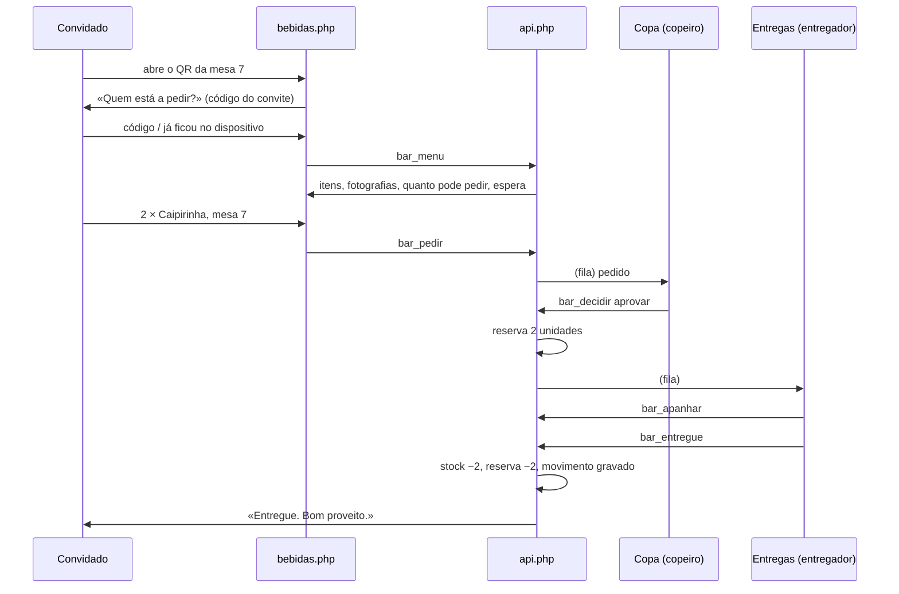
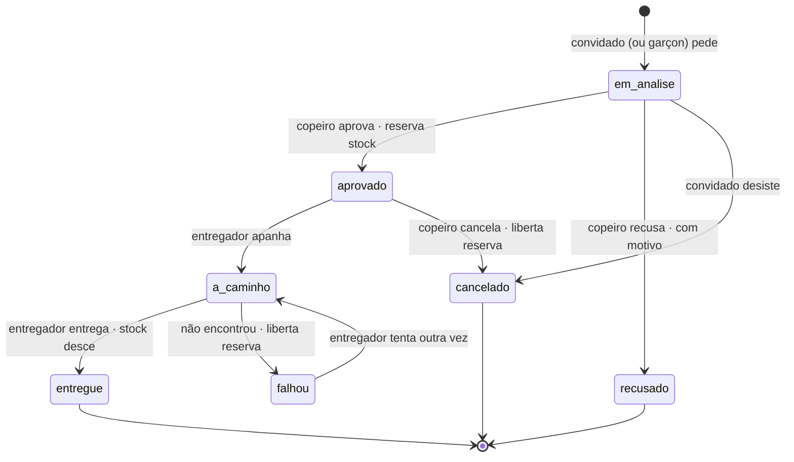

# Módulo «Bar» — estratégia de implementação

> Estado: **proposta**. Nada disto está construído.
> Contra que código: `casamento_web` no esquema **v35**, módulos de licença
> `convidados`, `porta`, `mesas`, `orcamento`, `impresso`, `digital`.
> Este documento é para ser seguido por quem o vai implementar — e discutido
> antes disso. Onde tomei uma decisão que o pedido não fixava, está marcada
> com **[decisão]**; onde vejo um problema no que foi pedido, está marcado com
> **[reparo]**, com a alternativa ao lado.

---

## 1. O que é, em duas linhas

O convidado abre o menu de bebidas a partir do próprio convite — por link ou
por QR —, vê as bebidas com fotografia e quantas pode pedir, e faz o pedido
para a mesa onde está. O pedido cai na copa, que aprova ou recusa; aprovado,
aparece ao entregador, que o leva e dá por entregue. O stock desce quando a
bebida chega à mesa, e não antes.

Três pessoas, três ecrãs, um pedido a passar por eles. Tudo o resto neste
documento é detalhe desses três ecrãs e das regras que os ligam.

---

## 2. As pessoas e os seus ecrãs

| Quem | Ecrã | Como entra | O que faz |
|---|---|---|---|
| **Convidado** | `bebidas.php` | Sem conta: pelo código do convite (link ou QR) | Vê o menu, pede, acompanha o pedido, vê quanto falta para poder pedir outra vez |
| **Copeiro** | `copa.php` | Conta com papel `copeiro` | Triagem dos pedidos, stock em tempo real, limites, motivos de recusa, estatística |
| **Entregador** | `entregas.php` | Conta com papel `entregador` | Apanha pedidos aprovados, entrega, marca falhas, pede por conta de quem não tem rede |
| **Noivos** | `bar.php` | Conta de noivos (`admin`) | Monta o menu (categorias, itens, fotografias), abre e fecha o bar, imprime os QR das mesas, vê a estatística |

O entregador é o «garçon» / empregado de mesa. Uso *entregador* no código e
*garçon* nos textos que o convidado lê, que é a palavra dele.

**[decisão]** Papéis novos, e não um papel só. O copeiro decide e o entregador
transporta: são responsabilidades diferentes e, num casamento grande, pessoas
diferentes. Num casamento pequeno a mesma conta pode ter os dois papéis — a
tabela `cw_acessos` passa a aceitar `copeiro` e `entregador` além de `noivos` e
`porteiro`, e nada impede duas linhas para o mesmo utilizador.

---

## 3. O percurso, do princípio ao fim



---

## 4. Como o convidado chega

Três portas, todas para a mesma página.

1. **Link pessoal** — `https://…/bebidas.php?c=CÓDIGO`. O código é o do convite,
   o mesmo que já abre `convite-digital.php?c=` e `convite.php?c=`. Identifica
   *quem* pede.
2. **QR pessoal** — o mesmo link em QR. Entra no convite digital (uma secção
   nova, «Pedir bebidas») e, opcionalmente, no cartão impresso e no passe de
   entrada, que já leva um QR.
3. **QR da mesa** — `https://…/bebidas.php?m=TOKEN`, impresso e pousado na
   mesa. Identifica *onde*, não *quem*: ao abrir, a página pede o código do
   convite (ou reconhece o dispositivo, se já lá esteve).

A mesa escolhida por omissão é a do QR que foi lido; se o convidado entrou pelo
link pessoal, é a mesa do convite dele. Em qualquer dos casos pode trocar de
mesa numa lista — «estou na mesa 3» —, que é o que o pedido diz.

**Onde vive o token da mesa:** coluna nova `bar_token CHAR(12)` em `cw_mesas`,
gerada na migração para as mesas que já existem e ao criar uma mesa nova. Não é
segredo nenhum — está impresso em cima da mesa — e por isso não dá para pedir:
só escolhe a mesa.

---

## 5. Quem é quem: identidade, dispositivo e IP

Esta é a parte mais delicada do módulo, e a que mais merece ser lida devagar.

### 5.1 O que impede um convidado de pedir em nome de outro

Três camadas, por ordem de força:

1. **O código do convite é o segredo.** Sem ele não se pede. Está no convite
   digital de cada um e no passe impresso; não está pousado na mesa.
2. **O dispositivo fica preso ao convite.** No primeiro pedido, o browser
   recebe um testemunho assinado (cookie `bar_disp`, `HttpOnly`, `SameSite=Lax`,
   validade até ao fim do evento). A partir daí, aquele dispositivo é daquele
   convite: tentar pedir com outro código do mesmo telemóvel é recusado, e
   tentar usar aquele código noutro telemóvel levanta um aviso ao copeiro.
   Um copeiro pode desprender um dispositivo (telemóvel emprestado, bateria
   morta) num clique.
3. **O endereço IP fica registado** em cada pedido e em cada ligação do
   dispositivo, e serve de sinal — não de tranca. Ver a seguir porquê.

### 5.2 **[reparo]** O IP não pode ser a tranca principal

Foi pedido que os IP sejam rastreados para impedir pedidos em nome de outro.
Rastrear, sim — está feito, e o registo de ações já guarda o IP desde a v35.
Mas usá-lo como identidade parte-se num casamento real: **os convidados que
estejam na rede sem fios do salão saem todos pelo mesmo endereço público**. Com
uma regra do género «um IP, um convidado», o primeiro a pedir tranca a festa
inteira; com «um IP, muitos convidados», a regra não impede nada. É o pior de
dois mundos, e não é culpa da regra — é de NAT.

Por isso o IP entra assim, com três modos numa definição (`bar.ip_modo`):

| Modo | O que faz | Quando serve |
|---|---|---|
| `registo` **(origem)** | Grava o IP em tudo. Não bloqueia nada. | Salão com Wi-Fi partilhado — o caso comum |
| `aviso` | Além de gravar, marca na copa os pedidos em que N identidades diferentes usam o mesmo IP em pouco tempo | Quando se quer vigiar sem travar |
| `estrito` | Um IP serve um convite de cada vez; um segundo é recusado com «peça ao empregado de mesa» | Eventos em que cada convidado usa dados móveis, ou testes |

A promessa que o sistema pode cumprir com verdade é a do **dispositivo**, não a
do IP: um telemóvel, um convite. É essa que a interface explica ao convidado.

### 5.3 Quem não tem rede

É o desfecho previsto no pedido, e fecha o círculo: quem não consegue abrir a
página pede ao entregador, que lança o pedido por conta dele em `entregas.php`
(ver §12). Esse pedido fica marcado como feito por terceiro — `criado_por` é a
conta do entregador, `por_conta_de` é o convite — e conta para os limites do
convidado como qualquer outro. Sem esta porta, o módulo excluía exactamente
quem tem menos meios.

---

## 6. O menu e o stock

### 6.1 Três números por item, e um livro-razão

| Número | O que é | Quando muda |
|---|---|---|
| `stock` | O que existe fisicamente | Entrada (reposição), entrega, acerto, quebra |
| `reservado` | O que está prometido a pedidos aprovados por entregar | Aprovação (+), entrega (−), recusa/cancelamento/falha (−) |
| **`disponivel`** = `stock − reservado` | O que se pode prometer agora | Consequência dos dois |

O stock real desce **na entrega**, como foi pedido. A reserva existe para que
duas aprovações não prometam a mesma última garrafa: sem ela, com o stock a
descer só no fim, a copa aprovaria dez últimas cervejas.

Cada alteração escreve uma linha em `cw_bar_stock_mov` — quantidade, motivo,
pedido, quem, quando. O stock é uma coluna (leitura barata, em tempo real) e o
livro-razão é a verdade contra a qual se confere. Discordarem é um bug, e há
uma prova que os compara.

### 6.2 Quanto é que este convidado pode pedir deste item

```
podePedir(convidado, item) = min(
    disponivel(item),                     // o que há
    item.max_por_pedido,                  // quanto cabe num pedido só
    restanteDoLimite(convidado, item),    // o que ainda lhe cabe (§8)
    restanteDoLimite(convidado, categoria),
    restanteDoLimiteGeral(convidado)
)
```

É este número que aparece ao lado da fotografia — «pode pedir 2» —, e é ele que
o servidor volta a calcular no momento do pedido. O que a página mostra é uma
promessa; o que o servidor calcula é a decisão.

### 6.3 A fotografia

Mesmas regras das fotografias do convite, que já estão feitas e provadas:
`getimagesize` a mandar (e não o nome do ficheiro), jpg/png/webp, mínimo
400×400, máximo 5 MB, guardadas em `assets/bar/<casamento>/`. Miniatura
quadrada gerada no envio (o menu do convidado carrega-se num telemóvel, numa
rede de salão: 30 fotografias a tamanho real são um menu que não abre).

**[decisão]** Recorte quadrado com ponto de enquadramento, como as secções do
convite: uma garrafa ao alto e um copo ao baixo têm de caber na mesma grelha.

---

## 7. O pedido: estados e transições



| De → Para | Quem | Stock | Reserva | Notas |
|---|---|---|---|---|
| — → `em_analise` | Convidado, entregador | — | — | Valida limites e disponibilidade |
| `em_analise` → `aprovado` | Copeiro | — | **+q** | Recusa automática se entretanto faltar stock |
| `em_analise` → `recusado` | Copeiro | — | — | Exige motivo (predefinido ou escrito) |
| `em_analise` → `cancelado` | Convidado | — | — | Só enquanto ninguém decidiu |
| `aprovado` → `a_caminho` | Entregador | — | — | Fica com o nome de quem apanhou |
| `a_caminho` → `entregue` | Entregador | **−q** | **−q** | Grava movimento com o pedido |
| `a_caminho` → `falhou` | Entregador | — | **−q** | Com motivo curto; volta à fila da copa |
| `aprovado` → `cancelado` | Copeiro | — | **−q** | Última linha de defesa |

**[decisão]** Nada expira sozinho. Um pedido esquecido na fila fica lá, a
envelhecer à vista (a fila ordena-se pelo mais velho e pinta-se de âmbar aos 5
minutos, de vermelho aos 10). Expirar sozinho seria o sistema a decidir o que a
copa não decidiu — e a bebida que não chegou fica sem explicação.

---

## 8. Os limites

Uma tabela só, `cw_bar_limites`, com quatro eixos: **o quê**, **de quem**,
**quanto** e **em quanto tempo**.

| Campo | Valores | |
|---|---|---|
| `escopo` | `item` \| `categoria` \| `tudo` | sobre o que conta |
| `alvo_id` | id do item/categoria, 0 em `tudo` | |
| `sujeito` | `convidado` \| `casa` | de quem é o limite |
| `unidade` | `bebidas` \| `pedidos` | o que se conta |
| `quantidade` | inteiro | |
| `janela_min` | 0 = o evento inteiro | |

Exemplos que a copa vai querer no primeiro dia:

| Regra | escopo | alvo | sujeito | unidade | qtd | janela |
|---|---|---|---|---|---|---|
| «2 caipirinhas por convidado, ao todo» | item | Caipirinha | convidado | bebidas | 2 | 0 |
| «1 pedido de 20 em 20 minutos» | tudo | — | convidado | pedidos | 1 | 20 |
| «no máximo 3 bebidas de cada vez» | tudo | — | convidado | bebidas | 3 | 0 (por pedido) |
| «a copa serve 40 bebidas por 10 minutos» | tudo | — | casa | bebidas | 40 | 10 |
| «nada de destilados antes das 21h» | categoria | Destilados | casa | — | — | (janela horária, §8.2) |

### 8.1 Como se calcula a espera

Para um limite `L` atingido, a espera é o tempo que falta até o evento mais
antigo dentro da janela sair dela:

```
espera(L) = (instante_do_mais_antigo_na_janela + janela) − agora
esperaPessoal = max(espera(L)) sobre os limites de sujeito=convidado atingidos
esperaDaCasa  = max(espera(L)) sobre os limites de sujeito=casa atingidos
proximoPedido = max(esperaPessoal, esperaDaCasa)
```

O que conta para a janela: **[decisão]** os pedidos que não foram recusados
nem cancelados — isto é, o que a copa aceitou fazer. Um pedido recusado não
gasta a quota de ninguém; seria castigar duas vezes.

### 8.2 O ritmo da casa

O limite de sujeito `casa` é o que o pedido chama «conjugado com o ritmo de
consumo geral». Funciona como um caudal: enquanto a copa estiver dentro do
caudal, ninguém dá por ele; quando o ultrapassa, a espera de toda a gente sobe
ao mesmo tempo, e a mensagem que o convidado lê muda de tom — não é ele que
pediu de mais, é a copa que está cheia. A distinção importa: a primeira
mensagem repreende, a segunda explica.

A copa vê o caudal em tempo real (bebidas nos últimos 10 minutos contra o
limite) e pode afrouxá-lo ou apertá-lo com um deslizador, sem sair do ecrã.

---

## 9. A espera gentil

O que o convidado vê quando não pode pedir agora. **Os textos fazem parte do
módulo** — são eles que decidem se isto parece uma casa que cuida ou um
torniquete.

**Limite pessoal do item, ainda com outras opções:**
> Já pediu as suas 2 caipirinhas. Há mais para provar — a **água de coco** e o
> **sumo de maracujá** saem já.

**Limite pessoal de tempo:**
> Fica bem assim por uns minutos. O próximo pedido abre em **08:32**.
> _(contagem a andar, e o menu a recarregar-se sozinho quando chegar a zero)_

**Ritmo da casa:**
> A copa está a dar vazão a muitos pedidos neste momento. O seu abre em
> **03:10** — e fica na frente quando abrir.

**Sem stock:**
> A **cerveja preta** acabou. Da mesma família ainda há **cerveja branca** e
> **cidra**.

A contagem corre no browser, ao segundo, como a do cabeçalho — mesmo padrão,
mesma razão: uma contagem calculada no servidor nasce velha. O servidor manda
`proximo_em_s`; o cliente conta e recarrega o menu no fim.

### 9.1 As alternativas

Quando um item está travado, sugerem-se até três da **mesma categoria** que
passem por todos os testes *neste momento* — há stock, cabem no limite pessoal,
cabem no ritmo. Se o que trava é o ritmo da casa, não se sugere nada (não há
nada a sugerir) e diz-se só quanto falta. Sugerir o que também está travado é
pior do que não sugerir.

---

## 10. A copa (`copa.php`)

Um ecrã, três zonas, feito para um telemóvel apoiado no balcão.

**A fila.** Cartões por ordem de chegada, o mais velho no topo, com: o nome do
convidado, a mesa, o que pediu (com miniaturas), há quanto tempo espera, e se
há alguma bandeira (mesmo IP que outro convidado, dispositivo novo, pedido de
um convidado que já foi recusado hoje). Dois botões grandes: **Aprovar** e
**Recusar**. Recusar abre os motivos.

**Motivos de recusa** — predefinidos, editáveis, mais um campo livre. Semeados:

- Esta bebida acabou
- Já chegou ao limite desta bebida
- A copa está sem capacidade neste momento
- Pedido repetido
- Não conseguimos identificar quem pediu
- Não servimos esta bebida a menores

**O stock, em tempo real.** Uma linha por item: fotografia, nome, `disponivel`,
`reservado`, e um semáforo pela previsão de rutura (stock a dividir pelo ritmo
das últimas duas horas → «dá para ~40 min»). Botões de **repor** (+12, +24,
número à escolha) e de **acerto** (partiu-se, contou-se mal), cada um a exigir
uma nota curta e a gravar movimento.

**Os limites e o caudal**, como em §8, com um interruptor grande de **abrir /
fechar o bar** — que é o que se carrega quando é a hora do bolo.

---

## 11. As entregas (`entregas.php`)

Feito para andar com ele na mão, com o mesmo cuidado que a página do porteiro
já tem (letras grandes, alvos grandes, funciona com uma mão).

- **Fila de aprovados**, ordenada por antiguidade, com mesa em destaque — que é
  para onde a pessoa tem de ir.
- **Apanhar** — o pedido passa a ser daquele entregador e sai da fila dos
  outros. Evita dois entregadores a levar o mesmo tabuleiro.
- **Entregue** — um toque. É aqui que o stock desce.
- **Não entregue** — com um motivo de uma linha (não estava na mesa, mudou-se,
  desistiu). Volta à copa.
- **Pedir por conta de** — §12.
- **Os meus tempos** — quantas entregas, tempo médio, a comparação com a média
  da casa. Não como vigilância: como o entregador saber se está a ir bem.

### Os tempos, e o que cada um diz

| Tempo | Conta de | Diz |
|---|---|---|
| Análise | pedido → decisão | Se a copa está a acompanhar |
| Espera de recolha | decisão → apanhado | Se faltam entregadores |
| Percurso | apanhado → entregue | Se o salão é grande ou o entregador se perdeu |
| **Total sentido** | pedido → entregue | O único que o convidado conhece |

---

## 12. O pedido feito pelo garçon

Em `entregas.php`, «Pedir por…»: procura o convidado pelo nome ou pela mesa
(a mesma procura da porta), escolhe as bebidas, e lança. O pedido:

- conta para os limites daquele convidado, como qualquer outro;
- guarda `criado_por` (a conta do entregador) e `por_conta_de` (o convite);
- aparece na copa marcado como «pedido no salão», para o copeiro saber que ali
  não houve ecrã nenhum;
- **[decisão]** passa pela copa como os outros, por omissão. Uma definição
  (`bar.garcon_direto`) permite aprová-los de imediato quando a casa confia no
  seu pessoal e quer poupar um passo — mas o padrão é a copa ver tudo, porque é
  a copa que sabe do stock.

---

## 13. Estatística

**Geral (copa e noivos):**
- Consumo por item, por categoria, por hora, por mesa.
- Ritmo: bebidas por 10 minutos, com a linha do limite por cima.
- Recusas por motivo — a lista que diz o que correu mal na festa.
- Tempos médios (§11), e os piores casos, que são os que se lembram.
- Previsão de rutura por item.
- Top de mesas e horas de ponta — serve para o ano seguinte e para a conta do
  fornecedor.

**Pessoal (copa, e o próprio convidado no seu ecrã):**
- O que pediu, quando, e o que lhe foi recusado e porquê.
- Quanto lhe falta de cada limite.
- O convidado vê **só o seu**. A copa vê o de todos. Ninguém vê o de outro
  convidado a partir do ecrã público — e há uma prova que tenta e falha.

---

## 14. O esquema (v36)

Tudo com `casamento_id` à cabeça e índice por ele: a vigia de âmbito
(`LigacaoAmbito`) reclama de qualquer consulta a uma tabela do casamento que
não o mencione, e estas tabelas entram na lista dela.

```sql
CREATE TABLE cw_bar_categorias (
  id INT AUTO_INCREMENT PRIMARY KEY,
  casamento_id INT NOT NULL,
  nome VARCHAR(60) NOT NULL,
  ordem INT NOT NULL DEFAULT 0,
  cor CHAR(7) DEFAULT NULL,
  KEY (casamento_id, ordem)
);

CREATE TABLE cw_bar_itens (
  id INT AUTO_INCREMENT PRIMARY KEY,
  casamento_id INT NOT NULL,
  categoria_id INT DEFAULT NULL,
  nome VARCHAR(80) NOT NULL,
  descricao VARCHAR(200) DEFAULT NULL,
  foto VARCHAR(255) DEFAULT NULL,
  foto_pos VARCHAR(20) DEFAULT '50 50 100',   -- enquadramento, como no convite
  alcoolico TINYINT(1) NOT NULL DEFAULT 0,
  volume_ml INT DEFAULT NULL,
  stock INT NOT NULL DEFAULT 0,
  reservado INT NOT NULL DEFAULT 0,
  max_por_pedido INT NOT NULL DEFAULT 2,
  estado ENUM('ativo','oculto') NOT NULL DEFAULT 'ativo',
  ordem INT NOT NULL DEFAULT 0,
  criado_em DATETIME NOT NULL,
  atualizado_em TIMESTAMP(3) DEFAULT CURRENT_TIMESTAMP(3) ON UPDATE CURRENT_TIMESTAMP(3),
  KEY (casamento_id, estado, ordem),
  KEY (casamento_id, atualizado_em)
);

CREATE TABLE cw_bar_stock_mov (
  id BIGINT AUTO_INCREMENT PRIMARY KEY,
  casamento_id INT NOT NULL,
  item_id INT NOT NULL,
  delta INT NOT NULL,                          -- +entrada, −saída
  motivo ENUM('entrada','entrega','acerto','quebra','devolucao') NOT NULL,
  pedido_id BIGINT DEFAULT NULL,
  utilizador VARCHAR(80) DEFAULT NULL,
  nota VARCHAR(160) DEFAULT NULL,
  criado_em DATETIME NOT NULL,
  KEY (casamento_id, item_id, criado_em),
  KEY (casamento_id, pedido_id)
);

CREATE TABLE cw_bar_pedidos (
  id BIGINT AUTO_INCREMENT PRIMARY KEY,
  casamento_id INT NOT NULL,
  codigo_curto CHAR(4) NOT NULL,               -- «A47», para se dizer em voz alta
  convite_id INT NOT NULL,
  convidado_id INT DEFAULT NULL,               -- a pessoa, quando se sabe qual
  mesa_id INT DEFAULT NULL,
  estado ENUM('em_analise','aprovado','a_caminho','entregue',
              'recusado','cancelado','falhou') NOT NULL DEFAULT 'em_analise',
  motivo_id INT DEFAULT NULL,
  motivo_texto VARCHAR(200) DEFAULT NULL,
  dispositivo CHAR(64) DEFAULT NULL,           -- hash do testemunho
  ip VARCHAR(45) DEFAULT NULL,
  criado_por VARCHAR(80) DEFAULT NULL,         -- vazio = o próprio convidado
  criado_em DATETIME(3) NOT NULL,
  decidido_por VARCHAR(80) DEFAULT NULL,
  decidido_em DATETIME(3) DEFAULT NULL,
  entregue_por VARCHAR(80) DEFAULT NULL,
  apanhado_em DATETIME(3) DEFAULT NULL,
  entregue_em DATETIME(3) DEFAULT NULL,
  atualizado_em TIMESTAMP(3) DEFAULT CURRENT_TIMESTAMP(3) ON UPDATE CURRENT_TIMESTAMP(3),
  KEY (casamento_id, estado, criado_em),
  KEY (casamento_id, convite_id, criado_em),
  KEY (casamento_id, atualizado_em)
);

CREATE TABLE cw_bar_pedido_itens (
  id BIGINT AUTO_INCREMENT PRIMARY KEY,
  casamento_id INT NOT NULL,
  pedido_id BIGINT NOT NULL,
  item_id INT NOT NULL,
  nome_no_momento VARCHAR(80) NOT NULL,        -- o menu muda; o pedido não
  quantidade INT NOT NULL,
  KEY (casamento_id, pedido_id),
  KEY (casamento_id, item_id)
);

CREATE TABLE cw_bar_motivos (
  id INT AUTO_INCREMENT PRIMARY KEY,
  casamento_id INT NOT NULL,
  texto VARCHAR(120) NOT NULL,
  ordem INT NOT NULL DEFAULT 0,
  ativo TINYINT(1) NOT NULL DEFAULT 1,
  KEY (casamento_id, ativo, ordem)
);

CREATE TABLE cw_bar_limites (
  id INT AUTO_INCREMENT PRIMARY KEY,
  casamento_id INT NOT NULL,
  escopo ENUM('item','categoria','tudo') NOT NULL,
  alvo_id INT NOT NULL DEFAULT 0,
  sujeito ENUM('convidado','casa') NOT NULL,
  unidade ENUM('bebidas','pedidos') NOT NULL DEFAULT 'bebidas',
  quantidade INT NOT NULL,
  janela_min INT NOT NULL DEFAULT 0,
  ativo TINYINT(1) NOT NULL DEFAULT 1,
  KEY (casamento_id, ativo)
);

CREATE TABLE cw_bar_dispositivos (
  id BIGINT AUTO_INCREMENT PRIMARY KEY,
  casamento_id INT NOT NULL,
  token_hash CHAR(64) NOT NULL,
  convite_id INT NOT NULL,
  convidado_id INT DEFAULT NULL,
  primeiro_ip VARCHAR(45) DEFAULT NULL,
  ultimo_ip VARCHAR(45) DEFAULT NULL,
  criado_em DATETIME NOT NULL,
  ultimo_em DATETIME NOT NULL,
  bloqueado TINYINT(1) NOT NULL DEFAULT 0,
  UNIQUE KEY (token_hash),
  KEY (casamento_id, convite_id)
);

ALTER TABLE cw_mesas ADD COLUMN bar_token CHAR(12) DEFAULT NULL;
ALTER TABLE cw_acessos MODIFY papel
  ENUM('noivos','porteiro','copeiro','entregador') NOT NULL DEFAULT 'noivos';
```

Definições novas em `cw_definicoes` (por casamento): `bar.aberto`,
`bar.abre_as`, `bar.fecha_as`, `bar.ip_modo`, `bar.garcon_direto`,
`bar.mensagem_fechado`, `bar.so_maiores_aviso`.

**Migração** com os ajudantes que já existem (`migColuna`, `migIndice`), e a
`ESQUEMA_VERSAO` a subir para 36. As tabelas criam-se vazias: um casamento sem
o módulo nunca lhes toca.

---

## 15. A API

Uma acção por linha, no `api.php`, com o prefixo `bar_`. As de escrita entram
em `acoesDeEscrita()`; as do casal e do pessoal entram em `acoesDoCasamento()`;
as públicas seguem o padrão do RSVP — `carregarConvite($conn, $codigo,
'codigo')` fixa o âmbito a partir do código, e o casamento tem de estar ativo e
com o módulo `bar` na licença.

### Público (convidado, sem sessão)

| Acção | Entra | Sai |
|---|---|---|
| `bar_entrar` | `codigo`, `mesa_token?` | Convite, mesa sugerida, testemunho do dispositivo |
| `bar_menu` | — | Categorias, itens (foto, disponível, quanto pode pedir), espera, limites |
| `bar_pedir` | `itens[]`, `mesa_id` | Pedido criado, ou a recusa com o motivo e as alternativas |
| `bar_meus_pedidos` | — | Os pedidos deste convite, com estado e tempos |
| `bar_cancelar` | `pedido_id` | Só enquanto `em_analise` |
| `bar_pulso` | `desde` | O que mudou nos pedidos dele + a espera actual |

### Copa

| Acção | Faz |
|---|---|
| `bar_fila` | A fila por decidir, com as bandeiras |
| `bar_decidir` | `aprovar` \| `recusar` (+`motivo_id`/`motivo_texto`) |
| `bar_cancelar_copa` | Cancela um aprovado, libertando a reserva |
| `bar_stock_repor` / `bar_stock_acerto` | Movimento + nota |
| `bar_item_guardar` / `bar_item_foto` / `bar_item_apagar` | O menu |
| `bar_categoria_guardar` / `bar_categoria_apagar` | |
| `bar_limite_guardar` / `bar_limite_apagar` | §8 |
| `bar_motivo_guardar` / `bar_motivo_apagar` | |
| `bar_abrir` / `bar_fechar` | O interruptor do bar |
| `bar_dispositivo_soltar` | Desprende um telemóvel de um convite |
| `bar_stats` | §13 |
| `bar_pulso_copa` | `desde` → fila, stock e ritmo, incremental |

### Entregas

| Acção | Faz |
|---|---|
| `bar_entrega_lista` | Aprovados por apanhar + os meus a caminho |
| `bar_apanhar` / `bar_entregue` / `bar_falhou` | §7 |
| `bar_pedir_por` | §12 |
| `bar_meus_tempos` | §11 |
| `bar_pulso_entrega` | `desde` |

### Noivos

Reaproveitam as da copa (o papel `admin` do casamento tem-nas todas) mais
`bar_qr_mesas` (folha de impressão) e `bar_resumo` (o cartão do painel).

---

## 16. Ficheiros

**Novos**

| Ficheiro | O quê |
|---|---|
| `bebidas.php` | O menu do convidado (público, por código) |
| `copa.php` | O posto do copeiro |
| `entregas.php` | O posto do entregador |
| `bar.php` | A montagem do bar, para os noivos |
| `bar-qr.php` | Folha A4 com os QR das mesas, para imprimir e recortar |
| `assets/bar.css` | Estilo dos quatro ecrãs |
| `assets/bar-convidado.js` | Menu, pedido, contagem, alternativas |
| `assets/bar-copa.js` | Fila, decisão, stock, ritmo |
| `assets/bar-entrega.js` | Fila, apanhar, entregar, tempos |
| `tests/chk_bar_*.js` | As provas (§22) |
| `docs/modulo-bar.md` | Este documento |

**Que mudam**

| Ficheiro | Mudança |
|---|---|
| `db.php` | Migração v36; `licencaModulosTudo()` + `imagensDaMontra()` + `semearPrecario()` com o módulo `bar`; `nomesDeAcao()` com as acções novas; a vigia de âmbito com as tabelas novas |
| `config.php` | `acoesDoCasamento()` e `acoesDeEscrita()` com as acções `bar_*` |
| `auth.php` | Papéis `copeiro` e `entregador`; `podeCopa()`, `podeEntregar()`; `casamentosDoUtilizador` a contá-los |
| `parcial-cabecalho.php` | Entrada «Bar» no menu, comandada pelo módulo; a barra dos postos |
| `gestao.php` | Criar contas de copeiro e de entregador, como já cria a do porteiro |
| `licenca.php`, `registo.php`, `assets/planos.js` | O módulo novo na montra e no plano |
| `convite-digital.php` | Secção/botão «Pedir bebidas» com o link e o QR |
| `index.php` | Cartão de resumo do bar no painel, no dia |
| `api.php` | As acções de §15 |
| `versao.php` | Uma marca por cada fase entregue |
| `LEIA-ME.md` | Os ficheiros novos e as tabelas novas |

---

## 17. Licença, papéis e menu

O `bar` é um módulo como os outros: entra em `licencaModulosTudo()`, tem
imagem de montra, escalões no preçário semeado, e `exigirModulo('bar')` à porta
das páginas. Sem ele, a entrada «Bar» não aparece no menu — a regra que já
existe: uma entrada para um módulo que este casamento não tem é uma porta que
só sabe dizer «não».

**[decisão]** Escalões sugeridos, a afinar com quem vende:

| Escalão | O que abre |
|---|---|
| `bar_basico` | Menu, pedidos, copa e entregas. Sem limites nem estatística. |
| `bar_completo` | Mais os limites, o ritmo, as alternativas e a estatística. |

O papel `copeiro` chega a `copa.php`; o `entregador` a `entregas.php`; os
noivos (`admin`) chegam aos dois mais `bar.php`. O pessoal da plataforma vê
tudo, como já vê, e em visita de leitura os botões que escrevem ficam apagados
(o `so-ver.js` já trata disso, bastando registar as acções novas).

---

## 18. Tempo real sem WebSockets

Não há servidor de eventos nem vontade de o haver. Sondagem, curta e barata:

| Ecrã | Cadência | Como |
|---|---|---|
| Copa | 4 s | `bar_pulso_copa?desde=<carimbo>` |
| Entregas | 5 s | `bar_pulso_entrega?desde=<carimbo>` |
| Convidado | 15 s, e ao voltar ao separador | `bar_pulso?desde=<carimbo>` |

O carimbo é `atualizado_em` (TIMESTAMP(3)), com 2 segundos de folga para o
desvio de relógio. A resposta traz só o que mudou; sem mudanças, é um JSON de
duas linhas. A contagem do convidado corre no browser e não pede nada ao
servidor até chegar a zero.

Com 200 convidados e 3 postos, isto é da ordem de 1 pedido/segundo em toda a
casa no pico. Não é problema para nada — mas o polling pára quando o separador
está escondido (`visibilitychange`), que é o que poupa bateria a quem tem o
menu aberto a tarde inteira.

---

## 19. Segurança e abuso

| Risco | Resposta |
|---|---|
| Pedir em nome de outro | §5: o código é o segredo, o dispositivo prende-se, o IP regista-se |
| Enxurrada de pedidos | Limites (§8) + travão por dispositivo (máx. N pedidos/minuto, 429) |
| Adivinhar códigos de convite | Já são aleatórios; acrescenta-se atraso progressivo por IP ao 5.º código errado |
| Ver o consumo de outro | O endpoint público só devolve o do convite autenticado — com prova |
| Alterar o pedido no browser | O servidor recalcula tudo: preço não há, mas disponibilidade e limites são recalculados na hora |
| Fotografias | Mesma validação das do convite (conteúdo, não nome) |
| Bar fechado | Todas as acções de pedido verificam `bar.aberto` e a janela horária |
| Menores | `alcoolico` no item e um aviso configurável; a decisão fica no copeiro, que é quem vê a pessoa |

O QR da mesa **não** é credencial: quem o fotografar de longe só consegue
escolher a mesa. É de propósito — está pousado em cima de uma mesa a noite
inteira.

---

## 20. Dados: levar, trazer e apagar

- `retratoCasamento()` passa a incluir as sete tabelas do bar, para a
  exportação continuar a ser o casamento inteiro.
- A importação escreve-as pela mesma ordem das chaves estrangeiras.
- Apagar um casamento apaga-as (a lista de tabelas a limpar é uma só, no
  `db.php`).
- As fotografias do bar vivem em `assets/bar/<casamento>/` e vão no mesmo saco.
- **[decisão]** O bar não entra nas versões do convite: não é desenho da peça,
  é operação de uma noite.

---

## 21. O registo de ações

Nomes por extenso em `nomesDeAcao()`, família `bar`:

| Chave | Frase |
|---|---|
| `bar_pedido` | fez um pedido de bebidas |
| `bar_pedido_por` | fez um pedido por conta de um convidado |
| `bar_aprovado` | aprovou um pedido de bebidas |
| `bar_recusado` | recusou um pedido de bebidas |
| `bar_entregue` | entregou um pedido de bebidas |
| `bar_falhou` | não conseguiu entregar um pedido |
| `bar_stock` | mexeu no stock do bar |
| `bar_item` | criou ou alterou uma bebida |
| `bar_limite` | mudou um limite de pedidos |
| `bar_abriu` / `bar_fechou` | abriu / fechou o bar |
| `bar_dispositivo_solto` | desprendeu um telemóvel de um convite |

Cada linha leva o IP, que a v35 já grava, e o detalhe legível («2 × Caipirinha
· mesa 7 · #A47»).

---

## 22. Provas

Uma por fase, no estilo das que existem (Playwright contra o servidor de
desenvolvimento, a contar o que se prova e porquê).

| Prova | O que fecha |
|---|---|
| `chk_bar_esquema.js` | v36 sobe, tabelas nascem, a vigia de âmbito não reclama, o módulo aparece na montra |
| `chk_bar_menu.js` | O convidado abre por código e por QR de mesa; vê fotografias, disponíveis e o que pode pedir; um casamento sem o módulo não abre |
| `chk_bar_pedido.js` | O ciclo inteiro: pedir → aprovar → apanhar → entregar; o stock desce **na entrega** e não antes; a reserva impede a venda a dobrar |
| `chk_bar_recusa.js` | Recusa com motivo predefinido e com motivo escrito; a reserva volta; o convidado vê o motivo |
| `chk_bar_limites.js` | Limite por item, por tempo e da casa; a espera calculada bate certo; a contagem anda; as alternativas só sugerem o que passa |
| `chk_bar_identidade.js` | Dispositivo preso ao convite; segundo código recusado; IP gravado; modo estrito bloqueia e modo registo não; o copeiro solta o dispositivo |
| `chk_bar_entregas.js` | Apanhar tira da fila dos outros; falhar devolve à copa; os tempos batem certo |
| `chk_bar_garcon.js` | Pedido por conta de outro conta para os limites do convidado e fica marcado |
| `chk_bar_stats.js` | Os números da copa batem com os pedidos lançados; o convidado só vê o seu |
| `chk_bar_dados.js` | Exportar e importar o casamento leva o bar inteiro; apagar o casamento não deixa órfãos |

E a linha de sempre em `versao.php`, uma por fase, para se saber por telefone o
que está mesmo instalado.

---

## 23. Fases de entrega

Cada fase é entregável sozinha e deixa a casa a funcionar. As estimativas são
minhas e grosseiras — dias de trabalho, não promessas.

| # | Fase | Entrega | Pronto quando | ~ |
|---|---|---|---|---|
| 1 | **Alicerces** | Esquema v36, módulo de licença, papéis, menu | A licença mostra e vende o bar; nada mais é visível | 1–2 d |
| 2 | **O menu** | `bar.php`: categorias, itens, fotografias, stock inicial, abrir/fechar | Os noivos montam o bar e vêem-no montado | 2–3 d |
| 3 | **O pedido** | `bebidas.php` + `copa.php` (fila, aprovar, recusar com motivo) | Um convidado pede e a copa decide | 3–4 d |
| 4 | **A entrega** | `entregas.php`, reserva e baixa de stock, tempos | O ciclo fecha-se e o stock diz a verdade | 2–3 d |
| 5 | **Os limites** | Limites, ritmo da casa, contagem, alternativas | A espera é justa e explica-se | 3–4 d |
| 6 | **A identidade** | Dispositivo, IP nos três modos, pedido pelo garçon | Ninguém pede pelos outros, e quem não tem rede é servido | 2–3 d |
| 7 | **A estatística** | Números da copa, tempos, previsão de rutura, o resumo no painel | A copa sabe o que se passa sem perguntar | 2–3 d |
| 8 | **Os QR e o convite** | `bar-qr.php`, botão no convite digital, LEIA-ME | Chega-se ao menu pelo convite e pela mesa | 1–2 d |

**Total: 16 a 24 dias de trabalho**, mais a folga de sempre. As fases 1–4 já
são um produto: um bar com pedidos, decisão e entrega. As 5–7 é que o tornam
governável numa festa de 200 pessoas.

**Ordem que eu recomendo alterar se houver pressa:** a 6 antes da 5. Sem
limites o bar funciona (serve-se até acabar); sem identidade, o primeiro
engraçado pede vinte cervejas em nome do padrinho.

---

## 24. Riscos, decisões em aberto e o que fica de fora

**Riscos**

1. **A rede do salão.** Todo o módulo assenta em haver Wi-Fi ou dados. Se a
   rede cair, cai o bar. Mitigação: `entregas.php` guarda os pedidos apanhados
   em `localStorage` e sincroniza quando voltar — o mesmo que a porta já faz —,
   e o cartaz da mesa diz «sem rede? chame o empregado».
2. **O stock nunca bate certo.** Alguém serve directamente no balcão, uma
   garrafa parte-se, uma caixa aparece. Por isso há acerto com nota e um
   livro-razão: o objectivo não é exactidão contabilística, é a copa saber se
   dá para a noite.
3. **O IP prometer o que não pode cumprir** — §5.2. É o risco de expectativa,
   não técnico, e resolve-se sendo claro no ecrã de definições.
4. **A copa como estrangulamento.** Um copeiro só, a decidir tudo, num pico de
   40 pedidos: a fila cresce e a festa espera. Mitigações no produto: aprovação
   por lote, um botão «aprovar tudo o que tem stock e cabe nos limites», e o
   caudal (§8.2) que segura os pedidos antes de eles entrarem na fila.
5. **Fotografias pesadas** numa rede de salão. Miniaturas obrigatórias.

**Decisões em aberto — precisam de resposta antes da fase 3**

- **Preços e conta.** Assumi bar aberto, sem dinheiro. Se houver bebidas pagas,
  muda o modelo de dados (preço, conta por mesa, fecho de conta) e é outro
  módulo, não um campo.
- **Menores.** Marcamos convidados menores (uma coluna em `cw_convidados`) e
  bloqueamos as bebidas alcoólicas automaticamente, ou fica ao critério do
  copeiro? Assumi o segundo.
- **Pedido por membro ou por convite?** Assumi que o limite é **por convite**
  quando não se sabe a pessoa, e por pessoa quando o convidado se identifica na
  lista do convite. Uma família de quatro com «2 por convidado» tem direito a
  oito — mas se pedirem todos do mesmo telemóvel, o sistema só sabe distingui-los
  se eles disserem quem são.
- **Nome do módulo ao cliente:** «Bar», «Bebidas» ou «Copa»?

**Fora do âmbito, de propósito**

Comida e menus de prato; conta e pagamento; integração com fornecedores;
impressão de talões na copa (uma impressora térmica é outra obra); pedidos
antes do dia («quero uma garrafa reservada»); notificações push.

---

## 25. Apêndice: os textos

Reunidos aqui de propósito — são para rever com quem recebe os convidados,
não para inventar durante a implementação.

**Ao entrar (por QR de mesa):**
> Mesa 7. Para pedir, diga-nos quem é: escreva o código do seu convite.
> Está no seu convite digital e no passe de entrada.

**Bar fechado:**
> A copa está fechada neste momento. Abre às 20h30 — e o bolo é às 23h.

**Pedido feito:**
> Pedido **#A47** enviado à copa. Assim que for aprovado, um empregado leva-o à
> mesa 7.

**Aprovado:**
> **#A47** aprovado. A caminho da mesa 7.

**Entregue:**
> Entregue. Bom proveito.

**Recusado:**
> **#A47** não pôde ser servido: _{motivo}_. Fale com um empregado se precisar.

**Limite pessoal, com alternativas** — §9.
**Ritmo da casa** — §9.
**Dispositivo já preso a outro convite:**
> Este telemóvel já está a pedir pelo convite de _{nome}_. Se o telemóvel é
> emprestado, peça a um empregado — ele lança o pedido por si.

---

*Última revisão: setembro de 2026. Enquanto o módulo não existir, este
documento é a única coisa que existe dele — se algo aqui mudar de ideia, muda
aqui primeiro.*
