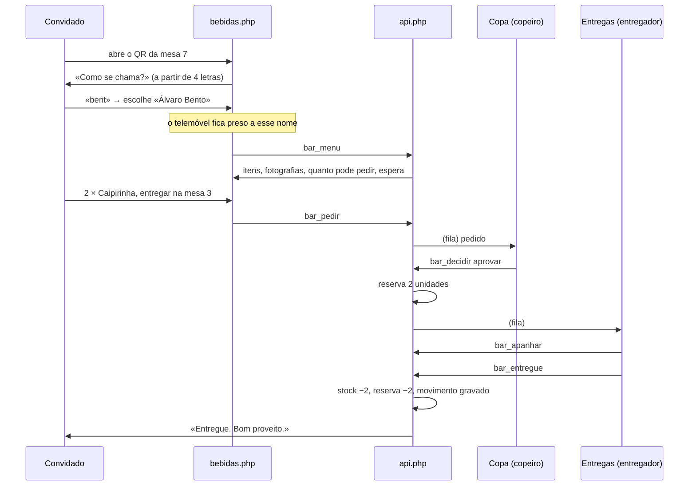
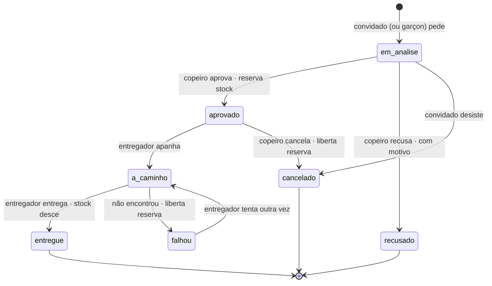

# Módulo «Bar» — estratégia de implementação

> Estado: **proposta**. Nada disto está construído.
> Contra que código: `casamento_web` no esquema **v35**, módulos de licença
> `convidados`, `porta`, `mesas`, `orcamento`, `impresso`, `digital`.
> Este documento é para ser seguido por quem o vai implementar — e discutido
> antes disso. Onde tomei uma decisão que o pedido não fixava, está marcada
> com **[decisão]**; onde vejo um problema no que foi pedido, está marcado com
> **[reparo]**, com a alternativa ao lado.
>
> **§25 é o desenho**, e é para cumprir como o resto: tokens, tipografia,
> medidas de toque, estados, movimento, acessibilidade — e a prova que os
> verifica. Lê-se antes de abrir o primeiro ficheiro, não depois de o ecrã
> estar feito.

---

## 1. O que é, em duas linhas

Em cada mesa há um QR e um link. O convidado abre-o, escreve quatro letras do
seu nome e escolhe-se na lista, vê as bebidas com fotografia e quantas pode
pedir, e faz o pedido para a mesa onde está — ou para outra, se entretanto
mudou de lugar. O pedido cai na copa, que aprova ou recusa; aprovado, aparece
ao entregador, que o leva e dá por entregue. O stock desce quando a bebida
chega à mesa, e não antes.

Três pessoas, três ecrãs, um pedido a passar por eles. Tudo o resto neste
documento é detalhe desses três ecrãs e das regras que os ligam.

---

## 2. As pessoas e os seus ecrãs

| Quem | Ecrã | Como entra | O que faz |
|---|---|---|---|
| **Convidado** | `bebidas.php` | Sem conta: pelo QR (ou link) da mesa, e escolhendo o seu nome numa caixa de procura | Vê o menu, escolhe a mesa de entrega, pede, acompanha o pedido, vê quanto falta para poder pedir outra vez |
| **Copeiro** | `copa.php` | Conta com papel `copeiro` | Triagem dos pedidos, stock em tempo real, limites da casa e **regras de cada convidado**, motivos de recusa, estatística |
| **Entregador** | `entregas.php` | Conta com papel `entregador` | Apanha pedidos aprovados, entrega, marca falhas, pede por conta de quem não tem rede |
| **Noivos** | `bar.php` | Conta de noivos (`admin`) | Monta o menu (categorias, itens, fotografias), abre e fecha o bar, imprime os QR das mesas, vê a estatística |

O entregador é o «garçon» / garçom. Uso *entregador* no código e
*garçon* nos textos que o convidado lê, que é a palavra dele.

Estes ecrãs não se parecem uns com os outros de propósito: são três registos
diferentes, e **§25 diz exactamente como cada um se desenha** — tokens,
tipografia, alvos de toque, estados, e a prova que os verifica. Quem for
implementar lê essa secção antes de abrir o primeiro ficheiro.

**[decisão]** Papéis novos, e não um papel só. O copeiro decide e o entregador
transporta: são responsabilidades diferentes e, num casamento grande, pessoas
diferentes. Num casamento pequeno a mesma conta pode ter os dois papéis — a
tabela `cw_acessos` passa a aceitar `copeiro` e `entregador` além de `noivos` e
`porteiro`, e nada impede duas linhas para o mesmo utilizador.

---

## 3. O percurso, do princípio ao fim



---

## 4. Como o convidado chega

Uma porta só: **o QR da mesa**.

`https://…/bebidas.php?m=TOKEN`, impresso e pousado em cada mesa, com o
endereço escrito por baixo em letras grandes para quem não consiga ler o
código. Não há link no convite impresso nem no digital — e não é esquecimento,
é o desenho certo por duas razões:

1. **Um convite não é uma pessoa.** «Família Bento» são quatro convidados, e o
   bar tem de saber qual deles está a pedir: os limites são de cada um, não da
   família. Um link no convite identificaria o convite, que é precisamente o
   que aqui não serve.
2. **O convite imprime-se semanas antes.** O bar é da noite: abre, fecha, muda
   de menu. Um QR impresso num cartão em Outubro para um bar que só existe em
   Dezembro é um QR que ninguém garante.

Ao abrir, a página pergunta o nome (§5). A mesa vem escolhida do QR que foi
lido — e pode ser trocada (§4.2).

### 4.1 A folha da mesa

`bar-qr.php` gera uma folha A4 com um cartão por mesa, para recortar e pousar:

- o nome da mesa em grande («Mesa 7»), que é o que o entregador vai procurar;
- o QR;
- o endereço escrito, curto, para quem prefere escrever;
- uma linha de rodapé: *sem rede? chame um garçom — ele faz o pedido por si*.

**Onde vive o token da mesa:** coluna nova `bar_token CHAR(12)` em `cw_mesas`,
gerada na migração para as mesas que já existem e ao criar uma mesa nova. Não é
segredo nenhum — está impresso em cima da mesa a noite inteira — e por isso não
dá para pedir: só escolhe a mesa. Reimprimir a folha gera tokens novos se se
pedir; por omissão mantém-nos, para não invalidar as folhas já em cima das
mesas.

### 4.2 A mesa de entrega escolhe-se

Numa festa, as pessoas levantam-se e trocam de mesa por acordo entre elas — é
o que acontece a partir do segundo copo. Por isso a mesa do QR é apenas a
**sugestão**, e não a resposta:

- no topo do menu, uma linha em permanência: **«Entregar na mesa 7»**, com o
  nome da mesa e um toque para trocar;
- trocar abre a lista de mesas do casamento (as que já existem em `cw_mesas`,
  pela mesma ordem da planta), com a do QR e a do convite no cimo;
- a escolha **fica no dispositivo**: quem se mudou para a mesa 3 não tem de o
  dizer outra vez em cada pedido;
- há uma entrada final na lista, «**não sei o número da mesa**», que manda o
  pedido sem mesa e obriga o entregador a procurar a pessoa pelo nome — melhor
  do que uma mesa errada, que faz o garçom dar duas voltas;
- o pedido guarda a mesa escolhida, e a copa vê as duas quando forem diferentes
  («pediu da mesa 7 · entregar na 3»), que é informação e não suspeita.

---

## 5. Quem é quem: nome, dispositivo e IP

Esta é a parte mais delicada do módulo, e a que mais merece ser lida devagar.

### 5.1 A caixa de procura

Ao abrir a folha da mesa, a página pergunta uma coisa só:

> **Como se chama?**
> Escreva pelo menos quatro letras do seu nome.

A partir da quarta letra, a caixa filtra a lista de convidados do casamento e
mostra até oito resultados. Cada resultado traz o nome e o convite a que
pertence — «Álvaro Bento · Família Bento» —, que é o que distingue dois
homónimos. Um toque escolhe, e o telemóvel fica preso àquele nome (§5.3).

Regras da procura:

| Regra | Porquê |
|---|---|
| **Mínimo de 4 letras** | Com menos, a caixa é um índice de toda a festa. Com quatro, quem procura já sabe o nome que procura |
| **Sem acentos e sem maiúsculas** | «alvaro» encontra «Álvaro» — a mesma normalização da procura do painel |
| **Procura em qualquer parte do nome** | Muita gente escreve o apelido |
| **No máximo 8 resultados** | Uma lista longa é uma lista para folhear, e folhear é o que não queremos |
| **Só quem chegou**, quando o módulo da porta está na licença e já houve entradas | Quem ainda não entrou não está a pedir bebidas |
| **Nunca mostra a mesa de outro** | O resultado diz o nome e o convite; onde a pessoa está sentada é dela |
| **Travão de sondagem** | 20 procuras por minuto por dispositivo; acima disso, espera |

E uma saída, sempre visível por baixo dos resultados:

> **Não encontro o meu nome** → *Chame um garçom: ele faz o pedido por si e
> avisa a copa.*

É a porta para quem chegou como acompanhante de última hora, para quem está na
lista com o nome de baptismo e responde por outro, e para quem escreveu mal.

### 5.2 **[reparo]** Sem link no convite, deixa de haver segredo

O pedido anterior queria impedir que um convidado pedisse em nome de outro, e a
resposta então era simples: **o código do convite era o segredo**, estava no
convite de cada um e não na mesa. Com o link só na mesa e o nome escolhido numa
lista, esse segredo desaparece — qualquer pessoa sentada a uma mesa pode
escrever quatro letras do nome do padrinho e pedir por ele.

Isto não tem remendo técnico: **um nome, numa festa, é coisa pública**. Quem
está na sala sabe os nomes de quem está na sala. Vale a pena dizê-lo com todas
as letras para que a decisão seja tomada de olhos abertos — e é uma decisão
defensável, porque o outro caminho (um segredo por pessoa, impresso e
distribuído) troca uma fraude improvável por um atrito certo em todos os
convidados.

O que fica de pé, por ordem de força:

1. **Um telemóvel, uma pessoa.** É a única barreira real, e é boa: quem quiser
   pedir por outro tem de o fazer do seu próprio telemóvel, o que deixa rasto e
   gasta a *sua* quota se a copa reparar (§5.3).
2. **A lista não se folheia.** Quatro letras.
3. **Só quem chegou aparece**, quando há porta.
4. **A copa vê a sala.** O copeiro conhece a festa e tem as bandeiras (§10);
   um convidado com três pedidos em dez minutos, vindos de telemóveis
   diferentes, salta à vista.
5. ~~**Um PIN, se a casa quiser.**~~ *Saiu do módulo — ver §27.1.* A definição `bar.pedir_pin` acrescentava quatro
   dígitos, pedidos depois de escolher o nome. **Desligado por omissão**,
   porque devolve o atrito que se quis tirar — mas fica lá para o casamento que
   faça questão.

   **O código é do CONVITE, não da pessoa**, e isso não é uma economia: o
   telemóvel da família já pode pedir por qualquer um dos seus (§5.3, primeira
   linha da tabela), portanto um segredo por pessoa fechava uma porta que está
   aberta de propósito. Um por convite devolve exactamente o segredo que se
   perdeu quando o link saiu do convite — quem sabe o nome do padrinho não
   sabe, por isso, o código do convite dele — e é uma linha a mais no convite
   que já se imprime. Os códigos saem em `bar-qr.php`, numa folha à parte que
   começa em página nova, porque não é para andar à vista de ninguém.

   **Há travão, porque quatro dígitos sem travão são teatro:** dez mil
   tentativas são uma tarde de trabalho para um guião. Cinco erros seguidos
   fecham *aquele convite* por cinco minutos. Conta-se contra o convite atacado
   e não contra o telemóvel de quem tenta — um contador no telemóvel apaga-se
   com o testemunho, e um contador no IP tranca a sala inteira (§5.4). O preço
   é que se pode trancar uma família de propósito; paga-se de bom grado, porque
   é curto, porque a copa levanta o travão num clique a partir da ficha dela, e
   porque com o convite travado **o garçom continua a pedir por eles**
   (§5.5). Nunca se perde uma bebida por causa de um código.

   Um guião determinado, com muitos convites e tempo, ainda assim adivinha um
   código. Diz-se aqui em vez de se fingir o contrário: a barreira que este
   módulo cumpre com verdade é a do telemóvel, e o PIN é uma segunda tranca,
   não um cofre.

### 5.2.1 Pedir por outro convidado, da própria página

Numa mesa há sempre quem não tenha o telemóvel à mão, quem o tenha sem bateria,
e quem simplesmente não queira lidar com aquilo — e pede ao vizinho. A página
do convidado tem por isso uma pastilha **«pedir por outra pessoa»**: procura-se
o nome, escolhe-se, e o pedido segue no nome dela.

**Isto não abre uma porta nova.** Já se podia pedir por outra pessoa antes, e
pela porta pior: trocando de nome no telemóvel (§5.3). Só que essa troca
**prende o aparelho** à outra pessoa, e a partir daí o pedido dizia que quem
pediu foi ela — quem pediu de facto desaparecia, e as bebidas seguintes saíam
todas no nome errado até alguém reparar. Pedir «por» deixa **melhor** rasto do
que a porta que substitui: o pedido guarda os dois nomes, e o telemóvel
continua de quem é.

O que se manteve, e é o que faz a coisa não ser um buraco:

| | |
|---|---|
| **A quota é de quem bebe** | Os limites (§8) contam-se contra a pessoa nomeada. Pedir por outro não é maneira de furar um tecto — é maneira de gastar o dela. Uma regra que a proíba trava o pedido, tenha-o feito quem o tiver feito |
| **O menu é o dela** | Com «por», o menu vem com os tectos e as esperas de quem vai beber. Mostrar as minhas quotas e recusar no fim seria uma promessa a fingir |
| **Dentro do convite é livre** | Como já era: a família é a unidade doméstica de todo o módulo |
| **Para outro convite obedece a `bar.trocar_nome`** | O mesmo interruptor que governa a troca de nome, porque é a mesma pergunta: este telemóvel pode agir por outra família? |
| **Com o PIN ligado, outro convite exige o código dele** | Sem isto o PIN não valia nada — bastava não trocar de nome e pedir «pelo padrinho» para o contornar por inteiro |
| **A copa vê os dois nomes** | «Convidado Três · pedido por Convidada Dois», na fila e no ecrã das entregas |
| **Volta-se a si sozinho** | Depois de cada pedido a pastilha apaga-se. Um «a pedir para outro» esquecido ligado dava a ronda seguinte inteira em nome do vizinho, à conta dele — e é o erro fácil de cometer e caro de desfazer |

Quem lançou o pedido também o pode cancelar, e vê-o na sua lista marcado «para
X»: quem pediu pela mãe é quem vai querer saber se já chegou. A conta pessoal
— o «já pediu 3 cervejas» — continua a ser só a dele: a bebida da mãe não lhe
entra na conta.

### 5.3 O telemóvel prende-se ao nome

No momento em que alguém se escolhe na lista, o browser recebe um testemunho
assinado (cookie `bar_disp`, `HttpOnly`, `SameSite=Lax`, válido até ao fim do
evento) e nasce uma linha em `cw_bar_dispositivos` a ligar aquele telemóvel
àquela pessoa.

**[decisão] Trocar de nome no mesmo telemóvel:**

| Caso | O que acontece | Porquê |
|---|---|---|
| Outro nome **do mesmo convite** | Livre, e sem aviso | O telemóvel da família é um só; a mãe pede, depois pede pelo filho. É uso normal, e o convite é a unidade doméstica |
| Nome **de outro convite** | Permitido mas **assinalado à copa**, e a definição `bar.trocar_nome` pode fechá-lo de vez | É aqui que a fraude vive — e também o telemóvel emprestado a quem ficou sem bateria |
| Mesmo nome **noutro telemóvel** | Permitido; a copa vê a bandeira | Um telemóvel morre, pega-se noutro |

O copeiro solta um dispositivo num clique quando a vida der um nó.

### 5.4 O IP: registo, aviso ou tranca

> **Revogado em §29.1.** Isto descreve os três modos que existiram até à quarta
> passagem. Saíram todos: os convidados pedem pela rede dos próprios telemóveis,
> e um endereço deixou de dizer alguma coisa sobre quem está a pedir. O
> raciocínio abaixo continua certo — é por isso que fica escrito —, mas já não
> descreve o que está instalado.


Foi pedido que os IP sejam rastreados. Rastrear, sim — em cada pedido e em cada
ligação do dispositivo; o registo de ações já guarda o IP desde a v35. Mas
usá-lo como identidade parte-se num casamento real: **os convidados que estejam
na rede sem fios do salão saem todos pelo mesmo endereço público**. Com uma
regra do género «um IP, um convidado», o primeiro a pedir tranca a festa
inteira; com «um IP, muitos convidados», a regra não impede nada. É o pior de
dois mundos, e não é culpa da regra — é de NAT.

Por isso o IP entra com três modos numa definição (`bar.ip_modo`):

| Modo | O que faz | Quando serve |
|---|---|---|
| `registo` **(origem)** | Grava o IP em tudo. Não bloqueia nada. | Salão com Wi-Fi partilhado — o caso comum |
| `aviso` | Além de gravar, marca na copa os pedidos em que N nomes diferentes usam o mesmo IP em pouco tempo | Quando se quer vigiar sem travar |
| `estrito` | Um IP serve um nome de cada vez; um segundo é recusado com «peça ao garçom» | Eventos em que cada convidado usa dados móveis, ou testes |

A promessa que o sistema pode cumprir com verdade é a do **dispositivo**, não a
do IP: um telemóvel, uma pessoa. É essa que a interface explica ao convidado.

### 5.5 Quem não tem rede

É o desfecho previsto no pedido, e fecha o círculo: quem não consegue abrir a
página pede ao entregador, que lança o pedido por conta dele em `entregas.php`
(ver §12). Esse pedido fica marcado como feito por terceiro — `criado_por` é a
conta do entregador, `por_conta_de` é o convidado — e conta para os limites
dele como qualquer outro. Sem esta porta, o módulo excluía exactamente quem tem
menos meios.

---

## 6. O menu e o stock

### 6.1 Três números por item, e um livro-razão

| Número | O que é | Quando muda |
|---|---|---|
| `stock` | O que existe fisicamente | Entrada (reposição), entrega, acerto, quebra |
| `reservado` | O que está prometido a pedidos aprovados por entregar | Aprovação (+), entrega (−), recusa/cancelamento/falha (−) |
| **`disponivel`** = `stock − reservado` | O que se pode prometer agora | Consequência dos dois |

O stock real desce **na entrega**, como foi pedido. A reserva existe para que
duas aprovações não prometam a mesma última garrafa: sem ela, com o stock a
descer só no fim, a copa aprovaria dez últimas cervejas.

Cada alteração escreve uma linha em `cw_bar_stock_mov` — quantidade, motivo,
pedido, quem, quando. O stock é uma coluna (leitura barata, em tempo real) e o
livro-razão é a verdade contra a qual se confere. Discordarem é um bug, e há
uma prova que os compara.

### 6.2 Quanto é que este convidado pode pedir deste item

```
podePedir(convidado, item) = min(
    disponivel(item),                       // o que há
    item.max_por_pedido,                    // quanto cabe num pedido só
    restanteDoLimite(convidado, item),      // desta bebida, para esta pessoa (§8)
    restanteDoLimite(convidado, categoria), // desta família de bebidas
    restanteDoLimiteGeral(convidado)        // de tudo
)
```

O `convidado` é aqui uma **pessoa** (`cw_convidados.id`), e não um convite:
como o nome se escolhe na lista (§5.1), o bar sabe sempre quem está a pedir. É
o que torna exacto o limite por bebida e por pessoa.

É este número que aparece ao lado da fotografia — «pode pedir 2» —, e é ele que
o servidor volta a calcular no momento do pedido. O que a página mostra é uma
promessa; o que o servidor calcula é a decisão.

### 6.3 A fotografia

Mesmas regras das fotografias do convite, que já estão feitas e provadas:
`getimagesize` a mandar (e não o nome do ficheiro), jpg/png/webp, mínimo
400×400, máximo 5 MB, guardadas em `assets/bar/<casamento>/`. Miniatura
quadrada gerada no envio (o menu do convidado carrega-se num telemóvel, numa
rede de salão: 30 fotografias a tamanho real são um menu que não abre).

**[decisão]** Recorte quadrado com ponto de enquadramento, como as secções do
convite: uma garrafa ao alto e um copo ao baixo têm de caber na mesma grelha.

---

## 7. O pedido: estados e transições



| De → Para | Quem | Stock | Reserva | Notas |
|---|---|---|---|---|
| — → `em_analise` | Convidado, entregador | — | — | Valida limites e disponibilidade |
| `em_analise` → `aprovado` | Copeiro | — | **+q** | Recusa automática se entretanto faltar stock |
| `em_analise` → `recusado` | Copeiro | — | — | Exige motivo (predefinido ou escrito) |
| `em_analise` → `cancelado` | Convidado | — | — | Só enquanto ninguém decidiu |
| `aprovado` → `a_caminho` | Entregador | — | — | Fica com o nome de quem apanhou |
| `a_caminho` → `entregue` | Entregador | **−q** | **−q** | Grava movimento com o pedido |
| `a_caminho` → `falhou` | Entregador | — | **−q** | Com motivo curto; volta à fila da copa |
| `aprovado` → `cancelado` | Copeiro | — | **−q** | Última linha de defesa |

**[decisão]** Nada expira sozinho. Um pedido esquecido na fila fica lá, a
envelhecer à vista (a fila ordena-se pelo mais velho e pinta-se de âmbar aos 5
minutos, de vermelho aos 10). Expirar sozinho seria o sistema a decidir o que a
copa não decidiu — e a bebida que não chegou fica sem explicação.

---

## 8. Os limites

Uma tabela só, `cw_bar_limites`, com quatro eixos: **o quê**, **de quem**,
**quanto** e **em quanto tempo**.

| Campo | Valores | |
|---|---|---|
| `escopo` | `item` \| `categoria` \| `tudo` | sobre o que conta |
| `alvo_id` | id do item/categoria, 0 em `tudo` | |
| `sujeito` | `convidado` \| `casa` | de quem é o limite |
| `alvo_convidado_id` | id de uma pessoa, ou vazio | a quem se aplica: vazio = a todos |
| `alvo_convite_id` | id de um convite, ou vazio | idem, para uma família inteira |
| `unidade` | `bebidas` \| `pedidos` | o que se conta |
| `quantidade` | inteiro; **0 = proibido** | |
| `janela_min` | 0 = o evento inteiro | de quanto em quanto tempo se renova |
| `mensagem` | texto, ou vazio | o que o convidado lê quando bate na regra |
| `nota` | texto, ou vazio | porquê — só o pessoal vê |
| `vigora_em` | data/hora, ou vazio | a partir de quando a regra vale |
| `expira_em` | data/hora, ou vazio | até quando — as duas juntas fazem uma janela |
| `criado_por`, `criado_em` | | quem a pôs, e quando |

Exemplos que a copa vai querer no primeiro dia:

| Regra | escopo | alvo | sujeito | unidade | qtd | janela |
|---|---|---|---|---|---|---|
| «2 caipirinhas por convidado, ao todo» | item | Caipirinha | convidado | bebidas | 2 | 0 |
| «1 whisky por convidado, de hora a hora» | item | Whisky | convidado | bebidas | 1 | 60 |
| «1 pedido de 20 em 20 minutos» | tudo | — | convidado | pedidos | 1 | 20 |
| «no máximo 3 bebidas de cada vez» | tudo | — | convidado | bebidas | 3 | 0 (por pedido) |
| «a copa serve 40 bebidas por 10 minutos» | tudo | — | casa | bebidas | 40 | 10 |
| «nada de destilados antes das 21h» | categoria | Destilados | casa | bebidas | 0 | 0, `expira_em` às 21h |
| «a partir das 2h, uma bebida por hora» | tudo | — | convidado | bebidas | 1 | 60, `vigora_em` às 2h |

### 8.0 O limite de uma bebida, e o limite de uma pessoa

São duas coisas, e a tabela dá as duas com os mesmos campos:

**Por bebida, para toda a gente** — «cada convidado pode levar duas
caipirinhas». `escopo=item`, `sujeito=convidado`, os dois alvos vazios. É o
caso comum, e é o que a copa monta ao lado de cada item, no ecrã do menu: uma
caixinha «máximo por convidado» junto ao stock, sem ter de ir a lado nenhum
declarar regras.

**Por bebida, para uma pessoa** — «o padrinho fica-se por um whisky», «a Rita
está grávida: nada de álcool», «o motorista da carrinha só bebe sem álcool».
A mesma linha, com `alvo_convidado_id` preenchido. Faz-se a partir da ficha do
convidado, no ecrã da copa: procura-se o nome (a mesma caixa de §5.1), e a
ficha mostra o que ele já levou e deixa pôr-lhe tectos próprios — por bebida,
por categoria («destilados: 0») ou de tudo.

**Precedência:** o limite mais específico **substitui** o mais geral, não se
soma a ele. Para uma pessoa e uma bebida, procura-se por esta ordem, e a
primeira que existir é a que manda:

```
1. limite da PESSOA para o ITEM           → «o padrinho: 1 whisky»
2. limite do CONVITE para o ITEM          → «a mesa dos jovens: 2 shots»
3. limite da PESSOA para a CATEGORIA      → «a Rita: 0 destilados»
4. limite do CONVITE para a CATEGORIA
5. limite geral para o ITEM               → «2 caipirinhas por convidado»
6. limite geral para a CATEGORIA
7. limite da PESSOA para TUDO             → «a Rita: 3 bebidas, ao todo»
8. limite do CONVITE para TUDO
9. limite geral de TUDO                   → «6 bebidas por convidado»
```

A ordem tem duas chaves, e por esta ordem: primeiro quão específica é a regra
sobre a **bebida** (uma bebida > uma gaveta > tudo), e só depois sobre **quem**
(uma pessoa > um convite > toda a gente). É o que faz «2 caipirinhas por
convidado» ganhar a «a Rita: 6 bebidas ao todo» quando o que está em causa é
uma caipirinha: a regra que fala da bebida é a que sabe do assunto.

Somar era a alternativa, e é pior: dar um tecto individual a alguém passaria a
aumentar-lhe a quota em vez de a fixar, que é o contrário do que quem o escreve
está a tentar fazer.

Os limites de sujeito `casa` (§8.2) correm sempre por cima, e nenhum limite
individual os levanta: são o caudal da copa, e o caudal é de todos.

### 8.0.1 As regras de um convidado, na prática

É a mesma tabela, mas merece um ecrã próprio, porque é uma coisa que se faz a
correr, no meio da festa, com uma pessoa à frente — «este senhor já vai no
quinto whisky», «esta senhora está grávida», «aquele rapaz conduz».

**Três números dizem tudo.** A gramática das regras é pequena de propósito:

| O que se quer | quantidade | janela | Lê-se |
|---|---|---|---|
| **Proibir** | `0` | — | «não pode pedir *isto*» |
| **Um tecto para a noite** | `N` | `0` | «no máximo *N*, ao todo» |
| **Um intervalo entre pedidos** | `N` | `M` | «*N* a cada *M* minutos» |

Cruzadas com o **escopo** — um item, uma categoria, ou tudo — e com a
**unidade** — bebidas ou pedidos —, estas três formas cobrem tudo o que foi
pedido: o que pode pedir, em que quantidade, e de quanto em quanto tempo, por
bebida ou em geral.

**O ecrã: uma frase, não um formulário.** Na ficha do convidado (§10), as
regras escrevem-se como quem fala, com listas em vez de campos:

```
Álvaro Bento
├── já levou:  3 cervejas · 1 whisky · 2 águas          [ver o histórico]
├── regras desta pessoa
│   ⦿ pode pedir  [Whisky      ▾]  no máximo [1 ▾]  a cada [2 horas   ▾]
│   ⦿ não pode pedir            [Destilados ▾]
│   ⦿ pode fazer  [1 ▾] pedido  a cada [30 minutos ▾]
│   ⦿ pode pedir  [Água        ▾]  sem limite
│   [ + regra ]
├── porquê (só nós vemos):  «pediu-nos para o travarmos»
└── telemóveis em nome dele:  1   [soltar]
```

Cada linha da lista é uma linha da tabela, e lê-se em voz alta sem tradução.
A última coluna de cada regra tem um ✕ que a levanta.

**Uma regra vale de imediato** — inclusive para os pedidos que já estejam na
fila por decidir. Um pedido que deixou de caber aparece ao copeiro com um aviso
(«já não cabe nas regras de Álvaro Bento») e um botão para o recusar com o
motivo certo já escolhido. Não se recusa sozinho: quem pôs a regra pode muito
bem querer servir o copo que já estava pedido.

**Quem pode pôr regras:** o copeiro e os noivos. O entregador não — ele serve,
não julga. Toda a regra fica no registo de ações com o nome de quem a pôs
(`bar_regra`), para que ninguém ande a perguntar de onde veio.

**Regras que passam, e regras que ainda não chegaram.** `expira_em` serve o «só
até à hora do bolo» e o «meia hora sem nada»; `vigora_em` é o campo simétrico,
e serve o «nada de destilados antes das 21h» e o «a partir das 2h, uma bebida
por hora». Vazios os dois, a regra dura o que a festa durar.

No ecrã são duas horas, «a partir das» e «até às», porque é assim que se pensa
no meio de uma festa. Uma festa atravessa a meia-noite, o que torna «às 2h»
ambíguo, e resolve-se com uma assimetria que é a leitura certa dos dois casos:
um **princípio** que já passou hoje quer dizer que a regra já começou
(empurrá-lo para amanhã calava-a a noite inteira); um **fim** que já passou
hoje quer dizer a madrugada seguinte (deixá-lo hoje matava a regra no instante
em que se escrevesse).

Uma regra fora da sua hora **não é levantada** — está escrita, à espera. Não
conta para o veredicto, mas continua à vista na ficha, esbatida e com a frase
«ainda não são horas» ao lado. Desaparecer do ecrã lia-se como «não guardou», e
escrevia-se outra vez.

**O que o convidado lê.** Nunca o motivo — esse é assunto de quem o escreveu.
Ou a `mensagem` que a copa tenha escrito para ele, ou o texto de origem (§9).
Uma proibição diz que a bebida não está disponível para ele; um intervalo
mostra a contagem, como qualquer outra espera. A diferença entre «a casa
limita» e «limitámos-lhe a si» não aparece no ecrã dele — e é de propósito:
essa conversa faz-se de pessoa para pessoa, não por um telemóvel.

### 8.1 Como se calcula a espera

Para um limite `L` atingido, a espera é o tempo que falta até o evento mais
antigo dentro da janela sair dela:

```
espera(L) = (instante_do_mais_antigo_na_janela + janela) − agora
esperaPessoal = max(espera(L)) sobre os limites de sujeito=convidado atingidos
esperaDaCasa  = max(espera(L)) sobre os limites de sujeito=casa atingidos
proximoPedido = max(esperaPessoal, esperaDaCasa)
```

O que conta para a janela: **[decisão]** os pedidos que não foram recusados
nem cancelados — isto é, o que a copa aceitou fazer. Um pedido recusado não
gasta a quota de ninguém; seria castigar duas vezes.

### 8.2 O ritmo da casa

O limite de sujeito `casa` é o que o pedido chama «conjugado com o ritmo de
consumo geral». Funciona como um caudal: enquanto a copa estiver dentro do
caudal, ninguém dá por ele; quando o ultrapassa, a espera de toda a gente sobe
ao mesmo tempo, e a mensagem que o convidado lê muda de tom — não é ele que
pediu de mais, é a copa que está cheia. A distinção importa: a primeira
mensagem repreende, a segunda explica.

A copa vê o caudal em tempo real (bebidas nos últimos 10 minutos contra o
limite) e pode afrouxá-lo ou apertá-lo com um deslizador, sem sair do ecrã.

---

## 9. A espera gentil

O que o convidado vê quando não pode pedir agora. **Os textos fazem parte do
módulo** — são eles que decidem se isto parece uma casa que cuida ou um
torniquete.

**Limite pessoal do item, ainda com outras opções:**
> Já pediu as suas 2 caipirinhas. Há mais para provar — a **água de coco** e o
> **sumo de maracujá** saem já.

**Regra posta só a esta pessoa** (§8.0.1) — o texto nunca denuncia o motivo,
que é assunto de quem a pôs. Ou a mensagem que a copa escreveu, ou esta:
> Esta bebida não está disponível para si esta noite. Fale com um garçom se
> achar que é engano.

**Regra pessoal com intervalo** — indistinguível, no ecrã do convidado, de
qualquer outra espera:
> O próximo **whisky** abre em **01:12:40**. Entretanto, saem já a **água de
> coco** e o **sumo de maracujá**.

**Limite pessoal de tempo:**
> Fica bem assim por uns minutos. O próximo pedido abre em **08:32**.
> _(contagem a andar, e o menu a recarregar-se sozinho quando chegar a zero)_

**Ritmo da casa:**
> A copa está a dar vazão a muitos pedidos neste momento. O seu abre em
> **03:10** — e fica na frente quando abrir.

**Sem stock:**
> A **cerveja preta** acabou. Da mesma família ainda há **cerveja branca** e
> **cidra**.

A contagem corre no browser, ao segundo, como a do cabeçalho — mesmo padrão,
mesma razão: uma contagem calculada no servidor nasce velha. O servidor manda
`proximo_em_s`; o cliente conta e recarrega o menu no fim.

### 9.1 As alternativas

Quando um item está travado, sugerem-se até três da **mesma categoria** que
passem por todos os testes *neste momento* — há stock, cabem no limite pessoal,
cabem no ritmo. Se o que trava é o ritmo da casa, não se sugere nada (não há
nada a sugerir) e diz-se só quanto falta. Sugerir o que também está travado é
pior do que não sugerir.

---

## 10. A copa (`copa.php`)

Um ecrã, três zonas, feito para um telemóvel apoiado no balcão.

**A fila.** Cartões por ordem de chegada, o mais velho no topo, com: o nome do
convidado, a mesa **de entrega** (e a do QR ao lado, quando são diferentes — «da
7, entregar na 3»), o que pediu (com miniaturas), há quanto tempo espera, e as
bandeiras que houver:

- o telemóvel escolheu um nome de **outro convite** (§5.3);
- o mesmo nome está a pedir de **dois telemóveis**;
- **vários nomes** do mesmo IP em pouco tempo (só nos modos `aviso` e
  `estrito`, §5.4);
- o pedido veio **sem mesa** («não sei o número»);
- o convidado **já foi recusado** hoje.

Dois botões grandes: **Aprovar** e **Recusar**. Recusar abre os motivos.

**A ficha de um convidado.** A mesma caixa de procura de §5.1, agora do lado da
copa — sem o mínimo de quatro letras, que aqui quem procura tem conta e é o seu
trabalho. Abre-se a ficha e ali está: o que a pessoa já levou, o que lhe falta
de cada limite, os telemóveis presos ao nome dela, e **as regras dela** —
o que pode pedir, quanto, e de quanto em quanto tempo, escritas como frases e
levantadas com um ✕ (§8.0.1). É deste ecrã que sai o «este senhor fica-se por
aqui» sem que ninguém tenha de o dizer à mesa.

**Motivos de recusa** — predefinidos, editáveis, mais um campo livre. Semeados:

- Esta bebida acabou
- Já chegou ao limite desta bebida
- A copa está sem capacidade neste momento
- Pedido repetido
- Não conseguimos identificar quem pediu
- Não servimos esta bebida a menores

**O stock, em tempo real.** Uma linha por item: fotografia, nome, `disponivel`,
`reservado`, e um semáforo pela previsão de rutura (stock a dividir pelo ritmo
das últimas duas horas → «dá para ~40 min»). Botões de **repor** (+12, +24,
número à escolha) e de **acerto** (partiu-se, contou-se mal), cada um a exigir
uma nota curta e a gravar movimento.

**Os limites e o caudal**, como em §8, com um interruptor grande de **abrir /
fechar o bar** — que é o que se carrega quando é a hora do bolo.

---

## 11. As entregas (`entregas.php`)

Feito para andar com ele na mão, com o mesmo cuidado que a página do porteiro
já tem (letras grandes, alvos grandes, funciona com uma mão).

- **Fila de aprovados**, ordenada por antiguidade, com a mesa de entrega em
  destaque — que é para onde a pessoa tem de ir. Quem pediu sem saber a mesa
  aparece com o nome em destaque e a mesa do convite em letra pequena, como
  pista de por onde começar a procurar.
- **Apanhar** — o pedido passa a ser daquele entregador e sai da fila dos
  outros. Evita dois entregadores a levar o mesmo tabuleiro.
- **Entregue** — um toque. É aqui que o stock desce.
- **Não entregue** — com um motivo de uma linha (não estava na mesa, mudou-se,
  desistiu). Volta à copa.
- **Pedir por conta de** — §12.
- **Os meus tempos** — quantas entregas, tempo médio, a comparação com a média
  da casa. Não como vigilância: como o entregador saber se está a ir bem.

### Os tempos, e o que cada um diz

| Tempo | Conta de | Diz |
|---|---|---|
| Análise | pedido → decisão | Se a copa está a acompanhar |
| Espera de recolha | decisão → apanhado | Se faltam entregadores |
| Percurso | apanhado → entregue | Se o salão é grande ou o entregador se perdeu |
| **Total sentido** | pedido → entregue | O único que o convidado conhece |

---

## 12. O pedido feito pelo garçon

Em `entregas.php`, «Pedir por…»: procura o convidado pelo nome ou pela mesa
(a mesma procura da porta — do lado do pessoal não há mínimo de quatro letras
nem tecto de resultados; quem está autenticado pode ver a lista, que é o
trabalho dele), escolhe a mesa de entrega e as bebidas, e lança. O pedido:

- conta para os limites daquele convidado, como qualquer outro;
- guarda `criado_por` (a conta do entregador) e `por_conta_de` (o convite);
- aparece na copa marcado como «pedido no salão», para o copeiro saber que ali
  não houve ecrã nenhum;
- **[decisão]** passa pela copa como os outros, por omissão. Uma definição
  (`bar.garcon_direto`) permite aprová-los de imediato quando a casa confia no
  seu pessoal e quer poupar um passo — mas o padrão é a copa ver tudo, porque é
  a copa que sabe do stock.

---

## 13. Estatística

**Geral (copa e noivos):**
- Consumo por item, por categoria, por hora, por mesa.
- Ritmo: bebidas por 10 minutos, com a linha do limite por cima.
- Recusas por motivo — a lista que diz o que correu mal na festa.
- Tempos médios (§11), e os piores casos, que são os que se lembram.
- Previsão de rutura por item.
- Top de mesas e horas de ponta — serve para o ano seguinte e para a conta do
  fornecedor.

**Pessoal (copa, e o próprio convidado no seu ecrã):**
- O que pediu, quando, e o que lhe foi recusado e porquê.
- Quanto lhe falta de cada limite.
- O convidado vê **só o seu** — o da pessoa a que o telemóvel está preso, e nem
  sequer o do resto da família. A copa vê o de todos. Ninguém vê o de outro
  convidado a partir do ecrã público, e há uma prova que tenta e falha.

---

## 14. O esquema (v36, e v37 para o resto)

Tudo com `casamento_id` à cabeça e índice por ele: a vigia de âmbito
(`LigacaoAmbito`) reclama de qualquer consulta a uma tabela do casamento que
não o mencione, e estas tabelas entram na lista dela.

```sql
CREATE TABLE cw_bar_categorias (
  id INT AUTO_INCREMENT PRIMARY KEY,
  casamento_id INT NOT NULL,
  nome VARCHAR(60) NOT NULL,
  ordem INT NOT NULL DEFAULT 0,
  cor CHAR(7) DEFAULT NULL,
  KEY (casamento_id, ordem)
);

CREATE TABLE cw_bar_itens (
  id INT AUTO_INCREMENT PRIMARY KEY,
  casamento_id INT NOT NULL,
  categoria_id INT DEFAULT NULL,
  nome VARCHAR(80) NOT NULL,
  descricao VARCHAR(200) DEFAULT NULL,
  foto VARCHAR(255) DEFAULT NULL,
  foto_pos VARCHAR(20) DEFAULT '50 50 100',   -- enquadramento, como no convite
  alcoolico TINYINT(1) NOT NULL DEFAULT 0,
  volume_ml INT DEFAULT NULL,
  stock INT NOT NULL DEFAULT 0,
  reservado INT NOT NULL DEFAULT 0,
  max_por_pedido INT NOT NULL DEFAULT 2,
  estado ENUM('ativo','oculto') NOT NULL DEFAULT 'ativo',
  ordem INT NOT NULL DEFAULT 0,
  criado_em DATETIME NOT NULL,
  atualizado_em TIMESTAMP(3) DEFAULT CURRENT_TIMESTAMP(3) ON UPDATE CURRENT_TIMESTAMP(3),
  KEY (casamento_id, estado, ordem),
  KEY (casamento_id, atualizado_em)
);

CREATE TABLE cw_bar_stock_mov (
  id BIGINT AUTO_INCREMENT PRIMARY KEY,
  casamento_id INT NOT NULL,
  item_id INT NOT NULL,
  delta INT NOT NULL,                          -- +entrada, −saída
  motivo ENUM('entrada','entrega','acerto','quebra','devolucao') NOT NULL,
  pedido_id BIGINT DEFAULT NULL,
  utilizador VARCHAR(80) DEFAULT NULL,
  nota VARCHAR(160) DEFAULT NULL,
  criado_em DATETIME NOT NULL,
  KEY (casamento_id, item_id, criado_em),
  KEY (casamento_id, pedido_id)
);

CREATE TABLE cw_bar_pedidos (
  id BIGINT AUTO_INCREMENT PRIMARY KEY,
  casamento_id INT NOT NULL,
  codigo_curto CHAR(4) NOT NULL,               -- «A47», para se dizer em voz alta
  convidado_id INT NOT NULL,                   -- a pessoa: escolhe-se sempre (§5.1)
  convite_id INT NOT NULL,                     -- o convite dela, para os limites de família
  mesa_id INT DEFAULT NULL,                    -- a de ENTREGA; vazio = «não sei a mesa»
  mesa_qr_id INT DEFAULT NULL,                 -- a mesa cujo QR foi lido, se foi
  estado ENUM('em_analise','aprovado','a_caminho','entregue',
              'recusado','cancelado','falhou') NOT NULL DEFAULT 'em_analise',
  motivo_id INT DEFAULT NULL,
  motivo_texto VARCHAR(200) DEFAULT NULL,
  dispositivo CHAR(64) DEFAULT NULL,           -- hash do testemunho
  ip VARCHAR(45) DEFAULT NULL,
  criado_por VARCHAR(80) DEFAULT NULL,         -- vazio = o próprio convidado
  criado_em DATETIME(3) NOT NULL,
  decidido_por VARCHAR(80) DEFAULT NULL,
  decidido_em DATETIME(3) DEFAULT NULL,
  entregue_por VARCHAR(80) DEFAULT NULL,
  apanhado_em DATETIME(3) DEFAULT NULL,
  entregue_em DATETIME(3) DEFAULT NULL,
  atualizado_em TIMESTAMP(3) DEFAULT CURRENT_TIMESTAMP(3) ON UPDATE CURRENT_TIMESTAMP(3),
  KEY (casamento_id, estado, criado_em),
  KEY (casamento_id, convite_id, criado_em),
  KEY (casamento_id, atualizado_em)
);

CREATE TABLE cw_bar_pedido_itens (
  id BIGINT AUTO_INCREMENT PRIMARY KEY,
  casamento_id INT NOT NULL,
  pedido_id BIGINT NOT NULL,
  item_id INT NOT NULL,
  nome_no_momento VARCHAR(80) NOT NULL,        -- o menu muda; o pedido não
  quantidade INT NOT NULL,
  KEY (casamento_id, pedido_id),
  KEY (casamento_id, item_id)
);

CREATE TABLE cw_bar_motivos (
  id INT AUTO_INCREMENT PRIMARY KEY,
  casamento_id INT NOT NULL,
  texto VARCHAR(120) NOT NULL,
  ordem INT NOT NULL DEFAULT 0,
  ativo TINYINT(1) NOT NULL DEFAULT 1,
  KEY (casamento_id, ativo, ordem)
);

CREATE TABLE cw_bar_limites (
  id INT AUTO_INCREMENT PRIMARY KEY,
  casamento_id INT NOT NULL,
  escopo ENUM('item','categoria','tudo') NOT NULL,
  alvo_id INT NOT NULL DEFAULT 0,              -- o item ou a categoria
  sujeito ENUM('convidado','casa') NOT NULL,
  alvo_convidado_id INT DEFAULT NULL,          -- só para esta pessoa (§8.0)
  alvo_convite_id INT DEFAULT NULL,            -- só para este convite
  unidade ENUM('bebidas','pedidos') NOT NULL DEFAULT 'bebidas',
  quantidade INT NOT NULL,                     -- 0 = proibido (§8.0.1)
  janela_min INT NOT NULL DEFAULT 0,           -- 0 = a noite inteira
  mensagem VARCHAR(160) DEFAULT NULL,          -- o que o convidado lê
  nota VARCHAR(160) DEFAULT NULL,              -- o porquê, só para o pessoal
  expira_em DATETIME DEFAULT NULL,
  criado_por VARCHAR(80) DEFAULT NULL,
  criado_em DATETIME NOT NULL,
  ativo TINYINT(1) NOT NULL DEFAULT 1,
  KEY (casamento_id, ativo),
  KEY (casamento_id, alvo_convidado_id)
);

CREATE TABLE cw_bar_dispositivos (
  id BIGINT AUTO_INCREMENT PRIMARY KEY,
  casamento_id INT NOT NULL,
  token_hash CHAR(64) NOT NULL,
  convidado_id INT NOT NULL,                   -- a pessoa que este telemóvel é
  convite_id INT NOT NULL,
  trocas INT NOT NULL DEFAULT 0,               -- quantas vezes mudou de nome (§5.3)
  primeiro_ip VARCHAR(45) DEFAULT NULL,
  ultimo_ip VARCHAR(45) DEFAULT NULL,
  criado_em DATETIME NOT NULL,
  ultimo_em DATETIME NOT NULL,
  bloqueado TINYINT(1) NOT NULL DEFAULT 0,
  UNIQUE KEY (token_hash),
  KEY (casamento_id, convidado_id)
);

ALTER TABLE cw_mesas ADD COLUMN bar_token CHAR(12) DEFAULT NULL;

-- v38: o convidado que pede por outro convidado. Não se aproveita o
-- criado_por que já existe: esse é a conta do PESSOAL, e um nome de convidado
-- lá dentro ficava indistinguível de um garçom — a copa deixava de saber se
-- o pedido veio do balcão ou da mesa 12.
ALTER TABLE cw_bar_pedidos ADD COLUMN criado_por_convidado_id INT DEFAULT NULL;

-- v37: a hora a que uma regra entra, e os quatro dígitos do convite.
ALTER TABLE cw_bar_limites ADD COLUMN vigora_em DATETIME DEFAULT NULL;
-- v39: o código do convite saiu do módulo (§27.1) e as colunas com ele.
ALTER TABLE cw_convites DROP COLUMN bar_pin;
ALTER TABLE cw_convites DROP COLUMN bar_pin_falhas;
ALTER TABLE cw_convites DROP COLUMN bar_pin_ate;
-- v39: o limiar de «a acabar», por bebida (§27.5), e a nota do garçom (§27.7).
ALTER TABLE cw_bar_itens   ADD COLUMN stock_minimo INT NOT NULL DEFAULT 8;
ALTER TABLE cw_bar_pedidos ADD COLUMN nota_entrega VARCHAR(240) DEFAULT NULL;

ALTER TABLE cw_acessos MODIFY papel
  ENUM('noivos','porteiro','copeiro','entregador') NOT NULL DEFAULT 'noivos';
```

Definições novas em `cw_definicoes` (por casamento): `bar.aberto`,
`bar.abre_as`, `bar.fecha_as`, `bar.ip_modo`, `bar.garcon_direto`,
`bar.mensagem_fechado`, `bar.so_maiores_aviso`,
`bar.trocar_nome`, `bar.procura_min` (4, por omissão).

**Migração** com os ajudantes que já existem (`migColuna`, `migIndice`), e a
`ESQUEMA_VERSAO` a subir para 36. As tabelas criam-se vazias: um casamento sem
o módulo nunca lhes toca.

**v38** é uma coluna só, `bar_pedidos.criado_por_convidado_id`: o convidado que
lançou o pedido, quando não é quem o bebe (§5.2.1).

**v37**, antes disso, para o que faltava: `bar_limites.vigora_em` (a hora a que uma
regra entra, simétrica de `expira_em`) e três colunas em `cw_convites` —
~~`bar_pin`, `bar_pin_falhas` e `bar_pin_ate`~~ *(largados na v39 — §27.1)*. O código vivia no convite e não na
pessoa pela razão de §5.2; as duas ao lado são o travão, e contam-se contra o
convite atacado e não contra quem tenta.

---

## 15. A API

Uma acção por linha, no `api.php`, com o prefixo `bar_`. As de escrita entram
em `acoesDeEscrita()`; as do casal e do pessoal entram em `acoesDoCasamento()`;
as públicas seguem o padrão do RSVP — `carregarConvite($conn, $codigo,
'codigo')` fixa o âmbito a partir do código, e o casamento tem de estar ativo e
com o módulo `bar` na licença.

### Público (convidado, sem sessão)

| Acção | Entra | Sai |
|---|---|---|
| `bar_mesa` | `m` (token) | A mesa, o estado do bar, e quem este telemóvel já é (se já é alguém) |
| `bar_procurar` | `q` (≥ 4 letras) | Até 8 nomes, cada um com o seu convite. Menos de 4 letras: erro pedagógico, não lista vazia |
| `bar_sou` | `convidado_id`, `pin?` | Prende o telemóvel a essa pessoa; devolve o testemunho e, se for troca, a bandeira que a copa vai ver |
| `bar_por_quem` | `por_id`, `pin?` | «Vou pedir por esta pessoa» — confirma-se ANTES de escolher as bebidas (§5.2.1) |
| `bar_mesas` | — | As mesas, para escolher a de entrega (§4.2) |
| `bar_menu` | `por?` | Categorias, itens (foto, disponível, quanto pode pedir), espera, limites. Com `por`, os limites são os de quem vai beber |
| `bar_pedir` | `itens[]`, `mesa_id?`, `por_id?`, `pin?` | Pedido criado, ou a recusa com o motivo e as alternativas |
| `bar_meus_pedidos` | — | Os pedidos desta pessoa, com estado e tempos |
| `bar_cancelar` | `pedido_id` | Só enquanto `em_analise` |
| `bar_pulso` | `desde` | O que mudou nos pedidos dela + a espera actual |

Todas exigem um telemóvel já identificado, menos `bar_mesa`, `bar_procurar` e
`bar_sou` — que são exactamente a porta de entrada.

### Copa

| Acção | Faz |
|---|---|
| `bar_fila` | A fila por decidir, com as bandeiras |
| `bar_decidir` | `aprovar` \| `recusar` (+`motivo_id`/`motivo_texto`) |
| `bar_cancelar_copa` | Cancela um aprovado, libertando a reserva |
| `bar_stock_repor` / `bar_stock_acerto` | Movimento + nota |
| `bar_item_guardar` / `bar_item_foto` / `bar_item_apagar` | O menu |
| `bar_categoria_guardar` / `bar_categoria_apagar` | |
| `bar_limite_guardar` / `bar_limite_apagar` | §8 — os limites da casa e os de uma pessoa são a mesma acção, com ou sem `alvo_convidado_id` |
| `bar_regras_do_convidado` | As regras de uma pessoa, para a ficha (§8.0.1) |
| `bar_motivo_guardar` / `bar_motivo_apagar` | |
| `bar_abrir` / `bar_fechar` | O interruptor do bar |
| `bar_dispositivo_soltar` | Desprende um telemóvel de um nome |
| `bar_convidado_ficha` | O que uma pessoa já levou, os limites dela e os telemóveis presos ao nome |
| `bar_stats` | §13 |
| `bar_pulso_copa` | `desde` → fila, stock e ritmo, incremental |

### Entregas

| Acção | Faz |
|---|---|
| `bar_entrega_lista` | Aprovados por apanhar + os meus a caminho |
| `bar_apanhar` / `bar_entregue` / `bar_falhou` | §7 |
| `bar_pedir_por` | §12 |
| `bar_meus_tempos` | §11 |
| `bar_pulso_entrega` | `desde` |

### Noivos

Reaproveitam as da copa (o papel `admin` do casamento tem-nas todas) mais
`bar_qr_mesas` (folha de impressão) e `bar_resumo` (o cartão do painel).

### O que ficou, e onde os nomes mudaram

As tabelas acima são o desenho, e ficam como estavam. Ao construir, algumas
acções juntaram-se e outras trocaram de nome; a lista curta das diferenças,
para quem vier procurar por elas:

| No desenho | No `api.php` |
|---|---|
| `bar_limite_guardar` / `bar_limite_apagar` | `bar_regra_guardar` / `bar_regra_apagar` |
| `bar_regras_do_convidado`, `bar_convidado_ficha` | `bar_ficha` (uma só: o que levou, as regras e os telemóveis) |
| `bar_fila`, `bar_pulso_copa` | `bar_estado` (a copa lê tudo de uma vez, de 8 em 8 segundos) |
| `bar_dispositivo_soltar` | `bar_soltar` |
| `bar_stats` | `bar_numeros` (copa) e `bar_meu_consumo` (convidado) |
| `bar_qr_mesas` | a página `bar-qr.php`, que desenha os QR no cliente |

E duas que o desenho não previa: `bar_defs` (as regras da casa num sítio só) e
`bar_pin_soltar` já não existe: o código do convite saiu do módulo (§27.1).

O `bar_pulso*` incremental não existe: a copa e as entregas relêem o estado
inteiro de 8 em 8 segundos, e o convidado de 10 em 10. Numa festa de 200
pessoas isso é uma resposta pequena a cada poucos segundos, e o que se poupava
com um `desde` não pagava o cuidado de o manter certo (§18).

---

## 16. Ficheiros

**Novos**

| Ficheiro | O quê |
|---|---|
| `bebidas.php` | O menu do convidado (público, por código) |
| `copa.php` | O posto do copeiro |
| `entregas.php` | O posto do entregador |
| `bar.php` | A montagem do bar, para os noivos |
| `bar-qr.php` | Folha A4 com um cartão por mesa (nome, QR, endereço escrito), para imprimir e recortar. `?mesa=N` reimprime só uma. Com o PIN ligado, uma segunda folha com os códigos dos convites |
| `assets/bar.css` | Estilo dos quatro ecrãs |
| `assets/icones.js` | Os desenhos da casa: seis copos e ~30 sinais de interface, 24×24 a traço, em `currentColor` (§25.17) |
| `assets/bar-pecas.js` | As peças comuns aos quatro ecrãs: escape, rodapé, procura sem acentos, pastilha, botão de ícone, vazio, miniatura, estado (§25.16) |
| `assets/bar-montagem.js` | Gavetas, bebidas, fotografias, stock, folhas de QR |
| `assets/bar-convidado.js` | Procura do nome, mesa, menu, pedido, os meus pedidos |
| `assets/bar-copa.js` | Fila, decisão, stock, motivos, regras da casa |
| `assets/bar-entrega.js` | Fila, apanhar, entregar, devolver, tempos |
| `tests/chk_bar.js` | A volta completa: montar, pedir, decidir, entregar (§22) |
| `tests/chk_bar_limites.js` | A precedência das regras, o caudal, a espera e as alternativas |
| `tests/chk_bar_identidade.js` | Um telemóvel uma pessoa; os três modos de IP |
| `tests/chk_bar_numeros.js` | A previsão de rutura, e o que o convidado não vê |
| `tests/chk_bar_parcial.js` | Servir menos com motivo, o limiar de cada bebida, a nota do garçom, e o pedido do balcão que nasce decidido (§27.12) |
| `tests/chk_bar_desenho.js` | O dedo, a fuga lateral, o anel de foco, o vazio, as cores inventadas (§25.14), as peças partilhadas (§25.16), a caça ao emoji (§25.17) e a procura (§25.18) |
| `tests/chk_bar_por_outro.js` | Pedir por outro convidado: a quota é de quem bebe, os dois nomes ficam, e o código do convite continua a valer (§5.2.1) |
| `tests/chk_bar_importar.js` | O retrato leva o bar, e o ficheiro de exemplo carrega um bar que serve (§19.1) |
| `docs/exemplos/bar-exemplo.json` | Um casamento inteiro pronto a importar, para experimentar o bar sem montar nada |
| `docs/modulo-bar.md` | Este documento |

**Que mudam**

| Ficheiro | Mudança |
|---|---|
| `db.php` | Migrações v36 e v37; `licencaModulosTudo()` + `imagensDaMontra()` + `semearPrecario()` com o módulo `bar`; `nomesDeAcao()` com as acções novas; a vigia de âmbito com as tabelas novas; `barGarantirPins()` |
| `assets/estilo.css` | Os tokens `--sala-*` do salão e o `--ink-fraco` de cada tema |
| `assets/janela.js` | O campo `tipo:'hora'`, para as horas de uma regra |
| `config.php` | `acoesDoCasamento()` e `acoesDeEscrita()` com as acções `bar_*` |
| `auth.php` | Papéis `copeiro` e `entregador`; `podeCopa()`, `podeEntregar()`; `casamentosDoUtilizador` a contá-los |
| `parcial-cabecalho.php` | Entrada «Bar» no menu, comandada pelo módulo; a barra dos postos |
| `gestao.php` | Criar contas de copeiro e de entregador, como já cria a do porteiro |
| `licenca.php`, `registo.php`, `assets/planos.js` | O módulo novo na montra e no plano |
| `mesas.php` | O token de cada mesa e o atalho para reimprimir a folha dela |
| `index.php` | Cartão de resumo do bar no painel, no dia |
| `api.php` | As acções de §15 |
| `versao.php` | Uma marca por cada fase entregue |
| `LEIA-ME.md` | Os ficheiros novos e as tabelas novas |

---

## 17. Licença, papéis e menu

O `bar` é um módulo como os outros: entra em `licencaModulosTudo()`, tem
imagem de montra, escalões no preçário semeado, e `exigirModulo('bar')` à porta
das páginas. Sem ele, a entrada «Bar» não aparece no menu — a regra que já
existe: uma entrada para um módulo que este casamento não tem é uma porta que
só sabe dizer «não».

**[decisão]** Escalões sugeridos, a afinar com quem vende:

| Escalão | O que abre |
|---|---|
| `bar_basico` | Menu, pedidos, copa e entregas. Sem limites nem estatística. |
| `bar_completo` | Mais os limites, o ritmo, as alternativas e a estatística. |

O papel `copeiro` chega a `copa.php`; o `entregador` a `entregas.php`; os
noivos (`admin`) chegam aos dois mais `bar.php`. O pessoal da plataforma vê
tudo, como já vê, e em visita de leitura os botões que escrevem ficam apagados
(o `so-ver.js` já trata disso, bastando registar as acções novas).

E — o passo que quase ficou esquecido — **os dois postos têm de poder existir**.
A Gestão só sabia convidar porteiros, e sem isso `copa.php` e `entregas.php`
eram dois ecrãs que ninguém a não ser o casal podia abrir. O formulário de
convite passa a ter a escolha do posto (só os que a licença abre), a lista de
acessos chama cada um pelo seu nome, e `acesso_convidar`/`acesso_papel` aceitam
os três — cada um exigindo o módulo que lhe dá trabalho.

---

## 18. Tempo real sem WebSockets

Não há servidor de eventos nem vontade de o haver. Sondagem, curta e barata:

| Ecrã | Cadência | Como |
|---|---|---|
| Copa | 4 s | `bar_pulso_copa?desde=<carimbo>` |
| Entregas | 5 s | `bar_pulso_entrega?desde=<carimbo>` |
| Convidado | 15 s, e ao voltar ao separador | `bar_pulso?desde=<carimbo>` |

> **O que está feito é mais simples do que isto.** As fases 1–4 sondam a
> leitura inteira — `bar_estado` de 8 em 8 segundos na copa e nas entregas,
> `bar_meus_pedidos` de 10 em 10 no telemóvel (e o menu completo a cada
> terceira volta). Não há acções de pulso nem carimbos: numa festa de 200
> pessoas a leitura inteira são poucos kilobytes, e um só caminho de código
> é menos coisa para estar errada. As acções de pulso ficam para quando
> houver uma festa que as peça — e a tabela acima é o desenho para esse dia.
>
> Duas coisas ficaram na mesma: as sondagens param com o separador escondido,
> e o relógio da copa acerta-se pelo `agora` que o servidor manda, porque um
> tablet com a hora errada mostrava «há 40 minutos» a pedidos acabados de
> chegar.

O carimbo é `atualizado_em` (TIMESTAMP(3)), com 2 segundos de folga para o
desvio de relógio. A resposta traz só o que mudou; sem mudanças, é um JSON de
duas linhas. A contagem do convidado corre no browser e não pede nada ao
servidor até chegar a zero.

Com 200 convidados e 3 postos, isto é da ordem de 1 pedido/segundo em toda a
casa no pico. Não é problema para nada — mas o polling pára quando o separador
está escondido (`visibilitychange`), que é o que poupa bateria a quem tem o
menu aberto a tarde inteira.

---

## 19. Segurança e abuso

| Risco | Resposta |
|---|---|
| Pedir em nome de outro | **Não há segredo** (§5.2): o telemóvel prende-se ao nome, a troca para outro convite é assinalada ou fechada, o IP regista-se, e a copa vê a sala. Quem quiser mais liga o PIN |
| Folhear a lista de convidados | Mínimo de 4 letras, no máximo 8 resultados, 20 procuras por minuto por dispositivo, e só com o bar aberto. O resultado nunca diz onde a pessoa está sentada |
| Enxurrada de pedidos | Limites (§8) + travão por dispositivo (máx. N pedidos/minuto, 429) |
| Ver o consumo de outro | O endpoint público só devolve o da pessoa a que o telemóvel está preso — com prova |
| Alterar o pedido no browser | O servidor recalcula tudo: preço não há, mas disponibilidade e limites são recalculados na hora |
| Fotografias | Mesma validação das do convite (conteúdo, não nome) |
| Bar fechado | Todas as acções de pedido verificam `bar.aberto` e a janela horária |
| Menores | `alcoolico` no item e um aviso configurável; a decisão fica no copeiro, que é quem vê a pessoa |

O QR da mesa **não** é credencial: quem o fotografar de longe só consegue
escolher a mesa. É de propósito — está pousado em cima de uma mesa a noite
inteira.

---

## 19.1 Um casamento de exemplo, para experimentar

`docs/exemplos/bar-exemplo.json` é um casamento inteiro pronto a importar, feito
para se poder mexer no bar sem montar nada à mão: 10 convites (25 pessoas), 7
mesas, 16 bebidas em 4 gavetas, 5 motivos de recusa e 10 regras — uma de cada
forma que o motor de §8 conhece, incluindo a janela horária, uma regra de uma
pessoa e uma de um convite inteiro. Traz de propósito uma bebida **oculta** e
uma quase esgotada, para o menu do convidado e a previsão de rutura terem o que
mostrar.

Importa-se pela Gestão → Dados. Duas maneiras, e a diferença importa:

* **«substituir»** põe-no por cima do casamento aberto. É o caminho rápido, e o
  bar fica logo a funcionar, porque a licença é a que esse casamento já tem.
* **«novo»** (só o admin) cria uma festa à parte. Mais limpo, mas o bar não
  abre até alguém lhe dar a licença: o ficheiro **não traz licenças**, e não
  deve trazer — um ficheiro que se auto-licenciasse era uma porta aberta ao
  lado da porta.

O que ele **não** traz são pedidos e telemóveis, e é uma decisão e não um
esquecimento: o `reservado` de cada bebida é a soma dos pedidos aprovados por
entregar, e importar uma fila de outra base punha as duas contas do stock a
divergir logo à entrada — que é exactamente a avaria que o módulo inteiro
existe para impedir (§6.1). Um bar importado está **por abrir**; a noite
faz-se usando-o.

`tests/chk_bar_importar.js` prova as duas metades: que o retrato leva o bar, e
que o ficheiro carrega um bar que serve mesmo uma bebida — importa como festa
nova, dá-lhe licença, abre o menu pelo QR de uma mesa, faz um pedido, e no fim
apaga a festa de exemplo pela escada que o sistema exige (revogar → arquivar →
apagar).

---

## 20. Dados: levar, trazer e apagar

- `retratoCasamento()` passa a incluir as sete tabelas do bar, para a
  exportação continuar a ser o casamento inteiro.
- A importação escreve-as pela mesma ordem das chaves estrangeiras.
- Apagar um casamento apaga-as (a lista de tabelas a limpar é uma só, no
  `db.php`).
- As fotografias do bar vivem em `assets/bar/<casamento>/` e vão no mesmo saco.
- **[decisão]** O bar não entra nas versões do convite: não é desenho da peça,
  é operação de uma noite.

---

## 21. O registo de ações

Nomes por extenso em `nomesDeAcao()`, família `bar`:

| Chave | Frase |
|---|---|
| `bar_pedido` | fez um pedido de bebidas |
| `bar_pedido_por` | fez um pedido por conta de um convidado |
| `bar_aprovado` | aprovou um pedido de bebidas |
| `bar_recusado` | recusou um pedido de bebidas |
| `bar_entregue` | entregou um pedido de bebidas |
| `bar_falhou` | não conseguiu entregar um pedido |
| `bar_stock` | mexeu no stock do bar |
| `bar_item` | criou ou alterou uma bebida |
| `bar_limite` | mudou um limite de pedidos |
| `bar_regra` | pôs ou levantou uma regra a um convidado |
| `bar_abriu` / `bar_fechou` | abriu / fechou o bar |
| `bar_dispositivo_solto` | desprendeu um telemóvel de um nome |
| `bar_nome_trocado` | um telemóvel passou a pedir por outra pessoa |

Cada linha leva o IP, que a v35 já grava, e o detalhe legível («2 × Caipirinha
· Álvaro Bento · entregar na mesa 3 · #A47»).

---

## 22. Provas

Uma por fase, no estilo das que existem (Playwright contra o servidor de
desenvolvimento, a contar o que se prova e porquê).

> **Feito, em seis provas e não nas dezasseis previstas.** O ciclo do bar não
> se parte — um pedido sem menu montado não existe, e uma entrega sem aprovação
> também não —, e uma prova por acção obrigava cada uma a remontar o bar
> inteiro para verificar uma linha. Juntaram-se por ASSUNTO:
>
> * `chk_bar.js` — a volta completa: montar, a porta pública, a procura do
>   nome, o pedido, a decisão, a entrega, a recusa com motivo, os dois postos
>   na Gestão, os quatro temas do salão e as folhas das mesas. As linhas que
>   mais defende são as três contas do stock: aprovar promete, só entregar
>   desconta.
> * `chk_bar_limites.js` — a precedência (com um número fixo: 2 gerais mais 1
>   pessoal dá 1, e não 3), o caudal da casa, a espera, as alternativas e as
>   horas de uma regra.
> * `chk_bar_identidade.js` — um telemóvel uma pessoa, e os três modos de IP.
> * `chk_bar_numeros.js` — a previsão de rutura, e o que o convidado NÃO vê.
> * `chk_bar_desenho.js` — §25.14.
>
> A tabela abaixo é o desenho original, e fica como estava para se poder ver o
> que se juntou a quê.

| Prova | O que fecha |
|---|---|
| `chk_bar_esquema.js` | v36 sobe, tabelas nascem, a vigia de âmbito não reclama, o módulo aparece na montra |
| `chk_bar_menu.js` | O convidado abre pelo QR da mesa; vê fotografias, disponíveis e o que pode pedir; um casamento sem o módulo não abre |
| `chk_bar_procura.js` | Três letras não procuram; quatro filtram; o tecto de 8 resultados; sem acentos; a mesa de outro nunca sai na resposta; o travão de sondagem morde |
| `chk_bar_mesa.js` | A mesa do QR vem escolhida; trocar de mesa fica no dispositivo e no pedido; «não sei a mesa» chega ao entregador com o nome em destaque |
| `chk_bar_pedido.js` | O ciclo inteiro: pedir → aprovar → apanhar → entregar; o stock desce **na entrega** e não antes; a reserva impede a venda a dobrar |
| `chk_bar_recusa.js` | Recusa com motivo predefinido e com motivo escrito; a reserva volta; o convidado vê o motivo |
| `chk_bar_limites.js` | Limite por item, por tempo e da casa; a espera calculada bate certo; a contagem anda; as alternativas só sugerem o que passa |
| `chk_bar_limite_pessoa.js` | Um tecto posto a uma pessoa substitui o geral e não o soma; a precedência das sete regras; a pessoa ao lado não é afectada |
| `chk_bar_regras.js` | As três formas — proibir (0), tecto (N, 0) e intervalo (N, M) — por item, por categoria e de tudo; a regra pega de imediato e assinala o pedido que já estava na fila; expira à hora marcada; o convidado lê a mensagem e nunca o motivo; o entregador não a pode pôr |
| `chk_bar_identidade.js` | Telemóvel preso ao nome; trocar dentro do convite é livre; trocar para outro convite levanta bandeira (e o modo fechado recusa); IP gravado; modo estrito bloqueia e modo registo não; o copeiro solta o telemóvel |
| `chk_bar_entregas.js` | Apanhar tira da fila dos outros; falhar devolve à copa; os tempos batem certo |
| `chk_bar_garcon.js` | Pedido por conta de outro conta para os limites do convidado e fica marcado |
| `chk_bar_stats.js` | Os números da copa batem com os pedidos lançados; o convidado só vê o seu |
| `chk_bar_dados.js` | Exportar e importar o casamento leva o bar inteiro; apagar o casamento não deixa órfãos |
| `chk_bar_desenho.js` | O desenho cumpre-se: zero hexadecimais fora dos tokens, os quatro temas, alvos de toque medidos, sem transbordo em 360/390/430 px, esqueleto e vazio, foco visível, números tabulares, o menu a vestir o convite do casal, movimento reduzido respeitado (§25.14); e ainda: as quatro páginas com as peças da casa (§25.16), nem um emoji (§25.17), nenhum botão de ícone mudo, e a procura a cortar a lista sem acentos (§25.18) |

E a linha de sempre em `versao.php`, uma por fase, para se saber por telefone o
que está mesmo instalado.

---

## 23. Fases de entrega

> **Estado da obra — feito, e sem lista de faltas.** O bar serve bebidas do
> princípio ao fim: os noivos montam o menu, o convidado escolhe-se numa lista
> e pede da mesa, a copa decide dentro das regras que ela própria pôs, o
> garçom entrega, o stock diz a verdade, e no fim há números para saber o
> que a festa bebeu. As três coisas que ficaram de fora das oito primeiras
> fases — o PIN, a hora de entrada de uma regra e a prova do desenho — foram
> feitas na nona.
>
> Seis provas, e cada uma defende uma ideia: `chk_bar.js` o ciclo e as três
> contas do stock; `chk_bar_limites.js` a precedência das regras e as horas
> delas; `chk_bar_identidade.js` o telemóvel preso a um nome e a decisão sobre
> o IP; `chk_bar_numeros.js` a previsão de rutura e o que o convidado NÃO pode
> ver; `chk_bar_desenho.js`
> o dedo, a fuga lateral, o anel de foco e as cores inventadas.
>
> E oito coisas de percurso, que valem para quem vier a seguir:
>
> * As definições do bar **não** cabem em `guardarDefinicoes()`. Essa função só
>   conhece `defsPadrao()`, o vocabulário do convite, e deita fora em silêncio
>   tudo o que lá não esteja — o interruptor do bar parecia funcionar e não
>   guardava nada. O bar tem `barGuardarDefs()`, contra `barDefsPadrao()`.
> * As ações do bar vivem **acima** da barreira `exigirAdminApi()` em `api.php`,
>   porque o bar tem gente que não é admin (o copeiro, o garçom) e gente que
>   não tem sessão nenhuma (o convidado). O CSRF das ações do pessoal é
>   conferido ali mesmo, contra a mesma lista de `config.php`.
> * Três coisas nestes ecrãs aparecem e desaparecem por atributo `hidden` — a
>   barra do cesto, a pastilha da mesa, os tempos da noite — e as três têm
>   `display` de classe. **Uma classe ganha à regra `[hidden]` do browser**: a
>   barra do cesto ficava a dizer «2 bebidas» depois de o pedido já ter
>   seguido, e a pessoa carregava outra vez a contar que o primeiro se perdera.
>   `bar.css` abre com um `[hidden]{display:none!important}` para toda a folha.
> * `barCategorias()` devolvia os `id` como texto (é o que o MySQL dá) enquanto
>   as bebidas já vinham com o seu `categoria_id` em inteiro. A comparação
>   estrita no browser não juntava bebida nenhuma à sua gaveta e **o menu do
>   convidado aparecia vazio, sem erro nenhum**. Os ids saem agora convertidos,
>   e o agrupamento deixa em «Outras» o que sobre — um menu que esconde metade
>   das bebidas em silêncio é pior do que um menu feio.
> * A escada de precedência de §8.0 tinha **sete degraus e faltavam-lhe dois**:
>   não havia degrau para uma regra de UMA PESSOA sobre TUDO. E «qualquer
>   bebida» é a primeira opção da lista no ecrã da copa, ou seja, a que sai se
>   ninguém mexer — a regra gravava-se, lia-se na ficha, e não travava nada.
>   Uma regra que parece cumprir-se e não se cumpre é a pior avaria possível
>   num travão. São nove degraus, e a ordem tem duas chaves: primeiro quão
>   específica é sobre a BEBIDA, depois sobre QUEM.
> * `assets/bar-convidado.js` lia `d.error` numa API que responde `message`.
>   Todos os erros do ecrã do convidado saíam como «Não deu.» — incluindo a
>   frase que explica porque é que um pedido foi travado, que é exactamente o
>   que a pessoa precisa de ler.
> * O `.b-bt-grande` — o «Entregue» do garçom, o alvo mais tocado da noite —
>   estava a **48 px e não a 56**: `body.b-noite .btn{min-height:48px}` é mais
>   específico do que um `.b-bt-grande` sozinho, e encolhia justamente o botão
>   que existe para ser grande. Uma medida escrita na folha de desenho não é a
>   medida que o dedo encontra; foi preciso medi-la.
> * No escuro do salão **não havia anel de foco**: os `.btn` da casa ficavam com
>   um contorno de 0 px branco e os links do cabeçalho com o anel do browser, de
>   1 px quase preto. Num ecrã escuro, os dois são o mesmo que nada.
> * A exportação do casamento **não levava o `bar_pin`** *(sem efeito desde a v39 — §27.1)*. Levar os dados e
>   trazê-los de volta invalidava em silêncio todos os códigos já impressos — e
>   em silêncio é o pior modo de falhar, porque só se dá por isso na festa, com
>   as folhas na mão. O travão fica de fora de propósito: é o estado de um
>   minuto, e não um dado do casal.

Cada fase é entregável sozinha e deixa a casa a funcionar. As estimativas são
minhas e grosseiras — dias de trabalho, não promessas — e **já contam com o
desenho de §25**: os tokens, os alvos de toque, os quatro estados de cada
lista e as capturas de ecrã de cada fase não são um acabamento no fim, são
parte de cada ecrã enquanto ele se faz. Deixá-los para o fim é como se sabe que
não vão ser feitos.

| # | Fase | Entrega | Pronto quando | ~ |
|---|---|---|---|---|
| 1 | **Alicerces** | Esquema v36, módulo de licença, papéis, menu | A licença mostra e vende o bar; nada mais é visível | 1–2 d |
| 2 | **O menu** | `bar.php`: categorias, itens, fotografias, stock inicial, abrir/fechar | Os noivos montam o bar e vêem-no montado | 2–3 d |
| 3 | **O pedido** | `bebidas.php` (procura do nome, escolha da mesa, menu, pedido) + `copa.php` (fila, aprovar, recusar com motivo) | Um convidado escolhe-se na lista, escolhe a mesa e pede; a copa decide | 4–5 d |
| 4 | **A entrega** | `entregas.php`, reserva e baixa de stock, tempos | O ciclo fecha-se e o stock diz a verdade | 2–3 d |
| 5 | **Os limites e as regras** | Limites gerais, ritmo da casa, contagem, alternativas, e a ficha do convidado na copa com as regras dele (proibir, tecto, intervalo — por bebida, por categoria ou de tudo) | A espera é justa e explica-se; o copeiro põe uma regra a uma pessoa em dez segundos, no meio da festa | 5–6 d |
| 6 | **A identidade** | Prender o telemóvel, as regras de troca, IP nos três modos, pedido pelo garçon | O telemóvel é de uma pessoa, e quem não tem rede é servido | 2–3 d |
| 7 | **A estatística** | Números da copa, tempos, previsão de rutura, o resumo no painel | A copa sabe o que se passa sem perguntar | 2–3 d |
| 8 | **As folhas das mesas** | `bar-qr.php`, os tokens em `mesas.php`, LEIA-ME | As folhas saem da impressora prontas a pousar | 1–2 d |
| 9 | **O que ficou por fazer** | O PIN do convite, a hora de entrada de uma regra, e `chk_bar_desenho.js` | A lista de faltas do fim de §23 fica vazia | 2–3 d |

**Total: 19 a 28 dias de trabalho**, mais a folga de sempre. As fases 1–4 já
são um produto: um bar com pedidos, decisão e entrega. As 5–7 é que o tornam
governável numa festa de 200 pessoas.

**A fase 8 sobe** se houver pressa de ver isto a funcionar: sem as folhas das
mesas não há por onde entrar, e portanto não há fase 3 a experimentar em sala.
Na prática, uma versão rudimentar da folha entra na fase 3 e a 8 só a acaba.

**Ordem que eu recomendo alterar:** a 6 antes da 5. Sem limites o bar funciona
(serve-se até acabar); sem o telemóvel preso a um nome, o primeiro engraçado
pede vinte cervejas em nome do padrinho — e agora que o nome se escolhe numa
lista, isso é um toque, não uma invasão.

---

## 24. Riscos, decisões em aberto e o que fica de fora

**Riscos**

1. **A rede do salão.** Todo o módulo assenta em haver Wi-Fi ou dados. Se a
   rede cair, cai o bar. Mitigação: `entregas.php` guarda os pedidos apanhados
   em `localStorage` e sincroniza quando voltar — o mesmo que a porta já faz —,
   e o cartaz da mesa diz «sem rede? chame o garçom».
2. **O stock nunca bate certo.** Alguém serve directamente no balcão, uma
   garrafa parte-se, uma caixa aparece. Por isso há acerto com nota e um
   livro-razão: o objectivo não é exactidão contabilística, é a copa saber se
   dá para a noite.
3. **Prometer uma identidade que não existe** — §5.2. Com o link só na mesa e
   o nome numa lista, o sistema *não* impede que se peça por outro; impede que
   se peça por outro **do mesmo telemóvel**, e mostra à copa quando alguém
   tenta. É um risco de expectativa, não técnico, e resolve-se dizendo-o no
   ecrã de definições em vez de o deixar por descobrir na noite.
4. **A lista de convidados fica ao alcance de quem se sente a uma mesa.** As
   quatro letras e o tecto de oito resultados não são segurança — são boa
   educação com os dados de quem foi convidado. Quem levar a sério a
   privacidade da lista tem de ligar o PIN, e assumir o atrito.
5. **A copa como estrangulamento.** Um copeiro só, a decidir tudo, num pico de
   40 pedidos: a fila cresce e a festa espera. Mitigações no produto: aprovação
   por lote, um botão «aprovar tudo o que tem stock e cabe nos limites», e o
   caudal (§8.2) que segura os pedidos antes de eles entrarem na fila.
6. **Fotografias pesadas** numa rede de salão. Miniaturas obrigatórias.

**Decisões em aberto — precisam de resposta antes da fase 3**

- **Preços e conta.** Assumi bar aberto, sem dinheiro. Se houver bebidas pagas,
  muda o modelo de dados (preço, conta por mesa, fecho de conta) e é outro
  módulo, não um campo.
- **Menores.** Marcamos convidados menores (uma coluna em `cw_convidados`) e
  bloqueamos as bebidas alcoólicas automaticamente, ou fica ao critério do
  copeiro? Assumi o segundo.
- ~~**Pedido por membro ou por convite?**~~ **Resolvido:** sempre por pessoa. Como
  o nome se escolhe numa lista antes de qualquer pedido (§5.1), o bar sabe
  sempre quem está a pedir, e os limites por bebida e por convidado tornam-se
  exactos. O convite continua a existir no pedido, mas só para os limites de
  família (§8.0) e para o entregador saber onde a pessoa estava sentada.
- **A lista de nomes é a dos convidados nominais.** Um convite com «2 lugares»
  sem nomes escritos não tem ninguém para escolher. Ou se obriga a nomear toda
  a gente antes do bar abrir (e a página do bar avisa-o aos noivos), ou se
  aceita que esses convidados peçam pelo garçon. Assumi o aviso, não a
  obrigação — mas é uma pergunta para quem organiza.
- **Nome do módulo ao cliente:** «Bar», «Bebidas» ou «Copa»?

**Fora do âmbito, de propósito**

Comida e menus de prato; conta e pagamento; integração com fornecedores;
impressão de talões na copa (uma impressora térmica é outra obra); pedidos
antes do dia («quero uma garrafa reservada»); notificações push.

---

## 25. O desenho: elegante, profissional e intuitivo

Esta secção é para ser cumprida, e não admirada. O que aqui está são medidas,
tokens e regras verificáveis — e no fim (§25.14) a prova que as verifica. Um
módulo que se serve a convidados numa festa não pode ser bonito por acidente.

### 25.1 Três registos, e nenhum deles é «genérico»

O módulo tem quatro ecrãs, mas só três maneiras de se apresentar. Confundi-las
é o erro que estraga tudo o resto.

| | **O convidado** (`bebidas.php`) | **O pessoal** (`copa.php`, `entregas.php`) | **A casa** (`bar.php`) |
|---|---|---|---|
| O que é | Parte da festa | Uma ferramenta, de noite, à pressa | O painel de sempre |
| Quem o vê | Alguém que nunca viu este sistema e nunca mais o verá | Quem trabalha nele cinco horas seguidas | Os noivos, com tempo |
| Fundo | O do convite deles (§25.2) | Escuro de salão | `--app-bg`, como as outras páginas |
| Tipografia | `--serif` no que se lê, generosa | `--sans`, `--serif` só nos números | A da casa |
| Densidade | Larga: uma mão, um polegar, pouca luz | Compacta mas com alvos grandes: muita informação, decisões rápidas | Normal |
| Alvo mínimo | 56 px | 56 px (48 nos secundários) | 44 px |
| Movimento | Discreto e caloroso | Nenhum que atrase | O da casa |
| Erro típico a evitar | Parecer um formulário de encomendas | Parecer um site bonito e ilegível a meia-luz | Inventar um estilo novo |

### 25.2 **[decisão]** A página do convidado veste o convite do casal

É a decisão de desenho mais importante do módulo, e a mais barata de cumprir:
`bebidas.php` **não tem paleta própria**. Lê as definições do casamento e emite
as mesmas variáveis que o convite digital já emite (`cssTema($defs)` em
`personalizacao.php`) — as cores que o casal escolheu, as fontes que escolheu,
o monograma que escolheu.

Consequência prática: o menu de bebidas de cada casamento é diferente, e
parece-se com o convite que os convidados receberam. Um convidado que veja um
verde-floresta no convite e um azul de aplicação no bar percebe imediatamente
que uma das duas coisas foi comprada em separado — e é justamente o contrário
do que se está a vender.

O que a página acrescenta por cima disso é só estrutura: cartões, grelha,
botões. Nunca cor.

### 25.3 Os tokens, e a proibição de inventar cor

Tudo o que se pinta sai de `assets/estilo.css`. Existem **quatro temas** —
`niras` (o de origem), `classico`, `azul` e `escuro` —, trocados em
`<html data-tema>`; o módulo tem de sobreviver aos quatro sem uma linha de
excepção.

| Token | Serve para |
|---|---|
| `--ink`, `--text` | Texto principal e corrente |
| `--forest`, `--forest-deep` | Superfícies escuras, cabeçalhos |
| `--ivory`, `--cream`, `--sand` | Fundos claros, faixas |
| `--card` | O papel de um cartão |
| `--gold`, `--gold-soft`, `--gold-pale`, `--gold-deep` | A acção, o destaque, o realce |
| `--ok`, `--ok-bg` · `--warn`, `--warn-bg` · `--danger`, `--danger-bg` | Estado |
| `--line`, `--shadow`, `--ring`, `--radius` | Traço, relevo, foco, canto |
| `--serif`, `--sans`, `--script` | Tipografia |

**As regras:**

1. **Zero hexadecimais** em `assets/bar.css` e nos `<style>` das quatro páginas,
   com três excepções declaradas: os pretos e brancos translúcidos de véus e
   sombras (`rgba(0,0,0,.5)`), que não são cor de marca; o cinzento de apoio
   `#8a8f88`, que é o da casa inteira (132 usos, `estilo.css` incluído) e que
   inventar de novo aqui seria a verdadeira incoerência; e o `#fff` sobre a
   cor de uma gaveta, que é dado e não desenho (ver a regra 4).
2. Uma cor que falte **acrescenta-se como token** em `estilo.css`, nos quatro
   temas, e não se escreve no módulo. **Feito:** a família `--sala-*` — o
   escuro de `copa.php` e `entregas.php`. Essa fica só no `:root` e **nenhum
   tema a redefine**, de propósito: aqueles dois ecrãs são escuros porque é
   meia-noite no salão, não porque o casal escolheu uma paleta escura. Com os
   tokens normais, o tema «escuro» virava-os ao contrário (`--gold-pale` passa
   de verde claro a quase preto) e os rótulos desapareciam contra o próprio
   fundo. `bar.css` limita-se a dar-lhes, dentro de `body.b-noite`, os nomes
   por que o resto da folha os conhece.
3. **Nunca** `color: #fff` sobre `--gold`: o dourado do tema `niras` é verde e
   o do `classico` é castanho, e o contraste não é o mesmo. Usa-se
   `--gold-deep` para texto sobre claro e `#fff` só sobre `--gold-deep`.
4. As cores das categorias de bebida (§14, `cw_bar_categorias.cor`) são
   **dados**, não desenho: escolhidas de uma paleta fixa de doze, como as
   categorias do orçamento já fazem, e usadas só em pastilhas e barras — nunca
   como fundo de texto.

### 25.4 Tipografia

Uma escala, e nada fora dela.

| Papel | Tamanho | Família | Onde |
|---|---|---|---|
| Número grande | `2rem`/`1.9rem` | `--serif` 700 | Contagens, stock, tempos médios |
| Título de ecrã | `1.35rem` | `--serif` 600 | «As bebidas», «A copa» |
| Nome de bebida | `1.05rem` | `--serif` 600 | No cartão do item |
| Texto de interface | `.9rem` | `--sans` 400 | Botões, listas, formulários |
| Apoio | `.8rem` | `--sans` 400, `#8a8f88` | Descrições, ajudas |
| Etiqueta | `.72rem`, maiúsculas, `letter-spacing:.06em` | `--sans` 600 | Cabeçalhos de coluna, estados |

- Números que mudam sozinhos (contagens, stock, tempos) levam
  **`font-variant-numeric: tabular-nums`**, sem excepção: sem isso a contagem
  «salta» a cada segundo, e é o pormenor que faz uma interface parecer amadora.
- Nada abaixo de `.72rem`. No escuro e a meia-luz, `.68rem` não se lê.
- A serif é para nomes e números, nunca para parágrafos: o convite tem tempo,
  a copa não.

### 25.5 Espaço, grelha e forma

- **Base 4 px.** Espaçamentos de `.25rem` em `.25rem`; nada de `7px` nem de
  `13px`.
- **Cantos:** `var(--radius)` nos cartões, `10px` nas miniaturas, `50px` nos
  botões (é a forma da casa).
- **Larguras máximas:** `560px` no convidado e no entregador (é um telemóvel
  ao alto, e a página do porteiro já usa esta medida), `1180px` na copa e na
  montagem (é o `.container` da casa).
- **Sombra:** só `var(--shadow)`, e só em cartões que se levantam do fundo.
  Duas sombras diferentes na mesma página são duas casas diferentes.
- **Uma linha ou uma sombra, nunca as duas** no mesmo elemento.

### 25.6 O toque, que é como isto se usa

Ninguém vai usar isto com um rato. Um convidado tem um copo na outra mão; um
entregador tem um tabuleiro.

- **56 × 56 px** o alvo mínimo das acções principais (pedir, aprovar, entregar),
  **48 × 48** as secundárias. Medido na caixa clicável, não no ícone.
- **12 px** de folga entre um botão principal e um destrutivo. «Aprovar» e
  «Recusar» nunca ficam encostados.
- **A acção principal vive em baixo**, na zona do polegar: no convidado, o
  botão «Pedir» é fixo no rodapé com o resumo do carrinho; no entregador, o
  «Entregue» é a linha inteira do fundo do cartão.
- **Nada de importante nos cantos de cima** num telemóvel: são os cantos que
  não se alcançam.
- **`touch-action`** declarado em tudo o que arrasta; nada de gestos escondidos
  sem um botão equivalente.

### 25.7 A cor diz o estado — e nunca sozinha

Um mapa só, cumprido nos três ecrãs. Quem vir um pedido âmbar na copa e âmbar
no ecrã do convidado sabe que é a mesma coisa.

| Estado | Token | Palavra | Forma |
|---|---|---|---|
| `em_analise` | `--warn` / `--warn-bg` | «em análise» | Pastilha com ponto a pulsar |
| `aprovado` | `--gold` / `--gold-pale` | «a aguardar entrega» | Pastilha cheia |
| `a_caminho` | `--gold-deep` | «a caminho» | Pastilha com seta |
| `entregue` | `--ok` / `--ok-bg` | «entregue» | Visto |
| `recusado` | `--danger` / `--danger-bg` | «não servido» | Traço |
| `cancelado` | `--line`, texto esbatido | «cancelado» | — |
| `falhou` | `--danger` | «não entregue» | Seta de volta |

**Nunca só a cor.** Cada estado tem palavra e forma, porque há daltónicos na
festa, porque a luz do salão é âmbar, e porque um ecrã ao sol não distingue
verdes. A mesma regra vale para o semáforo do stock: verde/âmbar/vermelho
**mais** «dá para ~40 min».

### 25.8 A fotografia manda

O menu do convidado é uma montra, não uma lista de texto.

- **Grelha de dois** num telemóvel (`repeat(auto-fill, minmax(150px, 1fr))`),
  de quatro numa copa em ecrã largo.
- **Proporção fixa 4/3** em todas as miniaturas, com `object-fit: cover` e o
  ponto de enquadramento do item — a mesma solução das fotografias do convite,
  já feita e provada.
- **Miniatura servida a 400 px**, nunca o original. Numa rede de salão, trinta
  originais são um menu que não abre.
- **`loading="lazy"` e `decoding="async"`** em tudo o que não está no primeiro
  ecrã.
- **Esqueleto, não roda.** Enquanto a fotografia não chega, o cartão mostra o
  seu próprio lugar em `--cream`, com o nome já legível. A página nunca salta
  quando as imagens chegam: o espaço está reservado desde o primeiro pixel.
- **Sem fotografia**, o cartão mostra uma placa na cor da categoria com a
  inicial da bebida em `--serif`. Um quadrado cinzento com um ícone de máquina
  fotográfica é a confissão de que ninguém tratou do menu.

### 25.9 Movimento

- **120–220 ms**, `cubic-bezier(.2,.6,.2,1)`, e só `opacity` e `transform`.
- Um pedido que entra na fila **desliza e esbate-se para dentro**; um que sai
  **encolhe**. É como se percebe que a lista mexeu sem se estar a olhar para
  ela.
- **`@media (prefers-reduced-motion: reduce)`** desliga tudo isto. Sem
  excepções.
- **Nada de animação de sucesso que atrase o trabalho.** O «Entregue» responde
  no instante do toque; a confirmação é a linha a sair da lista, não meio
  segundo de visto a desenhar-se.

### 25.10 O escuro do salão

> **Revogado em §28.1.** O que se segue descreve o desenho como esteve de pé
> até à terceira passagem, e fica escrito porque o raciocínio continua certo —
> aqueles dois ecrãs *querem* ser escuros. O que estava errado era o modo: em
> vez de o impor com uma paleta imune ao tema, o escuro passou a ser o **tema
> «escuro»**, escolhido por quem lá trabalha. Ler §28.1 antes de tomar isto
> por descrição do que está instalado.

`copa.php` e `entregas.php` usam-se numa sala às escuras, cinco horas seguidas.

- Fundo escuro do tema (`--forest-deep` → `--forest`), como a página do
  porteiro já faz.
- **Sem branco puro.** O texto mais claro é `--ivory`; `#fff` só em áreas
  minúsculas. Um cartão branco a 100 % de brilho, às onze da noite, cega quem o
  segura.
- **Sem preto puro** também: o `--forest-deep` tem cor, e é o que impede a
  interface de parecer uma consola.
- Contraste **acima do mínimo**, não à justa: no escuro, 4.5:1 lê-se pior do
  que no claro. Alvo prático: **7:1** no texto corrente do pessoal.
- O ecrã do convidado **não** escurece sozinho: veste o convite (§25.2), e o
  convite é como é.

### 25.11 Os quatro estados de cada lista

Toda a lista, sem excepção, tem quatro desenhos — e o terceiro é o que
distingue um produto de um protótipo.

| Estado | O que se mostra |
|---|---|
| **A carregar** | Esqueleto com a forma do conteúdo (três cartões cinzentos), nunca uma roda |
| **Com conteúdo** | O normal |
| **Vazio** | Ícone discreto, uma frase que diz porquê, e — se houver — o botão que a resolve. «Ainda sem pedidos. Quando alguém pedir, aparece aqui.» |
| **Em erro** | O que falhou, em linguagem de gente, e **um botão de tentar outra vez**. Nunca um `toast` que desaparece: um erro que exige acção não se esconde ao fim de três segundos |

### 25.12 As janelas, e o `window.confirm` que não volta

Confirmações são as de `assets/janela.css` (`licConfirmar`), que já se vestem
sozinhas e já foram afinadas. **`window.confirm`, `alert` e `prompt` não entram
neste módulo** — é uma batalha que esta casa já travou.

E confirma-se pouco, que é o que faz a confirmação valer alguma coisa:

| Confirma | Não confirma |
|---|---|
| Recusar um pedido (é a decisão que o convidado sente) | Aprovar (é o gesto normal, e é reversível) |
| Cancelar um pedido já aprovado | Apanhar |
| Apagar uma bebida do menu | Entregar (é o gesto normal, cem vezes por noite) |
| Fechar o bar | Pôr ou levantar uma regra |
| Acerto de stock com nota | Repor stock |

### 25.13 Acessibilidade — o mínimo que não se negoceia

- **Contraste** 4.5:1 no texto, 3:1 em ícones e limites de campos; 7:1 no
  pessoal (§25.10).
- **`:focus-visible` em tudo o que se toca**, com `--ring`. A copa vai ser usada
  com teclado por quem tem o telemóvel apoiado e um teclado à frente.
- **Rótulo em todos os ícones** (`aria-label`), e nunca um ícone sozinho a
  carregar uma acção destrutiva.
- **`aria-live="polite"`** no número de pedidos em fila e no estado do meu
  pedido; **nunca** na contagem decrescente, que mudaria de segundo a segundo e
  transformaria um leitor de ecrã num relógio falante — a contagem leva
  `aria-hidden` e o tempo que falta diz-se uma vez, em texto.
- **Ordem de tabulação** que segue a leitura, e o foco a entrar na janela
  quando ela abre e a voltar ao botão quando ela fecha (o `janela.js` já o faz).
- **Nada só por cor** (§25.7), nada só por passar o rato, nada só por gesto.

### 25.14 A prova do desenho

Isto verifica-se, como o resto. `chk_bar_desenho.js`:

| Verifica | Como |
|---|---|
| Zero hexadecimais fora dos tokens | Lê `assets/bar.css` e os `<style>` das páginas e falha em `#rrggbb` que não seja `rgba` de véu |
| Os quatro temas | Carrega cada ecrã com `data-tema` nos quatro valores e confirma que o texto tem contraste e que nada fica invisível |
| Alvos de toque | Mede a caixa de todos os botões em 390 px e falha abaixo de 48 (56 nos principais) |
| Sem transbordo lateral | `scrollWidth <= innerWidth` em 360, 390 e 430 px |
| Esqueleto e vazio | Intercepta a resposta, força lenta e vazia, e confirma que há esqueleto e que há frase |
| Foco | Percorre com Tab e confirma anel visível em cada paragem |
| Números tabulares | Confirma `font-variant-numeric` nos elementos de contagem |
| A página do convidado veste o casal | Muda a cor do convite e confirma que o menu mudou com ela |
| Movimento reduzido | Com `prefers-reduced-motion`, nenhuma transição acima de 0 ms |

**Feito**, com duas diferenças em relação ao que está escrito acima, e ambas
por boa razão:

* **Os quatro temas ficaram em `chk_bar.js`**, na secção 8b, ao lado dos
  `--sala-*` que os resolvem. Uma verificação em dois sítios é uma verificação
  que se corrige num só.
* **O esqueleto não se prova interceptando a resposta**, prova-se lendo o HTML:
  em `bebidas.php` e em `entregas.php` ele vem escrito na página, antes de o
  guião correr. É melhor do que o desenho pedia — um esqueleto que espera pelo
  JavaScript aparece exactamente quando a rede do salão está pior, que é o
  momento em que ele existe para servir.

O que a prova encontrou, e que estava escrito na folha e não no ecrã:

* o **`.b-bt-grande` a 48 px** — a acção principal do garçom, com a medida
  das secundárias, porque `body.b-noite .btn` é mais específico;
* **nenhum anel de foco no escuro**: os `.btn` com um contorno de 0 px branco,
  os links do cabeçalho com o anel do browser de 1 px quase preto;
* as **quatro abas da copa a 44 px**, que é a medida de um rato;
* três **cinzentos inventados** em `bar.css` e dois brancos literais, que
  viraram `--ink-fraco` (um por tema, mais um para o salão) e `--ivory`.

Uma nota sobre medir: os `.btn` desta casa têm `transition:.18s`, que vale para
todas as propriedades. Ler o anel de foco no instante do `Tab` dá sempre «sem
anel» — o contorno ainda está a crescer de zero. A prova espera 260 ms antes de
medir, e isso não é um remendo: é a diferença entre medir o estado e medir o
caminho até ele.

E, como em todas as mudanças visuais desta casa, **capturas de ecrã** dos
quatro ecrãs em cada fase — no telemóvel e no escritório —, que é o que apanha
o que nenhuma asserção apanha.

### 25.15 Os quatro ecrãs, em traço grosso

**`bebidas.php` — o convidado**

```
┌──────────────────────────────┐
│  ℐ&A            Mesa 7 ▾     │  ← veste o convite; a mesa troca-se aqui
│  Boa noite, Álvaro           │
├──────────────────────────────┤
│  ● Pode pedir mais 1 bebida  │  ← ou a contagem, quando não pode
├──────────────────────────────┤
│  ESPUMANTES                  │
│  ┌────────┐  ┌────────┐      │
│  │ [foto] │  │ [foto] │      │  ← 4/3, dois por linha
│  │ Moscatel│  │ Cidra  │      │
│  │ pode 2 │  │ pode 1 │      │
│  └────────┘  └────────┘      │
│  SEM ÁLCOOL                  │
│  …                           │
├──────────────────────────────┤
│  2 bebidas      [  PEDIR  ]  │  ← fixo no rodapé, zona do polegar
└──────────────────────────────┘
```

**`copa.php` — o copeiro** (escuro, ecrã largo ou telemóvel ao alto)

```
┌────────────────────────────────────────────────────────┐
│  A COPA   ● aberta      ritmo 28/40 por 10 min   ▮▮▮▯  │
├───────────────────────────┬────────────────────────────┤
│  FILA (4)                 │  STOCK                     │
│  ┌──────────────────────┐ │  Cerveja      42  ~2h  🟢  │
│  │ #A47 · há 2 min      │ │  Caipirinha   11  ~40m 🟠  │
│  │ Álvaro Bento         │ │  Whisky        3  ~15m 🔴  │
│  │ da 7 · entregar na 3 │ │  [ repor ] [ acerto ]      │
│  │ 2× Caipirinha        │ ├────────────────────────────┤
│  │ ⚑ trocou de nome     │ │  PROCURAR CONVIDADO        │
│  │ [ APROVAR ][ Recusar]│ │  [____________]            │
│  └──────────────────────┘ │                            │
└───────────────────────────┴────────────────────────────┘
```

**`entregas.php` — o entregador** (uma coluna, alvos enormes)

```
┌──────────────────────────────┐
│  ENTREGAS   3 por levar      │
├──────────────────────────────┤
│  MESA 3                      │  ← o que a pessoa procura, em grande
│  Álvaro Bento                │
│  2× Caipirinha               │
│  aprovado há 1 min           │
│  [        APANHAR         ]  │
├──────────────────────────────┤
│  MESA 12  ·  a caminho (eu)  │
│  [ ENTREGUE ] [ não entregue]│
└──────────────────────────────┘
│  [ + pedir por um convidado ]│
└──────────────────────────────┘
```

**`bar.php` — os noivos** (o painel de sempre, com abas)

```
┌────────────────────────────────────────────────────────┐
│  Bar                     Isabel & Abednego · faltam …  │
│  [ O menu ] [ Stock ] [ Limites ] [ Mesas e QR ] [ … ] │
│  ┌──────────────────────────────────────────────────┐  │
│  │ 6 bebidas · 3 categorias · bar fechado  [abrir]  │  │
│  └──────────────────────────────────────────────────┘  │
│  … a grelha das bebidas, como a das fotografias …      │
└────────────────────────────────────────────────────────┘
```

---

### 25.16 **[decisão]** Uma caixa de ferramentas, e não quatro

O módulo tem quatro páginas, e as quatro faziam as mesmas seis coisas: escapar
texto, dizer «feito» num rodapé, procurar sem acentos, desenhar uma caixa de
procura, uma pastilha de filtro e um estado vazio.

Estavam escritas **quatro vezes**, e as cópias já tinham divergido: uma procura
que ignorava acentos aqui e não ali, um vazio com botão numa página e sem botão
na outra, um `toast()` que não limpava o temporizador anterior. Nada disto foi
decidido — foi o que sobra de copiar um ficheiro para começar o seguinte. É o
que faz um módulo parecer o trabalho de quatro pessoas diferentes.

Passaram para **`assets/icones.js`** (os desenhos) e **`assets/bar-pecas.js`**
(as peças), por esta ordem, antes de tudo o resto:

| Peça | O que resolve |
|---|---|
| `BP.esc` / `BP.apo` | Texto que vai para dentro de HTML, e para dentro de um `onclick` |
| `BP.toast` | O rodapé de 2,6 s, com o temporizador anterior cancelado |
| `BP.chave` | A chave de procura: sem acentos, sem maiúsculas |
| `BP.campoBusca` / `BP.ligarBusca` | A caixa com a lupa dentro, o ✕ que só aparece quando há o que limpar, e a espera de 160 ms |
| `BP.pilula` | A pastilha de filtro: ícone, palavra, contagem, e ponto de cor quando é uma gaveta |
| `BP.btIco` | Um botão que é só ícone — com `title` **e** `aria-label`, sempre |
| `BP.vazio` | O vazio que diz o que falta, porquê, e o gesto que o resolve |
| `BP.foto` | A miniatura: a fotografia com o seu enquadramento, ou o copo da gaveta a traço |
| `BP.sinal` / `BP.estado` | O estado de um pedido em cor, palavra **e** forma (§25.7) |
| `BP.ha` | «há 7 min», já corrigido pelo desvio do relógio do servidor |

O que isto compra, além de menos linhas: uma correcção de acessibilidade feita
neste ficheiro chega às quatro páginas no mesmo instante, e quem aprende a
procurar na montagem já sabe procurar na copa. É a mesma peça, com outra luz —
`body.b-noite` dá-lhe o vidro fosco do salão e alvos de 48 px; `.b-festa`
dá-lhe a paleta do convite do casal.

**A prova prende-o**: `chk_bar_desenho.js` abre as quatro páginas e exige
`window.ICO` e `window.BP` em todas. Uma página que volte a escrever a sua
própria procura falha aí.

### 25.17 **[decisão]** Nem um emoji, nas quatro páginas

Um emoji é o desenho de **outra gente**: muda de forma em cada sistema
operativo, sai a cores no meio de uma página feita a traço, e nas fontes que
não o têm sai o quadrado do «não sei desenhar isto». Num ecrã de serviço, às
onze da noite, isso é pior do que não ter sinal nenhum.

Saíram todos — 🍹 🍽 🙋 ☕ 🍸, o `◔` das pastilhas de estado, o `✕` dos botões
de tirar, o `−`/`+` dos contadores, o `▾` das pastilhas do convidado, e o `✓`
do selector de tema da casa, que aparece em cima de todas estas páginas. No
lugar deles ficaram os desenhos de `assets/icones.js`: 24×24, traço de 1,6,
`currentColor` — atravessam os quatro temas e o escuro do salão sem uma regra
a mais.

Seis desses desenhos são **copos**: taça, flute, caneca, copo baixo, copo alto
e chávena. `ICO.copo(nome, gaveta)` escolhe um por palavras do nome da bebida
primeiro e da gaveta depois — o nome manda, senão um café dentro da gaveta
«Sem álcool» saía com um copo alto. É este copo que preenche a chapa das
bebidas sem fotografia (§25.8).

`chk_bar_desenho.js` varre os nós de texto das quatro páginas — mais a página
do código errado, que não carrega folha de estilo nenhuma — e falha em
qualquer emoji.

### 25.18 A procura, em todo o lado onde há lista

Três dos quatro ecrãs têm uma lista que cresce, e nenhum tinha maneira de lá
chegar sem a percorrer com o olho:

| Onde | Procura por | Porque é essa a pergunta |
|---|---|---|
| Montagem, no menu | nome, descrição, gaveta | «já pus a água?» |
| Montagem, nas gavetas | nome | |
| Copa, na fila | código, nome, mesa, quem lançou, bebidas | o convidado ao balcão diz «sou o Manuel da mesa 7» — ou «o meu era o B-14» |
| Copa, no stock | nome, gaveta | «ainda há gin?» |
| Entregas | mesa, nome, código, bebidas | com o tabuleiro cheio: «qual é o da Laranjeira?» |
| Menu do convidado | nome, descrição, gaveta | vinte bebidas são cinco ecrãs de rolar |

Duas regras que valem para as seis:

* **Sem acentos.** Quem escreve de pé, num teclado de telemóvel e com um copo
  na outra mão, escreve «agua». Uma procura que exija o acento não serve o
  sítio onde é usada. `chk_bar_desenho.js` prova-o com «agua com acento» a
  achar «ZZD Água com acento».
* **Um vazio de procura confessa-se.** «Nada com «laranjeira»» e não «a fila
  está vazia» — senão a copa deixa de olhar para trinta pedidos que lá estão,
  e a montagem cria uma bebida que já existe. Vem sempre com o botão que
  levanta o filtro.

E a procura **não se repinta** nas voltas de oito segundos dos ecrãs de
serviço: repintá-la roubava o cursor a quem estava a meio de escrever.

### 25.19 O que mais mudou, ecrã a ecrã

**Copa.** O topo passou a ser o **mesmo interruptor da montagem** — farol a
pulsar, a palavra «Bar aberto», e só depois o botão. Um ecrã que responde a
«está aberto?» pelo rótulo do botão obriga a ler ao contrário («Fechar o bar»
significa que está aberto), e é essa a leitura que se engana à uma da manhã.
As contagens da fila saíram da barra do topo e foram para dentro das pastilhas
que lá levam — o mesmo número em dois sítios do mesmo ecrã é ruído. As quatro
abas passaram a ser as pastilhas de filtro da casa.

**Entregas.** A **mesa passou a ser o título** do cartão, com o seu sinal ao
lado. Estava em corpo 13 numa linha de notas, por baixo do código — e o código
não serve para nada a quem atravessa o salão: serve à chegada, para confirmar.
Trocaram de lugar. Os cabeçalhos das filas ganharam sinal e contagem, e a barra
do topo ficou só com o que nenhuma fila diz: quantas foram servidas.

**Menu do convidado.** As iniciais em corpo 32 sobre cor cheia deram lugar à
chapa com o copo da gaveta — e, **sem fotografia, em faixa e não em painel**:
em 4:3, dezasseis bebidas sem fotografia eram cinco ecrãs de rolar, e o que se
rolava era cor. Ganhou procura e pastilhas de gaveta (que rolam de lado, para
não empurrarem o menu para fora do ecrã), e o `+` acende-se na cor do casal
quando há alguma coisa no cesto.

**As janelas.** Um formulário em janela mostrava os sim/não **sem o rótulo**:
via-se «SIM, PARA QUEM NÃO TEM REDE» sem em lado nenhum dizer sim a *quê* — a
pergunta ficava só no código. Agora o rótulo aparece sempre, e a caixa tem
contorno como os outros campos, enchendo-se de cor quando está ligada. As
listas dentro de janelas (regras, motivos, telemóveis) saíram de `bar.css`
para `janela.css`, com `.j-sec` e `.j-linha`: vestiam-se com as cores do
**salão** e apareciam sobre o cartão claro de uma janela, onde o cinzento fraco
do escuro era quase invisível.

### 25.20 Sobre frameworks de terceiros

Bootstrap, Tailwind e afins ficaram **de fora, de propósito**, e a razão é
concreta e não ideológica.

Esta casa já tem o que um framework traria: uma grelha, uma tipografia, botões,
campos, janelas — tudo saído de tokens que existem em **quatro temas** e que o
casal pode mudar da página de definições. Bootstrap traz consigo um `reset`, um
sistema de cor próprio (`$primary`, `$body-bg`) e uma escala de espaçamento que
não é a nossa. Adoptá-lo aqui daria uma de duas coisas: ou se reescreve o
sistema de cor dele para apontar aos nossos tokens — que é fazer o trabalho
duas vezes e ficar a dever a manutenção das duas —, ou o bar deixa de mudar
com o tema, e passa a ser a única parte do sistema que não obedece ao casal.

Há ainda a folha `janela.css`, que se veste sozinha (`--j-*`) porque as janelas
abrem-se por cima de páginas que **não carregam** `estilo.css` — os editores de
convite. Um reset global de terceiros passava por cima disso.

O que se fez em vez disso foi o que um framework dá de bom, mas em casa e à
medida: **um conjunto de peças com um nome** (§25.16), **um conjunto de
desenhos com uma regra** (§25.17), e uma prova que impede as duas coisas de se
desfazerem. Se um dia isto crescer para lá do que a casa aguenta, a conversa
faz-se — mas então será uma decisão tomada, e não uma dependência que entrou
para resolver um botão.

## 26. Apêndice: os textos

Reunidos aqui de propósito — são para rever com quem recebe os convidados,
não para inventar durante a implementação.

**Ao entrar (por QR de mesa):**
> **Mesa 7.** Para pedir, diga-nos quem é.
> _Escreva pelo menos quatro letras do seu nome._

**Menos de quatro letras:**
> Mais uma letra ou duas, e encontramo-lo.

**Sem resultados:**
> Não encontrámos ninguém com «xpto». Veja se está bem escrito — ou chame um
> garçom, que faz o pedido por si.

**Depois de se escolher:**
> Boa noite, **Álvaro**. Este telemóvel fica a pedir em seu nome.

**A mesa de entrega:**
> Entregar na **mesa 7** · _trocar_

**Mudou de mesa:**
> Passámos a entregar na **mesa 3**. Fica assim até dizer o contrário.

**Sem número de mesa:**
> Sem mesa: o garçom vai procurá-lo pelo nome. Pode demorar um pouco mais.

**Bar fechado:**
> A copa está fechada neste momento. Abre às 20h30 — e o bolo é às 23h.

**Pedido feito:**
> Pedido **#A47** enviado à copa. Assim que for aprovado, um garçom leva-o à
> mesa 7.

**Aprovado:**
> **#A47** aprovado. A caminho da mesa 7.

**Entregue:**
> Entregue. Bom proveito.

**Recusado:**
> **#A47** não pôde ser servido: _{motivo}_. Fale com um garçom se precisar.

**Limite pessoal, com alternativas** — §9.
**Ritmo da casa** — §9.
**Trocar para um nome do mesmo convite:**
> Agora a pedir por **{nome}**.

**Trocar para um nome de outro convite (modo aberto):**
> Este telemóvel estava a pedir por **{anterior}**. Passa a pedir por **{novo}**
> — a copa foi avisada da troca.

**Trocar para um nome de outro convite (modo fechado):**
> Este telemóvel já está a pedir por **{anterior}**. Se o telemóvel é
> emprestado, peça a um garçom — ele lança o pedido por si.

---

*Última revisão: setembro de 2026 — terceira volta, com o link a viver só na
mesa, o nome a sair de uma caixa de procura, a mesa de entrega à escolha, e as
regras de cada convidado (o que pode pedir, quanto, e de quanto em quanto
tempo) a escreverem-se na ficha dele, no meio da festa. Enquanto o módulo não existir, este
documento é a única coisa que existe dele — se algo aqui mudar de ideia, muda
aqui primeiro.*

## 27. A segunda passagem: o que o uso mostrou

O módulo estava inteiro e funcionava. Uma segunda leitura, com o desenho já
feito, mostrou seis coisas que estavam no sítio errado — e uma que não devia
sequer existir. Estão aqui pela mesma razão que o resto: para se poder
discordar delas com os factos à frente.

### 27.1 **[decisão]** O código do convite sai do módulo

§5.2 dava à casa a opção de pedir quatro dígitos ao convidado depois de ele
escolher o nome. Saiu, e com ele as três colunas (`bar_pin`, `bar_pin_falhas`,
`bar_pin_ate`), o travão dos cinco enganos, a folha impressa e a definição
`bar.pedir_pin`.

Porquê: **o segredo que dava estava escrito no mesmo papel pousado na mesa**.
O código era do convite; quem se senta àquela mesa lê o QR e, com ele, tem o
menu — e a única coisa que o PIN acrescentava era saber quatro dígitos que iam
impressos no convite de uma família que está ali, na mesma sala. Contra um
impostor decidido não fazia nada; contra o engano distraído, o telemóvel preso
ao nome (§5.3) já faz. O que ficou foi o atrito, numa página cuja razão de ser
é pedir uma cerveja de pé, com uma mão.

As colunas largam-se, e isso é de propósito: **dados que ninguém lê são dados
que alguém, um dia, volta a acreditar**.

### 27.2 «Empregado» passa a «Garçom»

Uma palavra, em toda a parte: o papel na Gestão, os textos das quatro páginas,
o QR, a documentação e as provas. O valor guardado na base continua a ser
`entregador` — é uma chave interna, e mudá-la só partia migrações antigas sem
mudar nada do que se lê.

### 27.3 **[decisão]** As regras da casa mudam-se para a montagem

As regras da casa e os motivos de recusa viviam em duas janelas de atalho na
copa. Estavam no sítio errado por duas razões, e nenhuma delas é de arrumação:

* são **decisões do casal** — o que a casa serve, e como fala com quem recusa;
* tomam-se **antes da festa**, com tempo, e não às onze da noite entre dois
  pedidos, num tablet à meia-luz.

Passaram para dois separadores novos de `bar.php`. O que fica na copa é o que
lá tem de estar: **escrever um motivo à mão em cada recusa**. A lista poupa a
escrita; nunca a proíbe — e é isso que a torna útil em vez de uma gaiola.

### 27.4 **[decisão]** A terceira porta: servir menos

A copa tinha duas portas — aprovar e recusar — e a vida do balcão tem três.
«Pediu quatro cervejas e só há duas» não é nem uma nem outra: **recusar quatro
por causa de duas é servir zero**, e a pessoa volta a pedir daí a um minuto.

`bar_decidir` passou a aceitar `cortes` — `{item_id: quantidade nova}`, com
zero a significar «tira a bebida do pedido». As regras à volta disso não são
decorativas:

| Regra | Porquê |
|---|---|
| Um corte **exige motivo** (da lista ou escrito) | Quem recebe menos do que pediu tem direito a saber porquê. Uma quantidade que encolhe em silêncio faz pedir outra vez. |
| Cortar **tudo** é recusado como aprovação | Um pedido a zero não é «aprovado e vazio»: é uma recusa, e faz-se como recusa — senão fica um pedido a meio que ninguém entende. |
| Reserva-se o que **fica**, não o que se pediu | É a regra de ouro do módulo (§4). Reservar as quantidades originais depois de as cortar prometia bebida que não ia sair, e a conta partia-se em silêncio. |
| O motivo fica **guardado no pedido** | É o que o convidado lê no telemóvel quando o pedido dele encolhe, e o que a copa relê daqui a meia hora sem se ter de lembrar. |

### 27.5 **[decisão]** O limiar de «a acabar» é de cada bebida

Era 5 na copa e 8 na montagem — os dois inventados, e os dois errados. **Cinco
garrafas de whisky é uma emergência; cinco águas não é nada.** Quem monta o
menu sabe a diferença e agora escreve-a: `stock_minimo`, um campo por bebida.

O servidor devolve o limiar E o veredicto (`a_acabar`), e os dois ecrãs leem o
mesmo — a marca «Resta pouco» na montagem e o semáforo da copa deixaram de
poder discordar um do outro.

### 27.6 **[decisão]** «Aprovar pedido» sobe para o topo da fila

Chamava-se «pedir por um convidado» e vivia numa coluna lateral, ao pé do
stock. Mas o gesto é outro: alguém está à frente do copeiro, e o que ele vai
fazer é **aprovar um pedido**. Mudou de nome e de sítio — é a primeira coisa da
fila por decidir.

E mudou de comportamento, que é o que importa: **nasce aprovado, e não em
análise**. Quem o escreve está a olhar para a pessoa e para as garrafas; pô-lo
a esperar por quem acabou de o escrever era encher a fila de trabalho
imaginário. Com o interruptor «já foi entregue» — o caso mais comum, o copo que
seguiu na mão — nasce **entregue**, e faz de uma vez o que faria pelos dois
ecrãs: promete e baixa.

### 27.7 O garçom: sempre pode pedir, e agora fala

`bar.garcon_direto` desapareceu. Era um interruptor para desligar a única saída
que existe quando um convidado não tem rede — e desligá-lo não protegia nada,
só criava uma festa onde essa pessoa fica sem bar.

Em troca, o garçom ganhou voz. **É o único do bar que fala com o convidado**, e
o que ele traz da mesa — «pediu para não lhe servirem mais», «está com os
miúdos», «não era para ele, era para a mãe» — morria ali. Agora escreve-se ao
entregar (num botão à parte: entregar tem de continuar a ser um toque) e fica
no pedido. A copa lê-a **colada ao pedido seguinte dessa pessoa**, que é o
único momento em que a observação serve para decidir alguma coisa.

Só as três últimas de cada pessoa: uma nota de há quatro horas já não descreve
a mesma noite.

### 27.8 A equipa do bar, na página do bar

Os dois postos criavam-se na Gestão, no meio das contas da casa. Quem monta o
bar é quem depois precisa de um copeiro — e mandá-lo a outra página, procurar
entre porteiros e noivos, para criar a conta de alguém que vai trabalhar
*naquele* ecrã, é fazer o caminho todo ao contrário.

O separador novo cria, troca de posto e tira contas, e tem a porta para os dois
ecrãs. Os noivos entram lá com tudo — `podeCopa()` e `podeEntregar()` já
incluíam o admin do casamento —, e é como tem de ser: **são a casa, e a casa
tem de poder decidir um pedido ou levar uma bebida quando falta alguém**.

### 27.9 «Os números»: sem piscar, e com forma

Duas mudanças.

**Actualiza-se sozinho, e sem piscar.** Cada volta apagava o painel inteiro e
punha um esqueleto no lugar; quem estava a ler uma linha via-a desaparecer
debaixo dos olhos. Agora a moldura desenha-se uma vez e o que muda é o miolo de
cada cartão. O esqueleto só aparece à primeira leitura, quando de facto ainda
não há nada. E quando a rede cai, **o que estava fica**: números de há dez
segundos valem mais do que um painel em branco, e a barra do topo já diz que a
ligação caiu.

**Dois gráficos.** «Chega até ao fim?» já respondia à pergunta urgente; faltava
a forma da noite. Uma coluna de doze números não tem forma nenhuma — o olho
compara comprimentos, não lê dígitos em coluna:

* **o que a festa bebeu**, cada barra na cor da gaveta da bebida;
* **quem bebeu mais**, e cada barra abre a ficha da pessoa. Sem isso era um
  desenho mudo: o gráfico aponta, e a ficha é onde se faz alguma coisa a
  respeito.

Barras horizontais, e não colunas, porque o que varia são **nomes** — «Espumante
da casa», «Maria Fernandes» — e um nome deitado de lado numa coluna de 40 px não
se lê. A largura é sobre o **maior** e não sobre o total: com doze bebidas, a
percentagem do total dá doze tracinhos indistinguíveis.

### 27.10 **[decisão]** As janelas seguem o escuro do salão

`janela.css` vestia-se pelos tokens do tema, e no salão isso dava um **cartão
branco no meio de um ecrã escuro** — uma lanterna na cara de quem está àquela
luz há cinco horas.

Agora `body.b-noite .pl-modal` redefine os `--j-*` pela paleta do salão. E isso
destrancou uma correcção maior: os tokens `--ink`, `--text`, `--card`, `--line`,
`--cream` e `--sand` ficavam **do tema** precisamente porque as janelas se
vestiam por eles. Com as janelas independentes, o salão pôde finalmente
virá-los também — e com isso morreu uma **classe inteira de avarias**: tudo o
que na página usasse `--ink` escrevia tinta escura sobre fundo escuro. «A copa
está em dia» e «Nada nas mãos» eram dois casos; havia mais que ninguém tinha
visto.

Uma sobrou, e vale a pena registá-la: a tira do suporte escreve-se a `--ink`
sobre `--warn-bg`, **dois tokens de famílias diferentes**. No salão isso
separa-se. A tinta passou a vir do par do próprio fundo (`--warn`), que é o que
nunca se separa dele.

### 27.11 O botão do tema, nos quatro ecrãs

`bar.php` já o tinha pelo cabeçalho da casa. A copa, as entregas e o menu do
convidado passaram a tê-lo também. No salão ele veste-se de escuro — um disco
branco a brilhar no canto era o contrário do que aqueles ecrãs existem para
ser.

Na página do convidado o tema **não muda o menu** (esse veste o convite do
casal, §25.2): muda as **janelas**, que são cartões da casa e são o que ele lê
quando alguma coisa corre mal.

Trazê-lo para cá custou duas correcções, e nenhuma delas era de gosto:

**Estava por cima do «Pedir».** O botão da casa é `position:fixed` no canto de
baixo à direita; a barra do pedido (`.b-rodape`) é fixa em baixo e o «Pedir»
vive-lhe à direita. Os dois no mesmo canto, e o flutuante por cima
(`z-index:75` contra `30`): o toque ia todo para o botão do tema e **o pedido
não seguia**. Não era um desalinho — era a página do convidado sem a sua única
acção. A barra só aparece quando há bebidas no cesto, e é exactamente aí que
aquele canto deixa de estar vago; por isso o botão sobe enquanto ela lá está e
volta ao canto quando o cesto se esvazia:

```css
body.com-rodape .tema-fab{
  bottom:calc(var(--b-rodape-alt) + env(safe-area-inset-bottom) + 14px); }
```

A altura não é um número copiado à mão: `--b-rodape-alt` sai das medidas que a
própria barra usa (`--b-rodape-bt` + `--b-rodape-p` × 2 + a borda), para não
ficar errada no dia em que alguém mexer no botão.

A classe `com-rodape` vem do guião — `pintarRodape()`, que é quem já decide
mostrar a barra. A folha sabia perguntá-lo sozinha, com
`body:has(.b-rodape:not([hidden]))`, e ficou escrito assim durante uma tarde.
Só que `:has()` é de 2022 para cá, e num telemóvel que não o perceba a regra
desaparece inteira — o «Pedir» volta para debaixo do botão flutuante, e a
página do convidado deixa de fazer a única coisa que faz. Numa festa há
telemóveis de todas as idades. Uma classe entende-a toda a gente.

**Tinha 44px.** É a medida da casa, pensada para quem está sentado com um rato
à frente. Nestes ecrãs ninguém está sentado, e a regra do módulo é 48 (§25.14)
— vale para tudo o que aqui se toca, incluindo o que veio de fora.

E a cor do menu suspenso passou a `--sala-carta`, um token novo da família do
salão: opaco de propósito, porque a folha do salão levanta as superfícies com
brancos translúcidos e um menu não tem página por baixo — tem o que estava no
ecrã, que se lia através dele.

### 27.12 A prova

`tests/chk_bar_parcial.js`, e o que ela defende:

| Verifica | Porque é que se parte |
|---|---|
| O corte muda as quantidades E o que fica reservado | Reservar o original depois de cortar promete bebida que não sai |
| Um corte sem motivo é recusado | Sem a frase, a pessoa pede outra vez |
| Cortar tudo não é aprovar | Ficava um pedido a meio que ninguém entende |
| O convidado vê o pedido cortado e o motivo | Uma quantidade que encolhe em silêncio é uma promessa quebrada |
| O limiar é de cada bebida, e os dois ecrãs leem-no | Um número na copa e outro na montagem discordam à vista de todos |
| A nota do garçom chega à copa, e ao ECRÃ | Uma nota que fica nos dados é uma nota que não existe |
| O pedido do balcão nasce aprovado, ou entregue | Senão a fila enche-se de trabalho imaginário |
| Um pedido que nasce entregue baixa o stock na hora | É a regra de ouro do módulo (§4) |
| As regras da casa já não têm o PIN nem o `garcon_direto` | Uma definição órfã volta um dia a ser lida |

`chk_bar_pin.js` foi apagada: provava uma coisa que deixou de existir, e uma
prova que sobrevive à funcionalidade é uma prova que passa a mentir.

---

## 28. A terceira passagem: o módulo entra no sistema

A segunda passagem tratou do que o uso mostrou. Esta trata de uma coisa mais
funda: o bar estava a portar-se como um produto à parte dentro da casa. Tinha
paleta própria, tinha regras que só ele sabia onde guardar, e tinha um ecrã
que mandava quem lá trabalha para a porta da rua.

### 28.1 **[decisão]** O salão escuro sai; o tema entra

Durante três fases a copa e as entregas foram escuras **por decreto**. O
argumento era bom e continua a ser verdade: aqueles dois ecrãs ficam cinco
horas ligados num canto do salão, à meia-luz, e um cartão a 100% de brilho
cega quem o segura. Para o garantir existia uma família de tokens — os
`--sala-*` — que tema nenhum redefinia, e uma prova (`chk_bar.js` §8b) que
media exactamente isso: que a copa fosse **igual nos quatro temas**.

Saiu tudo. A razão é de uma linha: **um módulo que não obedece ao tema não
pertence ao sistema.** Quem escolhe um tema escolhe-o para a casa toda, e ter
um canto a ignorá-lo é a definição de remendo — por muito bem fundamentado que
o remendo seja.

O escuro não se perdeu; mudou de dono. Estes ecrãs já têm o botão do tema
(§27.11), e quem for passar a noite na copa escolhe «escuro» uma vez. Passou a
ser uma escolha de quem lá está em vez de uma imposição de quem escreveu a
folha — que é a mesma resposta, dada pela pessoa certa.

O que ficou da história é a **medida**, que nunca foi cor: a classe passou a
chamar-se `b-servico` e só diz que ali os alvos são de 48 e 56px, porque ali
se trabalha de pé com um tabuleiro na outra mão.

A prova virou-se ao contrário e passou a defender duas coisas: que a copa
**muda** com o tema, e que em qualquer dos quatro se continua a ler (o pior
par mede 6.0:1, contra o mínimo de 4.5 que §25.13 exige).

| Saiu | Onde estava |
|---|---|
| A família `--sala-*` inteira | `assets/estilo.css` |
| 56 regras `body.b-noite` de cor | `assets/bar.css` |
| A paleta de salão das janelas | `assets/janela.css` |

### 28.2 As Regras do Bar são uma aba da copa

A copa tinha um botão «Ver as regras da casa» que apontava para
`bar.php#regras`. `bar.php` é dos noivos: um copeiro que lhe carregasse era
mandado para a tela de entrada, a meio de uma noite de trabalho. Um atalho que
expulsa quem lhe carrega é pior do que atalho nenhum.

Agora é uma **aba da própria copa**, a seguir a «Os números». E não é uma
segunda versão do painel — é o **mesmo ficheiro** (`assets/bar-regras.js`)
montado nos dois sítios. Duas cópias parecidas do mesmo ecrã foi exactamente
como as regras começaram a divergir.

### 28.3 **[decisão]** Os limites passam a ter ecrã

Aqui estava o buraco que dava o sintoma que se via de fora — «os intervalos
parecem diferentes na página de pedidos e na copa».

O painel «Regras da casa» tinha as **definições** (como se procura um nome, o
que dizer quando está fechado) e os **motivos de recusa**. Não tinha os
**limites** — os tectos e os intervalos, que é o que realmente trava um
pedido. Esses só se punham pela ficha de uma pessoa, na copa, e portanto só
existiam **por pessoa**. A API sempre soube guardar uma regra da casa; não
havia era por onde a escrever.

O resultado: o convidado esbarrava em travões que ecrã nenhum sabia mostrar, e
a copa mostrava-lhe outros. As Regras do Bar passaram a ter as três coisas, e
os limites aparecem agrupados por alcance:

| Grupo | O que conta |
|---|---|
| O caudal da copa | Quantas bebidas a copa serve por período, seja quem for que peça |
| Para toda a gente | O que vale para cada convidado, um a um |
| Para um convite | A mesma conta, partilhada pela família |
| Para uma pessoa | A extensão, com nome — a que se abre clicando na fila |

### 28.4 **[correcção]** A mesma regra lida de duas maneiras

E havia uma divergência a sério, no motor, por baixo do sintoma.

Uma regra da casa contada em **pedidos** («a copa aceita 30 pedidos de 5 em 5
minutos») era avaliada por dois caminhos que discordavam:

- `barRitmoDaCasa()` apanhava-a — não filtrava por unidade — e fechava **todas
  as bebidas, uma a uma**, com a mensagem do caudal;
- `barVeredictoPedido()` ignorava-a, porque só olhava para regras «de
  convidado».

A mesma linha da base de dados fazia coisas diferentes consoante quem a lesse.
Agora tem um dono só: o caudal conta **bebidas**, e o que se conta em
**pedidos** trava o acto de pedir e diz-se na faixa que fecha a página — com o
tom certo, porque quem esbarra no caudal da copa não pediu de mais e não se
lhe fala como se tivesse pedido.

### 28.5 O garçom volta a poder pedir

`entPedirPor()` — a janela «Pedir por alguém», que existe porque há sempre
quem não tenha rede — lia a lista de bebidas de `bar_estado`. `bar_estado` é a
leitura da **copa**: a fila, o stock, as regras, as notas. O garçom não tem
acesso a ela, e bem. O que chegava ao ecrã era um `403` disfarçado de lista
vazia, e a janela dizia «Não há nada disponível para pedir» com a copa cheia
de garrafas.

Ficou com porta própria — `bar_itens_pedir` —, aberta aos dois postos e com só
o que a janela precisa.

### 28.6 As regras de pessoa são uma extensão, não uma espécie

Havia duas janelas parecidas com campos diferentes: a das regras da casa e a
da ficha de uma pessoa. É assim que duas telas começam a dizer coisas
diferentes sobre a mesma noite.

Agora é **uma** janela. A ficha abre-a com o «a quem» já respondido. O copeiro
continua a clicar no nome na fila para lá chegar — o gesto não mudou; mudou o
que se abre.

### 28.7 A escolha com procura, e porque não é o Select2

Uma lista de dezasseis bebidas ou de duzentos convidados dentro de um
`<select>` é uma parede: rola-se à procura do nome, passa-se ao lado, e
recomeça-se.

Foi pedido o Select2, e o Select2 faz isto e fá-lo bem. Ficou de fora, pela
mesma conta que deixou o Bootstrap de fora (§25.20):

- traz o **jQuery** atrás — ~160KB para uma caixa de procura, numa página que
  se abre com a rede de um salão;
- traz a **sua** linguagem de cores, que teria de ser reescrita nos quatro
  temas, mais o modo de leitura, mais as janelas dos editores, que se vestem
  por `--j-*`.

O que faltava não era uma biblioteca — era um componente, e o componente são
setenta linhas em `janela.js` que já falam a língua da casa. Abre, filtra sem
olhar a acentos, anda com as setas, escolhe com Enter, fecha com Escape. O
valor vive num campo escondido com o id de sempre, e por isso **tudo o que lê
formulários continua a ler este como lia um `<select>`**.

Aparece sozinha a partir de oito opções; `procura: true/false` força a mão.

> **A armadilha que custou uma tarde.** Esta folha alinha as cadeias de texto
> pondo o `+` no princípio da linha. Dentro de uma arrow function isso
> encontra-se com o `+` do operador, e `'texto' + + (x ? ' on' : '')` é uma
> soma com um **mais unário** à frente: converte `' on'` em número, dá `NaN`, e
> cola «NaNNaNNaN» ao fim de cada opção. O ecrã mostrava «Cervejas NaNNaNNaN» e
> a procura não filtrava nada. A linha vive agora numa função sua
> (`licSelOpcaoHtml`), onde a armadilha não existe.

### 28.8 O «Soltar» sai da ficha

A ficha de uma pessoa listava os telemóveis em nome dela e deixava largá-los.
Saiu — a ficha existe para decidir o que alguém pode beber, e a manutenção de
aparelhos só lhe roubava espaço. O nó que ela desatava (um telemóvel
emprestado, um nome escolhido por engano) desata-se sozinho por
`bar.trocar_nome`, que já existia.

A acção `bar_soltar` foi com ela, e não ficou de porta entreaberta: uma acção
de API que ecrã nenhum alcança é uma coisa em que alguém volta a confiar um
dia. Saiu também o `bar_pin_soltar`, que estava na lista de acções de escrita
desde que o PIN saiu na segunda passagem.

### 28.9 A página do convidado abre e fecha

É a única página do módulo que um **convidado** vê, e abria como um
formulário: o nome do casal em corpo pequeno e logo os botões.

Ganhou uma **abertura** — o nome da casa, os nomes do casal, um filete
desenhado — que não é colante de propósito: aparece uma vez, ao chegar, e sai
da frente. A barra de trabalho (em nome de quem se pede, para que mesa) essa
sim continua colada ao topo, que é o que se precisa de ver a rolar.

E ganhou um **fecho**, que responde ao que a pessoa perguntaria ao garçom: o
pedido vai à copa, alguém o traz, e é a esta mesa. A página acabava no ar.

Os cartões passaram a mostrar duas marcas que a copa sempre teve e o convidado
nunca viu: o que **leva álcool**, e o que está **quase a acabar** — que é uma
cortesia, porque quem sabe que restam três escolhe agora em vez de descobrir
daqui a meia hora que ficou sem.

O filete é desenhado em CSS e não é uma imagem nem um carácter (`❦`, `◆`): uma
imagem tinha de ser servida por aquela rede, e um carácter sai como o quadrado
do «não sei desenhar isto» nas fontes que não o têm.

### 28.10 A prova

`tests/chk_bar_terceira.js`, e o que ela defende:

| Verifica | Porque é que se parte |
|---|---|
| Não há paleta paralela nem `b-noite` | Um token imune ao tema é o princípio de um módulo desligado outra vez |
| «Regras do Bar» é aba da copa, depois de «Os números» | Um atalho para `bar.php` expulsa o copeiro para a tela de entrada |
| O garçom lê a lista de bebidas e lança o pedido | Era um 403 disfarçado de lista vazia |
| Uma regra da casa em pedidos trava o gesto, e não as bebidas | A mesma linha lida de duas maneiras é como as telas discordam |
| Com o tom certo — a copa está cheia, a pessoa não pediu de mais | §8.2 |
| A ficha não traz telemóveis | A ficha é sobre o que se bebe |
| Os selects grandes filtram, e sem acentos | Quem escreve de pé não põe acentos |
| E o rótulo é o nome, e não «NaNNaNNaN» | §28.7 |
| A regra de pessoa abre a mesma janela, preenchida | Duas gramáticas para a mesma regra |
| A página do convidado tem abertura e fecho, e a abertura não é colante | Uma abertura que segue a pessoa rouba-lhe o ecrã |

`chk_bar.js` §8b foi invertida: defendia que a copa **não** mudasse com o
tema, e passou a defender que muda — e que se lê nos quatro.

---

## 29. A quarta passagem: o que ficou por afinar

### 29.1 **[decisão]** O wi-fi partilhado sai do módulo

O bar nasceu a desconfiar do endereço de onde o pedido saía. Havia três modos
(`registo`, `aviso`, `estrito`), uma função que procurava outro nome no mesmo
IP, e uma bandeira que avisava a copa quando três nomes saíam da mesma ligação
em meia hora. §5.4 explicava porque é que aquilo nunca podia funcionar bem:
num salão atrás de um router, «um IP, um convidado» tranca a festa ao primeiro
que pedir; sem NAT, não impede nada.

Saiu tudo. A razão é mais simples do que o raciocínio de §5.4: **os convidados
pedem pela rede dos próprios telemóveis.** Um endereço deixou de dizer o que
quer que seja sobre quem está a pedir, e o que restava era código a decidir
sobre um facto que já não existe.

O que fica de pé é a barreira que sempre valeu: um telemóvel, uma pessoa, com
`bar.trocar_nome` a decidir se ele pode passar para outro convite (§5.2).

### 29.2 **[correcção]** Ninguém serve o que as regras travam

Este era o mais grave. A fila **assinalava** os pedidos que deixaram de caber
numa regra posta depois de eles entrarem — e assinalar era tudo o que fazia. O
botão «Aprovar» continuava a aprovar.

Uma regra que a copa salta com um clique não é uma regra: é um aviso. Agora é
o servidor que recusa, seja quem for que carregue.

E a terceira porta (§27.4) não se fechou, porque a conta se faz sobre o que
**fica depois do corte** e não sobre o que foi pedido: quem pediu quatro e só
pode levar duas continua a poder levar duas. É exactamente para isso que
«servir menos» existe.

> Uma subtileza que custou uma leitura: o pedido tem de se **descontar a si
> próprio**. Ele já está na fila em `em_analise`, e `barConsumo()` conta tudo
> o que a copa aceitou fazer — incluindo-o. Sem o desconto, um pedido de duas
> bebidas com um tecto de duas media-se contra si mesmo e nunca podia ser
> aprovado. Daí o parâmetro `$excluir`.

### 29.3 As regras têm duas famílias

Andavam numa lista só, ordenada por «alcance», e o resultado era um painel
onde o caudal da copa aparecia ao lado de «o senhor da mesa 4 não pode
destilados» como se fossem a mesma espécie de coisa. São duas conversas:

| Família | O que é | Conta |
|---|---|---|
| **Gerais** | O que a COPA aguenta, seja quem for que peça | a sala toda |
| **Específicas** | De uma bebida, do acto de pedir, de uma pessoa | por convidado |

Dentro das específicas há quatro grupos — de uma bebida ou gaveta, do acto de
pedir, de uma pessoa ou convite, de toda a gente. As duas caixas aparecem
sempre, cheias ou vazias: quem chega precisa de perceber a distinção **antes**
de escrever a primeira regra, e um painel que só mostra a estrutura depois de
já haver regras obriga a descobri-la.

### 29.4 O formulário mostra a frase que vai escrever

Eram dez campos seguidos, três deles só relevantes consoante a resposta de
outro. Agora começa pela pergunta que separa as duas conversas, esconde o que
não vem ao caso — «qual pessoa» só existe se a regra for de uma pessoa; «de
que bebida» desaparece quando se contam pedidos — e mostra em cima, por
palavras, a frase que a regra vai passar a ser:

> **A copa**: no máximo **60 bebidas** **a cada 10 min**.

Reescreve-se a cada campo que se toca. Quem escreve uma regra a meio de uma
festa não devia ter de a imaginar a partir de três números.

### 29.5 Editar, e não levantar e voltar a escrever

A API sempre aceitou um `id`; faltava o caminho no ecrã. Cada regra tem agora
o seu lápis, e a janela é a mesma — preenchida.

### 29.6 A copa fecha um pedido; o garçom muda-lhe a mesa

Duas coisas que a noite pedia e não havia:

- **A copa dá por entregue.** Serviu-se ao balcão, ou o garçom levou-a e
  esqueceu-se de marcar. Sem isto o pedido ficava «por entregar» a noite
  inteira e a bebida reservada por nada — com o stock a mentir. Pergunta-se
  antes de fechar: é o gesto que baixa o stock a sério (§4).
- **O garçom muda a mesa.** A pessoa pediu sentada e levantou-se para dançar.
  A única saída era «não estava na mesa», que devolve o pedido à copa e faz
  esperar outra vez por uma bebida que já estava pronta.

### 29.7 A ficha traz todas as notas

A fila mostra as três últimas ao decidir, que chegam para um gesto de um
minuto. A ficha é o outro momento — o de perceber a noite de alguém — e aí
três não chegam: uma nota escrita às 23h («pediu para não lhe servirem mais»)
é o que explica o que se está a ver à uma da manhã.

### 29.8 A escolha com procura cresce, e sai das janelas

Duas mudanças:

**Vê-se mais.** A lista era de 230px — cinco linhas e meia, com a última
cortada a meio, que é a lista a dizer «há mais» sem dizer quanto. Passou a 340
(oito inteiras, que é o número a partir do qual esta caixa sequer aparece), com
linhas mais altas e uma barra de rolagem fina.

**Serve qualquer `<select>` da casa.** Era só dos formulários em janela. Agora
`licSelUpgrade(sel)` veste um `<select>` que já exista na página — e é
**melhoria progressiva**, não substituição: o `<select>` continua lá, escondido
mas presente, e continua a ser quem guarda o valor. Quem o manipulava antes
(a acrescentar opções, a mudar `value`, a desactivá-lo) continua a fazê-lo sem
saber que isto existe; basta disparar `change`.

Foi assim, e não por gosto: o selector de mesa do formulário de convite é
manipulado por código que insere e remove uma opção «Mesa dos noivos» conforme
o papel da pessoa. Trocá-lo por um componente novo era reescrever esse código
e arriscar um ecrã central; vestido por fora, ele não deu por nada.

Onde está: a mesa de cada pessoa no formulário de convite, a mesa de entrega, a
bebida e a pessoa das regras. Abaixo de nove opções fica o `<select>` nativo —
no telemóvel abre a roda do sistema, que é melhor do que qualquer coisa que se
desenhe.

### 29.9 A página do convidado: três correcções

- **Diz em nome de quem se pede.** O botão dizia «Pedir por outra pessoa», que
  é o que ele FAZ e não o que MOSTRA. Agora lê-se «A pedir para Ana» — ela, por
  omissão, ou outra pessoa quando for o caso.
- **É uma coluna só.** A abertura centrava-se no ecrã inteiro e o corpo numa
  coluna de 560px: num portátil, o nome do casal ficava a flutuar por cima de
  um corpo alinhado noutro sítio.
- **O cursor deixa de fugir.** Escrever na procura repintava o corpo inteiro —
  a própria caixa incluída. O elemento onde se estava a escrever deixava de
  existir a cada letra, o foco caía para o `<body>`, e a letra seguinte ia para
  lado nenhum: escrevia-se «a», e depois nada.

### 29.10 A prova

`tests/chk_bar_quarta.js`:

| Verifica | Porque é que se parte |
|---|---|
| A definição da rede e o `IP_MODOS` desapareceram | Uma definição órfã volta um dia a ser lida |
| As regras estão em duas famílias | Misturadas, o caudal da copa lê-se como uma regra de pessoa |
| Uma regra edita-se no sítio, sem nascer uma segunda | §29.5 |
| A copa NÃO aprova o que as regras travam | Uma regra que se salta com um clique é um aviso |
| Mas cortar para o que cabe passa | A terceira porta é o que evita servir zero (§27.4) |
| A copa dá por entregue, e é aí que o stock desce | A regra de ouro do módulo (§4) |
| O garçom muda a mesa em vez de devolver o pedido | §29.6 |
| A ficha traz as notas dos garçons | §29.7 |
| O botão do convidado diz o nome dele | §29.9 |
| A abertura e o corpo são a mesma coluna | §29.9 |

---

## 30. A quinta passagem: a porta de serviço, e a bebida que se fecha

Quatro passagens depois, o módulo tinha um buraco do tamanho de um posto: o
pessoal do bar podia tudo. Não por decisão nenhuma — por omissão, que é como os
buracos deste tipo aparecem. E tinha uma peça em falta que a copa pedia todas as
noites: fechar uma bebida por um bocado.

### 30.1 O garçom submete; a copa decide

`bar_pedir_por` fazia nascer o pedido **aprovado**, fosse quem fosse a
lançá-lo. Para o copeiro isso é a leitura certa e continua a ser: quem escreve o
pedido está a olhar para a pessoa e para as garrafas, e pô-lo a aprovar o que
acabou de escrever era encher a fila de trabalho imaginário (§27.6).

Para o garçom não é. O que ele tinha à mão era a única porta do bar que não
passava por ninguém: escrevia o pedido e ele estava servido. Não é falta de
confiança — é que **decidir é um posto**, e um posto não se exerce por acidente
de onde se está a escrever. O pedido do garçom nasce agora `em_analise` e entra
na fila por decidir como o de qualquer convidado.

Três coisas mudam com o estado, e todas por consequência:

- **`decidido_por` e `decidido_em` ficam vazios.** Assinar por ele uma decisão
  que ele não tomou dava, além do resto, tempos de análise a contar zeros que
  ninguém gastou.
- **Não se reserva stock.** Quem promete é a aprovação (§4). Reservar aqui
  contava a mesma garrafa duas vezes quando ela chegasse.
- **O formulário diz o que faz.** «O pedido entra na fila por decidir — quem o
  aprova é a copa», em vez de deixar acreditar que carregar no botão põe a
  bebida no tabuleiro.

### 30.2 As regras não têm porta de serviço

`bar_pedir_por` não consultava as regras. Nenhuma. O resultado era a pior falha
que uma regra pode ter, e é a mesma que já se tinha corrigido uma vez noutro
sítio (§29.3, §8.0): escrevia-se «uma cerveja de hora a hora», via-se escrita no
painel, e o bar servia dez — bastava que o pedido entrasse pelo balcão. Quem a
pôs ficava convencido de que a casa a estava a cumprir, e o aviso que explica a
espera nunca chegava a aparecer a ninguém.

`barTravaoDe()` passa a correr também aqui, para os dois postos. **O alcance de
uma regra é absoluto ou não é regra nenhuma**; o balcão não é excepção, é só
outra maneira de entrar. A recusa lê-se dentro da janela, ao pé do campo que a
há-de resolver, e não numa nota que passa no canto.

### 30.3 Suspender uma bebida, e ela volta sozinha

O gesto do meio da noite: o copeiro olha para «Os números», vê o gin a sair a
três por minuto, e quer fechá-lo por meia hora.

Não se levanta o menu nem se apaga a bebida. Põe-se-lhe uma regra de escopo
`item` com `quantidade = 0` e **hora de saída** (`expira_em`), e ela volta
sozinha quando o tempo passar — `barLimites()` já filtrava por `expira_em`, o
que faltava era o gesto e o texto. Ninguém tem de se lembrar de a levantar, que
é a parte que sempre corre mal: uma pausa esquecida é uma bebida fechada a noite
inteira.

Duas afinações no motor:

- `barVeredicto()` distingue **`proibido`** de **`suspensa`**. Uma proibição sem
  hora é «esta noite não»; com hora é «agora não», e a diferença é a única coisa
  que a pessoa quer saber. A espera calcula-se do `expira_em`.
- O texto novo: *«A «X» está indisponível de momento. Volte a tentar daqui a
  Y.»* O motivo não vai lá — «está a sair depressa de mais» dito ao convidado
  lê-se como uma acusação a quem a pediu (§9).

Os minutos contam-se **no servidor** (`expira_min`). Se fosse o ecrã a converter
«meia hora» numa hora concreta, convertia-a pelo relógio do telemóvel: a casa
corre em `Africa/Luanda`, o aparelho de quem trabalha corre no que quiser, e uma
pausa de dez minutos podia nascer expirada ou durar uma hora.

### 30.4 As regras de uma bebida, por onde se vê o problema

A ficha de uma pessoa mostra as regras dela desde a terceira passagem. A de uma
bebida não existia: para saber o que travava o gin era preciso ir às Regras do
Bar e ler a lista toda à procura da palavra «gin».

Passa a haver-lhe uma janela — as regras escritas sobre aquela bebida, com
editar e levantar, mais «suspender» e «regra nova» — e chega-se-lhe pelos dois
sítios onde o problema se vê:

- **a coluna do stock**, por baixo do acerto de garrafas (é a mesma janela: quem
  carrega numa bebida quer uma das duas coisas, e as duas estão lá);
- **o gráfico de «Os números»**, carregando na barra. É o mesmo princípio de
  «Quem bebeu mais» (§28): o gráfico aponta, e o que se abre é o sítio onde se
  faz alguma coisa a respeito do que ele aponta. É ali que o copeiro vê o gin a
  subir; é dali que o há-de poder travar, sem atravessar dois separadores para
  chegar à mesma bebida.

Uma regra escrita a partir de uma bebida devolve à bebida — quem entrou por «Os
números» quer ver a regra escrita ali, e não ser largado no ecrã de trás como se
nada tivesse acontecido.

### 30.5 O nome uma vez só, e a lista que cabe

Duas correcções de desenho, ambas da mesma família: coisas que ocupavam espaço
sem dizer nada de novo.

**O nome escrito duas vezes.** A barra de trabalho do convidado tinha, por cima
das pastilhas, uma linha com o nome de quem tinha entrado. Desde que a pastilha
passou a dizer «A pedir para Ana» (§29.9), o nome ficou escrito duas vezes, uma
por baixo da outra. Repetir não é sublinhar: é ocupar a linha que a barra tem
para dizer o que **muda**, e empurrar o menu para fora do primeiro ecrã de um
telemóvel. A linha saiu, e a barra apertou-se com ela.

**A lista cortada.** A escolha com procura é absoluta dentro do campo, e o campo
vive no corpo de uma janela que **rola**. Uma caixa absoluta não pinta para fora
de um antepassado com `overflow`: num campo perto do fundo, a lista saía cortada
a meio de uma linha — e meia linha cortada é a lista a dizer «há mais» sem dizer
quanto, que é exactamente o que esta caixa existe para evitar (§29.1).

`assentar()` resolve-o com três gestos, por esta ordem: **rolar** o que rola
para ganhar espaço (quase sempre chega, e a lista fica onde a pessoa espera —
debaixo do campo que carregou); **virar para cima** se o espaço estiver todo lá;
e, em último, **apertar a altura** ao que sobrar — sempre em linhas inteiras,
porque cortar a meio de uma linha era a queixa de origem por outra via.

De caminho, `.j-bt` deixou de estar preso ao rodapé da janela. Um botão dentro
do **corpo** — «Regra nova» na ficha de uma pessoa, «Suspender» na de uma
bebida — apanhava só a cor e nada da forma: saía um rectângulo de canto vivo no
meio de uma janela onde tudo o resto tem raio e respiro.

### 30.6 A prova

`tests/chk_bar_quinta.js`:

| Verifica | Porque é que se parte |
|---|---|
| O pedido do garçom nasce `em_analise` | §30.1 — decidir é um posto |
| E não promete stock antes de a copa o aprovar | Contava a garrafa duas vezes |
| Aprovado pela copa, aí sim | A regra de ouro do módulo (§4) |
| O copeiro NÃO serve pelo balcão o que as regras travam | §30.2 — era a porta de serviço |
| Nem o garçom o submete | A regra é a mesma nas duas portas |
| Suspender põe hora de saída | §30.3 |
| O convidado lê «indisponível de momento» e quanto falta | O texto de `suspensa`, e não o de `proibido` |
| Passada a hora, a bebida volta sozinha | Uma pausa esquecida fechava a bebida a noite toda |
| A janela de uma bebida traz as regras dela | §30.4 |
| A barra de «Os números» abre-as | §30.4 |
| O nome do convidado lê-se uma vez só | §30.5 |

---

## 31. A sexta passagem: o motor assistido

O plano desta passagem está em `docs/bar-motor-assistido.md` — o que já existia,
o que é novo, e o que se recusou construir. Aqui fica o que foi feito, fase a
fase.

### 31.1 Fase 1 — o esquema v40

Até aqui, uma regra do bar fazia uma coisa e uma só: **recusava** no momento do
pedido. É a leitura certa para «esta pessoa não bebe álcool». É a leitura errada
para «o gin está a sair depressa de mais» — nessa, quem tem de decidir é quem
está a olhar para a sala, e o sistema devia limitar-se a apontar. Faltava ao
módulo a diferença entre uma regra que **fecha a porta** e uma que **toca a
campainha**.

Esta fase não muda comportamento nenhum. Abre o sítio onde o motor vai escrever.

**`bar_limites.modo`** — `trava` · `sugere` · `confirma` · `avisa`. Nasce
`trava` em todas as linhas que já existiam, que é exactamente o que elas faziam
ontem. Uma migração que muda o comportamento de uma regra já escrita é a pior
espécie de migração: ninguém a vê acontecer, e o bar passa a fazer outra coisa a
meio de uma festa.

**`bar_itens.base_noite`** — com quantas a noite abriu, para a percentagem
(«restam 15% do gin») ter denominador. Zero enquanto o bar não abrir: uma
percentagem sobre uma noite que não começou é um número inventado. Sobe com cada
entrada de stock — chegam mais duas caixas, a base conta-as, senão a
percentagem passava dos 100%.

O `stock_minimo` **fica**. É outra pergunta: cinco whiskies é uma emergência,
cinco águas não é nada, e isso não se lê numa percentagem.

**`bar_alertas`** — o que o motor propõe, e o que a copa respondeu. É uma
proposta com data, e não um registo: nasce `aberto` e fecha-se `aplicado`,
`adaptado`, `ignorado` ou `caducado`. A `chave` é a identidade do alerta («gin,
degrau 30»): é ela que impede o mesmo degrau de nascer outra vez a cada leitura
de oito segundos e afogar o painel. A `situacao` e a `sugestao` vão em JSON —
o que se mede muda de alerta para alerta, e uma tabela com vinte colunas quase
sempre vazias mente sobre a forma do que lá está.

**`bar_mensagens`** — o que se diz ao convidado em cada situação. Uma linha por
situação; vazia, vale o texto de fábrica, e por isso ninguém tem de preencher
nada para o bar funcionar.

**As definições novas:** `bar.degraus_stock` (`50,30,15,5`), que se arrumam
sozinhos do maior para o menor e sem repetidos — escritos ao contrário, o
alerta de 15% nascia antes do de 30% e a copa via a bebida a ficar «crítica»
com metade do stock ainda na mão; `bar.pausada_ate`, que só se guarda se for um
momento; e `bar.pausa_min`.

**No retrato, a mesma linha de sempre: a montagem viaja, a noite não.** As
mensagens e o `modo` de cada regra viajam — são escrita do casal. Os alertas
não: são propostas sobre um momento, e um momento não se importa de outra base.
A `base_noite` também não, pela mesma razão. As duas tabelas novas entram na
vigia de âmbito e nas três listas que apagam um casamento — órfãos numa base
que ninguém volta a olhar não dão erro nenhum, só confundem quem um dia for
contar linhas.

### 31.2 A prova

`tests/chk_bar_sexta.js` (fase 1):

| Verifica | Porque é que se parte |
|---|---|
| O esquema anuncia-se em 40 | A migração correu |
| Uma regra escrita sem modo nasce a `trava` | É isto que garante que o v40 não mexeu em nada |
| O retrato traz as mensagens | São escrita do casal, e viajam com o menu |
| E **não** traz os alertas nem a `base_noite` | São de um momento, e um momento não se importa |
| Os degraus arrumam-se do maior para o menor | Ao contrário, «crítico» acendia com o stock cheio |
| A hora da pausa só se guarda se for uma hora | Uma pausa com lixo dentro é uma copa fechada para sempre |

A vigia de âmbito das duas tabelas novas não se prova daqui: ela só
**acrescenta** uma verificação, e por isso a sua falta não dá erro nenhum — dá,
um dia, uma consulta sem âmbito que ninguém apanhou. Fica pinada em
`versao.php`, que é a ferramenta desta casa para «esta linha tem de estar neste
ficheiro».

### 31.3 Fase 2 — o motor mede e propõe

A fronteira desta fase cabe em duas linhas, e são as duas que a prova defende
primeiro:

> uma regra em `sugere` **não trava** o pedido, e **levanta** o alerta;
> a mesma regra em `trava` recusa, e não levanta alerta nenhum.

Se isto cair, ou o módulo ganhou um modo que não faz nada — e uma regra
desligada que continua escrita no painel é a pior coisa que este módulo pode
ter (§8.0) —, ou ganhou um modo que trava à mesma, e aí mentiu a quem o
escolheu.

**O filtro está num sítio só.** `barLimites()` passou a querer dizer *as regras
que travam agora*: as que valem E estão em `trava`. `barLimitesVivos()` é a
outra pergunta — *as que valem, seja qual for o modo* — e é contra essa que o
motor mede. Filtrar à saída, e não em cada sítio que decide, é deliberado: são
quatro os consumidores (o veredicto de uma bebida, o do acto de pedir, o caudal
da casa, e o que a página do convidado mostra do caudal), e filtrar em quatro
sítios é esquecer num — sendo que o que se esquecia era uma regra a recusar
bebidas num modo em que prometeu não recusar nenhuma.

**Onde o motor corre.** Em `bar_estado`, a leitura que a copa já faz de oito em
oito segundos. Não há processo à parte: um processo a correr sozinho numa noite
de festa é uma peça a mais para falhar, e ninguém a estaria a ver falhar. O
motor não aplica nada — escreve alertas, e a fase 3 dá-lhes botões.

**A chave, e porque é que ela é o coração disto.** Cada alerta tem uma
identidade — «gin, degrau 30». Enquanto houver um alerta vivo com essa chave,
não nasce outro; sem isto, o painel enchia-se de cópias do mesmo aviso de oito
em oito segundos e deixava de se poder ler, que é o mesmo que não haver painel.
«Vivo» inclui o que já foi **respondido**: um alerta ignorado foi ouvido, e
repetir a pergunta é não ter ouvido a resposta. A chave só se liberta quando a
**condição passa** — a bebida sobe acima dos 30% e o alerta fica `caducado`,
livre para a próxima descida. Caducar não apaga: o alerta fica no histórico da
noite, que é metade da razão de ele existir.

**O que o motor mede**, e nada mais do que isto:

- **Os degraus da percentagem.** Só fala o degrau **mais apertado** que a bebida
  cruzou — sem isso, uma bebida a 12% levantava três alertas de uma vez (50, 30
  e 15) a dizerem a mesma coisa por números diferentes. O que se propõe sobe de
  tom com o degrau: primeiro cortar o que cada pedido leva, e só no último
  fechar a bebida. E se ela já está em 1 por pedido, propõe-se `nenhuma` —
  dizer «baixe para 1» a quem já está em 1 é o sistema a não saber o que está a
  ver.
- **O esgotamento iminente.** O degrau diz *quanto* resta; isto diz *quanto
  tempo* resta, que é a conta que manda alguém à cidade buscar mais — ou não
  manda, se já não houver tempo.
- **As regras que não travam.** A da casa conta-se de uma vez. A de uma pessoa
  conta-se contra essa pessoa. A de toda a gente conta-se **por cabeça, numa
  consulta agrupada** — varrer convidado a convidado seria uma consulta por
  pessoa a cada oito segundos, e a diferença entre um número e trezentos é a
  diferença entre isto correr e isto não poder existir. Uma chave por pessoa:
  duas pessoas a passar o mesmo tecto são duas conversas, e juntá-las num
  alerta só dava um painel que diz «alguém».

**A base da noite.** Fixa-se ao abrir o bar, e não à primeira venda: a pergunta
que a percentagem responde é «quanto é que já se bebeu **desta** noite», e a
noite começa quando a copa abre. Reabrir a meio não volta a fixar nada — refazer
a base punha tudo a 100% com metade do armazém na rua. E nunca fica abaixo do
que há: se o stock sobe acima dela, ela sobe atrás, senão a percentagem passava
dos 100%, que é um número que ninguém sabe ler. Para baixo nunca desce — menos
garrafas do que a noite tinha é exactamente a notícia que a percentagem existe
para dar.

**Uma coisa que a prova apanhou pelo caminho:** apagar uma bebida deixava os
alertas dela para trás. Um alerta sobre uma garrafa que já não está no menu é
ruído que o copeiro não pode resolver — as acções propostas não têm sobre o que
agir. Vão com ela.

### 31.4 Fase 3 — o painel, e o que os três botões fazem

O motor mede e propõe (§31.3); aqui é onde alguém responde. **Três** saídas, e
nenhuma delas é deixar o alerta no ar:

| | |
|---|---|
| **Aplicar** | faz o que ele propõe, com o número que ele propôs |
| **Adaptar** | o mesmo, com outro número — e é por aqui que se chega à regra |
| **Ignorar** | fecha-o, e fica escrito quem o fechou |

**Eram quatro, e são três.** «Ver a regra» deixou de ser um botão à parte:
quem quer mudar a regra e quem quer mudar o número estão a fazer o mesmo gesto
— «isto não está bem, deixa-me corrigir» — e dois botões para o mesmo
pensamento é uma escolha a mais a meio de uma festa. A porta para a regra vive
dentro da janela de adaptar, e só aparece quando o alerta veio mesmo de uma
regra (os de stock não vêm).

**Adaptar muda o número, nunca a acção.** Um alerta que propõe suspender uma
bebida não vira, a meio, uma pausa da copa: seria deixar o painel mandar fazer
qualquer coisa, e um alerta não é isso — é um sítio de onde se responde **sim**
a uma pergunta concreta. Quem quer outra coisa fecha o alerta e faz o gesto pela
porta dele, que continua toda lá.

**Ignorar regista-se como se regista aplicar**, com quem e a que horas, e a nota
é sempre opcional. No dia seguinte, a pergunta «porque é que o gin acabou às
duas» tem de ter resposta escrita — e a resposta pode muito bem ser «porque
alguém decidiu, às onze, que não era preciso fazer nada». É uma decisão
legítima, e tem de se poder ver.

**O que a fase 2 tinha mal, e a prova apanhou.** A chave de um alerta libertava-
se quando a condição passava — mas só para os alertas **por responder**. Um
alerta aplicado às 23h segurava a chave a noite inteira: a bebida era reposta,
voltava a descer aos mesmos 15%, e o **segundo** esgotamento passava em silêncio,
que é exactamente o que o alerta existe para não deixar acontecer. Agora a
libertação deixa uma marca própria (`tipo = 'fim'`), e o que foi aplicado
continua a ler-se como aplicado no histórico — reescrever-lhe o estado teria
apagado a decisão para resolver a trava.

**A pausa da copa, trazida da fase 5.** `pausar_copa` é uma das acções que o
motor propõe. Sem a pausa a valer, «Aplicar» não fazia nada — e um botão que
finge é pior do que um botão que não existe. Entrou o mínimo: a copa em pausa
recusa pedidos com o tempo que falta, **reabre sozinha**, e a pausa vale também
ao balcão (§30.2 — uma paragem que se contorna pela porta de serviço não é uma
paragem, e quem a pôs foi a própria copa a dizer que não tem mãos a medir). Para
a fase 5 fica o gesto manual, no cabeçalho da copa.

**A aba vem primeiro.** Antes de «Por decidir», e com a conta na pastilha. Um
pedido por decidir espera oito segundos sem consequência; um alerta esperado até
ao fim da festa não valeu nada. O painel escreve em português o que o motor
mediu em números — o JSON da situação não se mostra a ninguém.

### 31.5 A prova das fases 2 e 3

`tests/chk_bar_sexta.js`, 38 verificações. As que defendem a passagem:

| Verifica | Porque é que se parte |
|---|---|
| Em `trava`, a regra recusa e não levanta alerta | Metade da fronteira |
| Em `sugere`, a mesma regra deixa passar e levanta | A outra metade |
| O alerta nomeia a pessoa e propõe uma acção | Um painel que diz «alguém» não serve |
| Cruzar 25% levanta UM alerta, o do degrau mais apertado | A 12%, três alertas diziam o mesmo |
| A leitura seguinte não levanta outro igual | Senão o painel enche-se de cópias |
| A base sobe com as caixas que chegam | Senão a percentagem passava dos 100% |
| **Aplicar muda mesmo a bebida** | Um botão que não faz nada é pior do que não haver botão |
| Adaptar aplica com o número escrito, e marca-se adaptado | A diferença conta-se no dia seguinte |
| Ignorar não mexe em nada, mas fica escrito | É uma decisão como as outras |
| Um alerta decidido não se decide outra vez | §31.4 |
| Aplicar `pausar_copa` põe mesmo a copa em pausa | Senão o botão fingia |
| O convidado esbarra na pausa, com o tempo que falta | §30.3 |
| O painel escreve português, e não JSON | O copeiro não lê chaves |
